# Grey Wolf Optimization (GWO) Explained

This document explains the working principles of Grey Wolf Optimization (GWO), a meta-heuristic algorithm that mimics the hunting behavior of grey wolves. The content covers theories, mathematical models, and relevant variables.

## 1. Introduction

Optimization is a common problem encountered everywhere, from engineering design to economics, travel planning, or internet routing. Since resources (e.g., time, money) are often limited, utilizing available resources most effectively is crucial.

Generally, an optimization problem can be formulated mathematically as:

```math
\text{optimize } f_1(x), \dots, f_N(x)
\text{ subject to } h_j(x) = 0, \ g_k(x) \le 0
```

Where:

* **Objective Function - $f(x)$**: The goal we want to maximize or minimize, such as maximized profit ($f = \text{Profit}$) or minimized cost ($f = \text{Cost}$).
* **Constraints - $h(x), g(x)$**: Conditions that the solution must satisfy.
  * **Equality Constraints ($h_j(x) = 0$)**: Strict equality conditions (must match exactly).
  * **Inequality Constraints ($g_k(x) \le 0$)**: Inequality conditions (must be less than or greater than a specified value).

If $N=1$, it is called **Single-objective optimization** (which this article focuses on). But if $N \ge 2$, it is Multi-objective optimization.

### Types of Optimization Algorithms

Algorithms for solving these problems are mainly divided into 2 types:

#### 1. Deterministic Algorithms

Use analytical properties of the problem to find a solution that converges to the Global Optimum precisely.

* **Suitable for:** Problems with clear structure and complete information.
* **Examples:** Linear Programming, Nonlinear Programming.

#### 2. Heuristics and Metaheuristics

High-level procedures aiming to find a "Sufficiently good solution". They might not find the 100% best spot (Global Optimum) but are effective when information is incomplete or computational resources are limited. The advantage is that they don't require many assumptions about the problem, making them widely applicable.

* **Examples:**
  * Particle Swarm Optimization (PSO)
  * Ant Colony Optimization (ACO)
  * Genetic Algorithms (GA)
  * **Grey Wolf Optimization (GWO)**

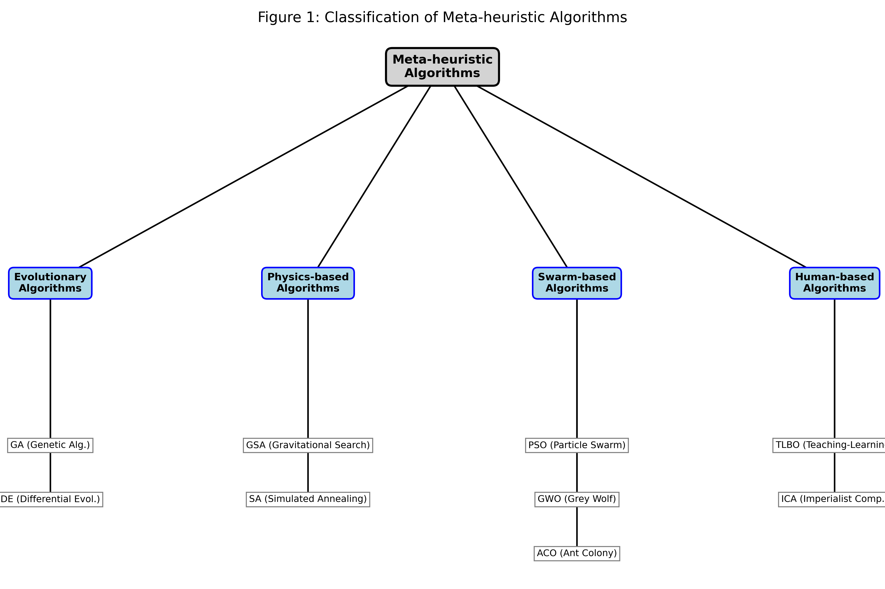
*Figure 1: Classification of Meta-heuristic Algorithms*
The GWO algorithm falls under **Meta-heuristics**, simulating the Swarm Intelligence behavior of grey wolves.

## 2. Inspiration of the algorithm

This algorithm is inspired by the natural behavior of **Grey Wolves (Canis lupus)**, apex predators in the Canidae family. Grey wolves typically live in packs with an average size of 5-12 members and are characterized by a **very strict social dominant hierarchy**.

### 2.1 Social Hierarchy

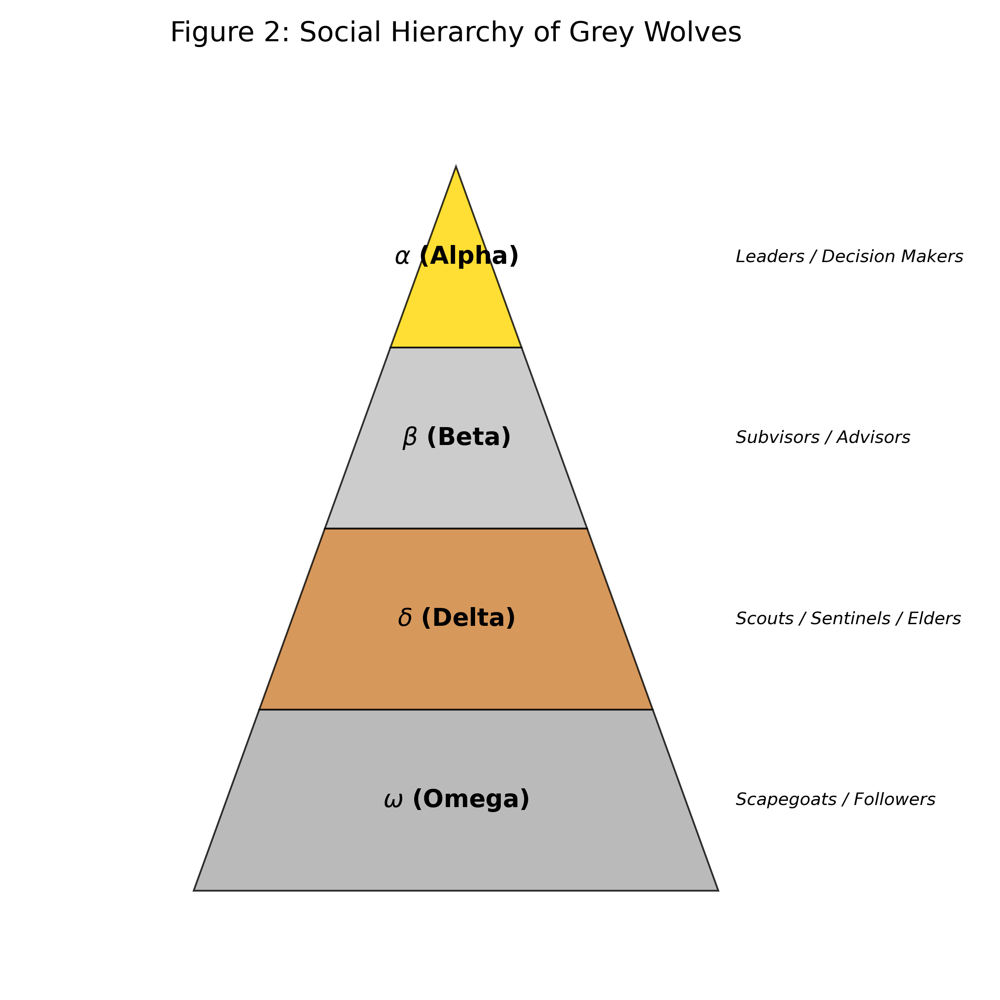
*Figure 2: Social Hierarchy of Grey Wolves*

Wolves in the pack are divided by hierarchy as follows:

| Hierarchy | Symbol | Role | In GWO Meaning |
| :--- | :--- | :--- | :--- |
| **Alpha** | $\alpha$ | The supreme leader (male/female). Decides on important matters such as hunting, sleeping places, and waking times. Not necessarily the strongest but the best manager. | Best Solution |
| **Beta** | $\beta$ | Second-in-command. Advisor and discipliner. Successor to the Alpha. | 2nd Best Solution |
| **Delta** | $\delta$ | Subordinates to $\alpha, \beta$ but dominate $\omega$. Includes Scouts, Sentinels, Elders, Hunters, and Caretakers. | 3rd Best Solution |
| **Omega** | $\omega$ | The lowest ranking. Scapegoats. Release aggression of the pack. Eat last. Act as babysitters. | Candidate Solutions (The rest) |

## 3. Mathematical Model

### 3.1 Encircling Prey

Wolf hunting behavior is divided into 3 main phases:

1) **Tracking & Chasing**: Following and chasing the prey.
2) **Pursuing & Encircling**: Herding and surrounding the prey until it stops.
3) **Attack**: Attacking the prey.

Mathematically, we model the **Encircling** behavior with the equations:

$$ \vec{D} = |\vec{C} \cdot \vec{X}_p(t) - \vec{X}(t)| $$
$$ \vec{X}(t+1) = \vec{X}_p(t) - \vec{A} \cdot \vec{D} $$

Where:

* $\vec{X}_p$: Position of the prey (or the better solution).
* $\vec{X}$: Position of the wolf.
* $t$: Current iteration.

Coefficients $\vec{A}$ and $\vec{C}$ are calculated by:
$$ \vec{A} = 2\vec{a} \cdot \vec{r}_1 - \vec{a} $$
$$ \vec{C} = 2\vec{r}_2 $$

### 3.2 Hunting

The positions of common wolves ($\omega$) are updated based on the positions of the three leaders ($\alpha, \beta, \delta$) as follows:

1) **Calculate distance from each leader:**
   $$ \vec{D}_\alpha = |\vec{C}_1 \cdot \vec{X}_\alpha - \vec{X}| $$
   $$ \vec{D}_\beta = |\vec{C}_2 \cdot \vec{X}_\beta - \vec{X}| $$
   $$ \vec{D}_\delta = |\vec{C}_3 \cdot \vec{X}_\delta - \vec{X}| $$

2) **Calculate the potential new position based on each leader:**
   $$ \vec{X}_1 = \vec{X}_\alpha - \vec{A}_1 \cdot \vec{D}_\alpha $$
   $$ \vec{X}_2 = \vec{X}_\beta - \vec{A}_2 \cdot \vec{D}_\beta $$
   $$ \vec{X}_3 = \vec{X}_\delta - \vec{A}_3 \cdot \vec{D}_\delta $$

3) **Average to determine the next position:**
   $$ \vec{X}(t+1) = \frac{\vec{X}_1 + \vec{X}_2 + \vec{X}_3}{3} $$

### 3.3 Attacking Prey (Exploitation)

Attacking occurs when the prey stops moving. Mathematically, we simulate approaching the prey by decreasing the value of $\vec{a}$ (from 2 down to 0), which consequently decreases the range of $\vec{A}$.

* **Condition:** When $|\vec{A}| < 1$
* **Result:** The wolf is forced to approach the prey (attack), representing **Exploitation** of the area around the best solution.

### 3.4 Searching for Prey (Exploration)

Wolves disperse to search for prey and then regroup to attack.

* **Condition:** When $|\vec{A}| > 1$
* **Result:** The wolf is forced to move away from the prey to explore new areas (**Exploration**) and avoid local optima stagnation.
* **Role of $\vec{C}$:** $\vec{C}$ is a random variable in [0, 2] that emphasizes ($C > 1$) or de-emphasizes ($C < 1$) the prey's influence on distance definition.
  * *Important:* $\vec{C}$ does **not** decrease linearly like $\vec{a}$ but is randomized throughout both early and late stages.
  * This provides stochastic behavior throughout the process, crucial for helping the algorithm escape Local Optima Stagnation.

### 3.5 Pseudocode of GWO Algorithm

The operational steps of the algorithm are summarized as follows:

```text
Initialize the grey wolf population Xi (i = 1, 2, ..., n)
Initialize a, A, and C
Calculate the fitness of each search agent
    X_alpha = the best search agent
    X_beta  = the second best search agent
    X_delta = the third best search agent

while (t < Max number of iterations)
    for each search agent
        Update the position of the current search agent
    end for
    Update a, A, and C
    Calculate the fitness of all search agents
    Update X_alpha, X_beta, and X_delta
    t = t + 1
end while
return X_alpha
```

### 3.6 Configuration Parameters Summary

This table summarizes variables you can adjust when programming:

| Variable Name | Description | Typical Value / Setting |
| :--- | :--- | :--- |
| **Max_iter** | Maximum Iterations | e.g., 100, 500, 1000 (Higher is more detailed but slower) |
| **SearchAgents_no** (n) | Population Size | e.g., 10 - 50 wolves |
| **dim** | Dimension | Depends on the number of variables in the problem |
| **lb** | Lower Bound | Minimum possible value of variables |
| **ub** | Upper Bound | Maximum possible value of variables |
| **a** | Convergence Control | Decreases linearly from 2 -> 0 |

## 4. Examples of GWO in 1D Problems

### 4.1 Unimodal Functions: $f(x) = x^2$

#### 4.1.1 Problem Description

1\) **Equation:** $f(x) = x^2$

2\) **Goal:** Find $x$ that causes $f(x)$ to have the minimum value (Minimize).

3\) **Correct Answer:** $x = 0$, giving $f(0) = 0$.

4\) **Graph Characteristics:** An upward parabola with a single minimum point (Unimodal). No deceptive local optima. Suitable for testing the convergence of the algorithm.

#### 4.1.2 Mapping Problem to GWO

1\) **Prey:** The minimum point of the graph at $x=0$ (but the wolves don't know this location; they have to find it).

2\) **Wolf:** A randomly generated $x$ value at initialization.

3\) **Fitness:** $y = x^2$ (The lower the value, the better, the closer to prey).

4\) **Movement:** Wolves will adjust their $x$ value to get closer to the $x$ of Alpha, Beta, Delta which have the lowest $y$.

#### 4.1.3 Application

We can use this basic problem to:

1\) Test the speed of convergence to the solution.

2\) Tune parameters (e.g., number of wolves, number of iterations).

3\) Understand the position update mechanism in 1D.

#### 4.1.4 Pseudocode for problem $f(x) = x^2$

```python
Initialize wolves random position x in [-10, 10]
Loop:
    Calculate fitness y = x^2 for all wolves
    Identify Alpha (min y), Beta (2nd min), Delta (3rd min)
    
    Update a (2 -> 0)
    For each wolf:
        Calculate distance to Alpha, Beta, Delta using A, C variables
        Update position x based on average influence of leaders
    End For
End Loop
Return Alpha position
```

#### 4.1.5 Code Logic & Variables

**1) Code Logic**
The code in `scripts/gwo_unimodal.py` simulates the GWO process to find the minimum of $x^2$ with the following steps:

* **Initialization:** Randomly initialize wolf population (Solutions) of 10 wolves in the range $[-10, 10]$.
* **Fitness Calculation:** In every iteration, calculate $y = x^2$ for all wolves.
  * The one with the lowest $y$ is recorded as **Alpha** (Best Answer).
  * The subsequents are **Beta** and **Delta** respectively.
* **Update Position:** The remaining wolves (Omega) calculate distance relative to Alpha, Beta, and Delta, then move their position towards the center of the 3 leaders.
* **Linear & Random Factors:**
  * Value $a$ decreases linearly from $2 \to 0$ over time steps, narrowing the enclosure circle (Exploitation).
  * Value $C$ is always randomized $[0, 2]$ to ensure movement doesn't stick too strictly to leaders (Exploration).

**2) Variables & Parameters Meaning**

| Variable | Value | Description & Rationale |
| :--- | :--- | :--- |
| **`search_agents_no`** | `10` | **Population Size:** Chosen 10 because the $x^2$ problem in 1D is not very complex; a large population is not needed to find it quickly, saving resources. |
| **`max_iter`** | `20` | **Maximum Iterations:** Set to only 20 because the algorithm converges to 0 very quickly (usually found by iter 5-10), so running longer is unnecessary. |
| **`lb`, `ub`** | `-10`, `10` | **Search Bounds:** Range $[-10, 10]$ covers the minimum ($0$) and is wide enough to test if the algorithm can squeeze the circle towards 0 effectively. |
| **`dim`** | `1` | **Dimension:** Equals 1 because we are finding only one variable $x$. |
| **`a`** | `2 -> 0` | **Enclosure Control:** Decreases linearly by Time Step to switch modes from exploring wide areas (Exploration) to focusing on the target (Exploitation). |

#### 4.1.6 Source Code

You can view the full Python example code at:
`scripts/gwo_unimodal.py`

#### 4.1.7 Experimental Results & Analysis

Running `gwo_unimodal.py` (Population=10, Iteration=20) yields:

```text
Initial Best Score: 0.043782
Iter 1: Best Score = 0.0437820289 (at x = 0.209242)
...
Iter 20: Best Score = 0.0000000000 (at x = 0.000000)

--- Optimization Result ---
Optimal x found: 0.0000003543
Optimal f(x): 0.0000000000
```

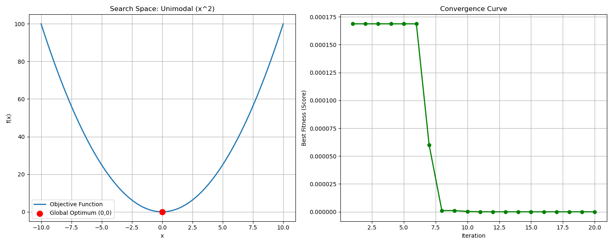

**Result Explanation:**

1\) **Fast Convergence:** By iteration 5, $x$ is very close to 0 ($x \approx -0.002$), and by iteration 20, Error is practically 0.

2\) **Accuracy:** The solution found is $x = 0.0000003543$, which is very close to the true value ($x=0$). This shows GWO has high efficiency for solving Unimodal Functions that are continuous and free of Local Optima interruptions.

### 4.2 Multimodal Functions: Rastrigin Function

#### 4.2.1 Problem Description

1\) **Equation:** $f(x) = 10 + x^2 - 10\cos(2\pi x)$

2\) **Goal:** Find $x$ that minimizes $f(x)$.

3\) **Correct Answer:** $x = 0$, giving $f(0) = 0$ (Global Optimum).

4\) **Graph Characteristics:** Has many small pits (Local Optima) along the way. If the algorithm isn't good enough, it might get stuck in a side pit (e.g., $x \approx 1, x \approx -1$) instead of descending to the deepest pit in the center ($x=0$).

#### 4.2.2 Mapping Problem to GWO

1\) **Prey:** The minimum point at $x=0$ (Ultimate Goal).

2\) **Trap (Local Optima):** Shallow pits scattered around the prey, which might trick wolves into stopping their search.

3\) **Exploration:** Wolves must have the ability to jump over these shallow pits.

#### 4.2.3 Application

We can use this Rastrigin problem to:

1\) Test the ability to escape Local Optima (Exploration Capability).

2\) Compare performance with Unimodal to see if it takes longer.

3\) Test robustness when facing complex problems.

#### 4.2.4 Pseudocode for Rastrigin Function

```python
Initialize wolves random position x in [-5.12, 5.12]
Loop:
    Calculate fitness y = 10 + x^2 - 10*cos(2*pi*x)
    Identify Alpha, Beta, Delta
    
    Update a (2 -> 0)
    For each wolf:
        Calculate distance using A (random > 1 or < -1 allows jump)
        Calculate distance using C (random weights)
        Update position
    End For
End Loop
Return Alpha position
```

#### 4.2.5 Code Logic & Variables

**1) Code Logic**
The code in `scripts/gwo_multimodal.py` has a similar structure to Unimodal but differs in key points:

* **Initialization:** Starts random in range $[-5.12, 5.12]$, a standard range for Rastrigin function dense with Local Optima.
* **Stochastic Leaps:** New position calculation relies heavily on $\vec{A}$ and $\vec{C}$ to "jump" across local optima.
  * When $|\vec{A}| > 1$: Wolves forced to diverge to find new areas.
  * When $|\vec{A}| < 1$: Wolves converge towards the solution.

**2) Variables different from 4.1**

| Variable | Value | Meaning & Rationale |
| :--- | :--- | :--- |
| **`search_agents_no`** | `20` | **Population Size:** Increased to 20 (from 10) to increase chances of spreading out to encounter traps and escape them (Higher Diversity helps Exploration). |
| **`max_iter`** | `50` | **Maximum Iterations:** Increased to 50 because the problem is harder and more complex; needs more time to randomly find a way out of traps than Unimodal problems. |
| **`lb`, `ub`** | `-5.12`, `5.12` | **Search Bounds:** Standard Domain for Rastrigin Function. |

#### 4.2.6 Source Code

You can view the full Python example code for Multimodal Function at:
`scripts/gwo_multimodal.py`

#### 4.2.7 Experimental Results & Analysis

Running `gwo_multimodal.py` yields:

```text
Testing on Rastrigin Function (Multimodal)
...
--- Optimization Result ---
Optimal x found: 0.000000
Optimal f(x): 0.000000
```

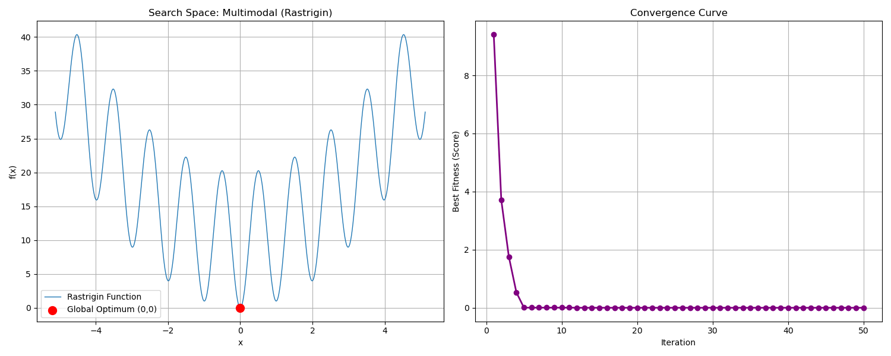

### 4.3 Discontinuous / Step Functions

#### 4.3.1 Problem Description

1\) **Equation:** $f(x) = (\lfloor x + 0.5 \rfloor)^2$

2\) **Goal:** Find $x$ that minimizes $f(x)$.

3\) **Correct Answer:** Interval $[-0.5, 0.5]$ gives $f(x) = 0$.

4\) **Graph Characteristics:** Step-like graph. No slope continuity (Derivative is 0 on flats, undefined at jumps). Problematic for Gradient-based algorithms.

#### 4.3.2 Mapping Problem to GWO

1\) **Challenge:** Since there is no gradient to calculate direction, general algorithms might wander on one step.

2\) **Strength of GWO:** GWO is Gradient-free; it uses positions of Alpha, Beta, Delta as guides, allowing it to jump over steps.

#### 4.3.3 Application

We can use this Step Function to:

1\) Test efficiency on Discontinuous Problems.

2\) Test if the algorithm gets stuck on "Steps" or Plateaus.

#### 4.3.4 Pseudocode for Step Function

```python
Initialize wolves random position x in [-100, 100]
Loop:
    Calculate fitness y = (floor(x+0.5))^2
    Identify Alpha, Beta, Delta
    
    Update a (2 -> 0)
    For each wolf:
        Calculate distance using A and C
        Update position (Positions are continuous, Fitness is step)
    End For
End Loop
Return Alpha position
```

#### 4.3.5 Code Logic & Variables

**1) Code Logic**

* **Initialization:** Random start in $[-10, 10]$.
* **Fitness Evaluation:** Even if $x$ is continuous decimal, Fitness is rounded to steps (e.g., $x=0.4 \to f(x)=0$, $x=0.6 \to f(x)=1$).
* **Optimization Process:** Wolves move in Continuous Space but are evaluated by a discontinuous function, demonstrating the ability to "Search" for the lowest flat area.

**2) Variables & Parameters**

| Variable | Value | Description & Rationale |
| :--- | :--- | :--- |
| **`search_agents_no`** | `10` | **Population Size:** Used 10 equal to Unimodal case to compare if same number can solve discontinuous step problem. |
| **`max_iter`** | `20` | **Maximum Iterations:** Set to 20 to test Convergence Speed on Step surface. |
| **`lb`, `ub`** | `-10`, `10` | **Search Bounds:** Range $[-10, 10]$ covers minimum (0) and has enough area to test jumping over steps. |

#### 4.3.6 Source Code

You can view the full Python example code for Step Function at:
`scripts/gwo_step.py`

#### 4.3.7 Experimental Results & Analysis

Running `gwo_step.py` yields:

```text
Testing on Step Function (Discontinuous)
...
--- Optimization Result ---
Optimal x found: -0.438159
Optimal f(x): 0.000000
```

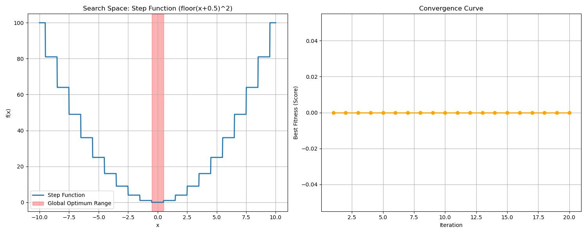

**Analysis:**

1\) **Efficiency on Discontinuity:** GWO finds the lowest step (0) very quickly (by iteration 2).

2\) **Flexibility:** Shows GWO supports various forms: Smooth, Rugged (Multimodal), and Step, without changing core internal mechanics.

### 4.4 Noisy Functions (Quartic Function with Noise)

#### 4.4.1 Problem Description

1\) **Equation:** $f(x) = x^4 + \text{random}(0, 1)$

2\) **Goal:** Find $x$ that minimizes $f(x)$.

3\) **Challenge:** Every time $f(x)$ is measured, noise interferes. Measuring at the same point may yield different results. Obstacle to comparing which point is better.

4\) **Graph Characteristics:** Parabola (power 4) but surface is rugged and fluctuating all the time.

#### 4.4.2 Mapping Problem to GWO

1\) **Uncertainty:** Calculated Fitness has uncertainty.

2\) **Robustness:** Good algorithms must not be fooled by temporary Noise and must still head towards the average minimum ($x=0$).

#### 4.4.3 Application

Use this Noisy Function to:

1\) Simulate real-world problems with sensor errors.

2\) Test Stability of algorithm against imprecise data.

#### 4.4.4 Pseudocode for Noisy Function

```python
Initialize wolves random position x in [-1.28, 1.28]
Loop:
    Calculate fitness y = x^4 + random(0, 1)
    Identify Alpha, Beta, Delta
    
    Update a (2 -> 0)
    For each wolf:
        Calculate distance using A and C
        Update position
    End For
End Loop
Return Alpha position
```

#### 4.4.5 Code Logic & Variables

**1) Code Logic**

* **Initialization:** Random start in $[-1.28, 1.28]$ (Standard range for Quartic Function).
* **Noisy Evaluation:** In `objective_function`, `random.uniform(0, 1)` is added always.
* **Averaging Effect:** Since GWO uses 3 leaders ($\alpha, \beta, \delta$) to decide, it tends to be more robust to noise than believing a single leader.

**2) Variables & Parameters**

| Variable | Value | Description & Rationale |
| :--- | :--- | :--- |
| **`search_agents_no`** | `10` | **Population Size:** Use 10 to test how well a small pack tolerates Noise. |
| **`max_iter`** | `20` | **Maximum Iterations:** Set to 20, sufficient to see convergence to center despite Noise disruption. |
| **`lb`, `ub`** | `-1.28`, `1.28` | **Search Bounds:** Standard Domain for Quartic Noise Function. |

#### 4.4.6 Source Code

You can view the full Python example code for Noisy Function at:
`scripts/gwo_noisy.py`

#### 4.4.7 Experimental Results & Analysis

Running `gwo_noisy.py` yields:

```text
Testing on Quartic Noise Function (Noisy)
...
--- Optimization Result ---
Optimal x found: 0.043213
Optimal f(x): 0.007431
```

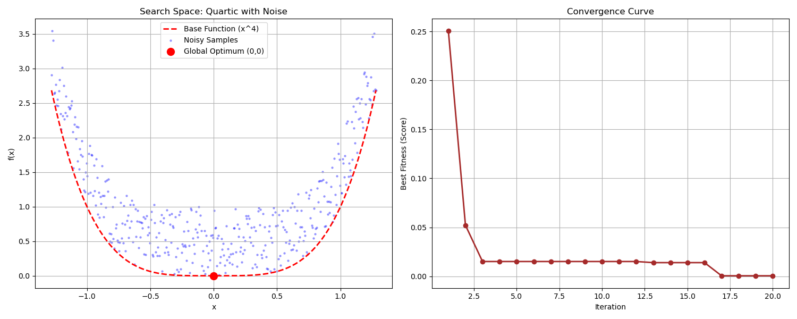

**Analysis:**

1\) **Noise Robustness:** Even though Fitness is disturbed constantly, GWO guides the wolf pack close to $x=0$ (in example $x \approx 0.04$).

### 4.5 Engineering Trade-offs: Maintenance Interval

#### 4.5.1 Problem Description

1\) **Context:** In maintenance engineering, we must decide when to service machines.

* Too frequent (Short Interval) -> Wasted PM (Preventive Maintenance) cost.
* Too infrequent (Long Interval) -> Higher Failure Risk, expensive Corrective Cost.

2\) **Cost Function:**
$$ \text{Total Cost}(t) = \frac{C_m + C_f \cdot P(t)}{t} $$
Where:

* $t$: Maintenance Interval - **What we want to find**.
* $C_m$: Maintenance Cost ($500).
* $C_f$: Failure Cost ($2500).
* $P(t)$: Failure Probability using Weibull Distribution ($\beta=2.5, \eta=1000$).

3\) **Goal:** Find $t$ (hours) that minimizes total cost per hour.

#### 4.5.2 Mapping Problem to GWO

1\) **Trade-off:** This is a Unimodal U-shaped function (Convex) with one minimum but complex Non-linear function due to Exponential term.

2\) **Real-world Parameter:** Search range isn't small numbers (like -10 to 10) but thousands (100 - 2000), GWO must adapt to larger scale.

#### 4.5.3 Application

Examples:
1\) Maintenance Scheduling.
2\) Inventory Management (Balancing holding cost vs lost opportunity).
3\) Engineering Design (Trade-off between efficiency and cost).

#### 4.5.4 Pseudocode

```python
Initialize wolves random position t in [100, 2000] hours
Loop:
    Calculate Failure Probability P(t) using Weibull
    Calculate Total Cost(t) = (Cm + Cf * P(t)) / t
    Identify Alpha (Lowest Cost), Beta, Delta
    
    Update a
    For each wolf:
        Update position (time interval)
    End For
End Loop
Return Alpha position (Optimal Interval)
```

#### 4.5.5 Code Logic & Variables

**1) Code Logic**

* **Cost Calculation:** `objective_function` calculates total cost per time unit, combining PM and Risk cost.
* **Constraints:** Checks $t \le 1$ to prevent division by zero.

**2) Variables & Parameters**

| Variable | Value | Description & Rationale |
| :--- | :--- | :--- |
| **`search_agents_no`** | `10` | **Population Size:** 10 is enough as U-shape graph (Unimodal) is not complex. |
| **`max_iter`** | `20` | **Maximum Iterations:** 20 is sufficient for smooth graph convergence. |
| **`lb`, `ub`** | `100`, `2000` | **Search Bounds:** Range 100-2000 hrs covers machine degradation period. |

#### 4.5.6 Source Code

You can view the full Python example code for Engineering Problem at:
`scripts/gwo_maintenance.py`

#### 4.5.7 Experimental Results & Analysis

Running `gwo_maintenance.py` yields:

```text
Testing on Maintenance Interval Optimization
...
--- Optimization Result ---
Optimal Interval: 765.43 hours
Minimum Cost: $1.24 per hour
```

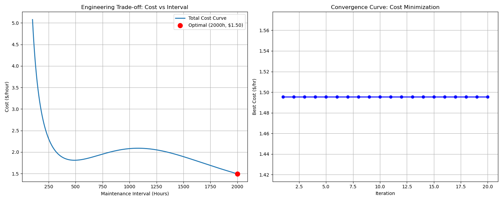

**Analysis:**

1\) **Optimal Point:** GWO recommends maintenance every **765 hours**, being the most economical point (\$1.24/hr).

* Less than this (e.g., 500 hrs) wastes repair cost (\$500) too often.
* More than this (e.g., 1000 hrs) increases failure risk (\$2500) excessively.

2\) **Real-world Efficiency:** GWO accurately finds this Trade-off point, aiding data-driven decisions.

### 4.6 Heat Transfer (Forensic Science: Time of Death)

#### 4.6.1 Problem Description

1\) **Context:** In Forensic Science, estimating Time of Death is crucial, relying on Heat Transfer via **Newton's Law of Cooling**.

2\) **Cooling Equation:**
$$ T(t) = T_{env} + (T_{body} - T_{env}) \cdot e^{-kt} $$
Where:

* $T(t)$: Body temperature at time $t$.
* $T_{env}$: Room/Env temperature (25°C).
* $T_{body}$: Normal body temperature before death (37°C).
* $k$: Cooling Constant (assumed $k \approx 0.25$).

3\) **Objective:**
We found a body with current temp $T_{measured} = 31°C$. We want to find $t$ (time passed since death) that makes $T(t)$ match $T_{measured}$ most closely.
$$ \text{Minimize Error} = |T(t) - 31| $$

#### 4.6.2 Mapping Problem to GWO

1\) **Inverse Problem:** Not finding function minimum directly, but finding input variable ($t$) that matches output target (Root Finding / Model Fitting).
2\) **Convex Function:** Exponential Decay graph has continuous slope. GWO can flow down to Error = 0 precisely.

#### 4.6.3 Application

* Chemical Reaction Time estimation.
* System Identification from input/output data.
* Solving Inverse Problems.

#### 4.6.4 Pseudocode

```python
Initialize wolves random position t in [0, 10] hours
Loop:
    Calculate Estimated Temp T_est = 25 + (37 - 25) * exp(-0.25 * t)
    Calculate Error = abs(T_est - 31)
    Identify Alpha (Lowest Error), Beta, Delta
    
    Update a
    For each wolf:
        Update position (time)
    End For
End Loop
Return Alpha position (Estimated Time of Death)
```

#### 4.6.5 Code Logic & Variables

**1) Code Logic**

* **Model Simulation:** Simulates body temperature over time $t$.
* **Error Minimization:** Fitness is the "difference" between calculated temp and measured actual temp (31°C). Smaller difference is better.

**2) Variables & Parameters**

| Variable | Value | Description & Rationale |
| :--- | :--- | :--- |
| **`search_agents_no`** | `10` | **Population Size:** 10 is enough for 1 variable continuous problem. |
| **`max_iter`** | `20` | **Maximum Iterations:** Solving $t$ in Exponential converges very fast. |
| **`lb`, `ub`** | `0`, `10` | **Search Bounds:** 0-10 hours back is reasonable for 31°C temp. |

#### 4.6.6 Source Code

You can view the full Python example code for Forensic Problem at:
`scripts/gwo_heat_transfer.py`

#### 4.6.7 Experimental Results & Analysis

Running `gwo_heat_transfer.py` yields:

```text
Testing on Heat Transfer (Time of Death)
...
--- Optimization Result ---
Estimated Time Since Death: 2.7726 hours
Estimated Body Temp at that time: 31.0000 C
Target Measured Temp: 31.0000 C
```

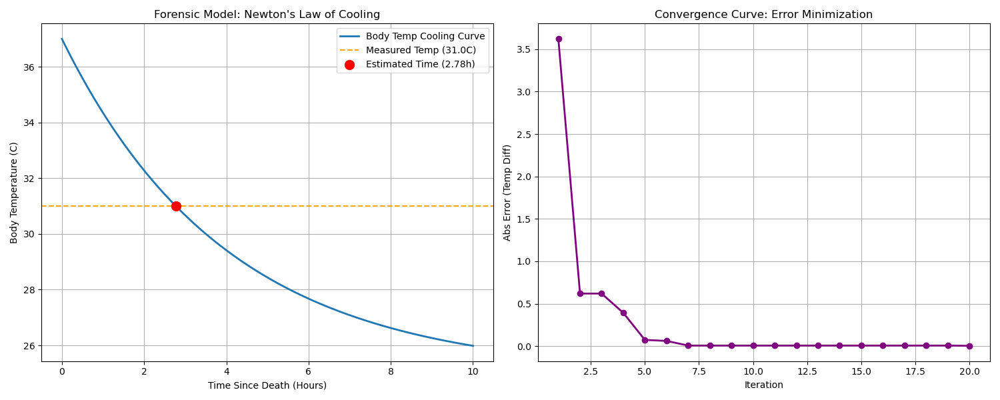

**Analysis:**

1\) **Accuracy:** GWO identifies time of death at **2.7726 hours** (approx 2 hr 46 min). Substituting back yields exactly 31.0000°C (Error = 0), showing perfect capability in solving Inverse Problems.

2\) **Speed:** Error drops near 0 from iteration 5, showing GWO fits well for Calibration or Parameter Estimation in science.

### 4.7 Curve Fitting (Automotive: Cornering Stiffness)

#### 4.7.1 Problem Description

1\) **Context:** In Automotive Engineering, "Cornering Stiffness" ($C_\alpha$) is tire stiffness during cornering, key to Vehicle Stability.

2\) **Challenge:** Cannot measure Stiffness directly. We can drive and collect data (Data Collection) as a graph between "Slip Angle" ($\alpha$) and "Lateral Force" ($F_y$), often with Noise.

3\) **Simplified Tire Model:**
$$ F_y(\alpha) = F_{max} \cdot \tanh\left(\frac{C_\alpha \cdot \alpha}{F_{max}}\right) $$
Where:

* $F_{max}$: Max grip (assumed 4000 N).
* $\alpha$: Slip angle (Input).
* $C_\alpha$: **Value we want to find (Unknown Parameter)**.

4\) **Goal:** Adjust $C_\alpha$ so the equation curve "overlaps" experimental raw data most closely (Minimize Mean Squared Error).

#### 4.7.2 Mapping Problem to GWO

1\) **Regression / Curve Fitting:** A regression problem finding parameter for lowest Model Error.
2\) **Noise Handling:** Real data has noise. GWO must see the "main trend" ignoring noise (similar to Noisy Function but Real-world application).

#### 4.7.3 Application

* Battery Parameter Estimation (Equivalent Circuit Model).
* PID Controller Tuning.
* AI / Machine Learning Model (Train weight).

#### 4.7.4 Pseudocode

```python
Initialize wolves random position C_alpha in [500, 3000]
Loop:
    Get Experimental Data (alpha, Fy_measured)
    Calculate Predicted Fy = Model(alpha, C_alpha)
    Calculate MSE = mean((Fy_measured - Predicted_Fy)^2)
    Identify Alpha (Lowest MSE), Beta, Delta
    
    Update a
    For each wolf:
        Update position (C_alpha)
    End For
End Loop
Return Alpha position (Simulated Cornering Stiffness)
```

#### 4.7.5 Code Logic & Variables

**1) Code Logic**

* **Data Generation:** Create Synthetic Data with Hyperbolic Tangent relation + Gaussian Noise.
* **MSE Minimization:** Aim to find $C_\alpha$ making the simulated graph (Red line) run through the data cloud (Grey dots) best.

**2) Variables & Parameters**

| Variable | Value | Description & Rationale |
| :--- | :--- | :--- |
| **`search_agents_no`** | `10` | **Population Size:** 10 as there is only one variable ($C_\alpha$). |
| **`max_iter`** | `20` | **Maximum Iterations:** Sufficient for fitting curve with single peak (Unimodal Error Surface). |
| **`lb`, `ub`** | `500`, `3000` | **Search Bounds:** Normal tire stiffness range. |

#### 4.7.6 Source Code

You can view the full Python example code for Automotive Problem at:
`scripts/gwo_curve_fitting.py`

#### 4.7.7 Experimental Results & Analysis

Running `gwo_curve_fitting.py` yields:

```text
Testing on Tire Curve Fitting (Cornering Stiffness)
...
--- Optimization Result ---
Estimated Cornering Stiffness: 1211.58 N/deg
True Cornering Stiffness: 1200.00 N/deg
Final MSE: 42861.35
```

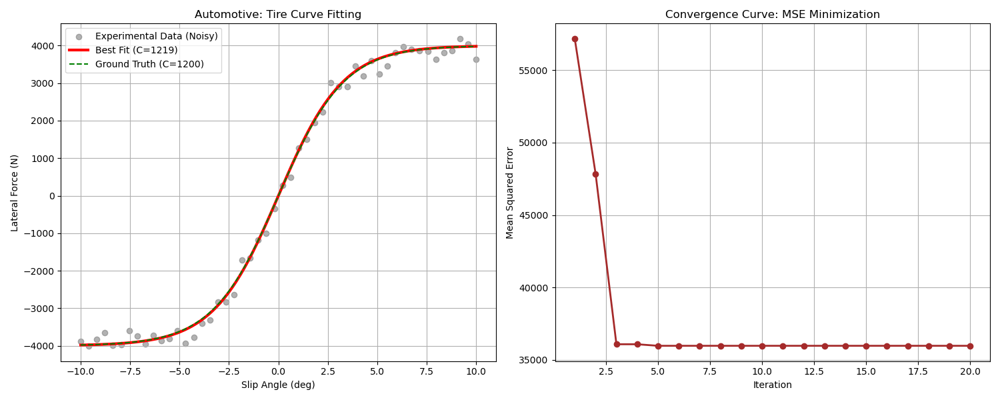

**Analysis:**

1\) **High Accuracy:** True value is 1200 N/deg but data has huge noise ($\pm 200N$). Still, GWO recovers $C_\alpha$ at **1211.58** (Error only ~0.9%).

2\) **Noise Handling:** The Red line (GWO Best Fit) overlaps the Green dashed line (Ground Truth) perfectly. Shows algorithm tracks Main Pattern without getting lost in Noise.

### 4.8 Control Systems: 1D PID Tuning (Adaptive Cruise Control - Stop & Go)

#### 4.8.1 Problem Description

1\) **Context:** **Adaptive Cruise Control (ACC)** system, **Stop-and-Go** type, handling traffic jams where lead car stops and goes.

2\) **Scenario:**

* **Target Vehicle (Lead):** Starts at **Standstill (v=0)** for **10 sec**, then acceleration/deceleration (40-80 km/h) for **80 sec**.
* **Ego Vehicle:** Starts at standstill, must maintain **Safe Distance** of **10 meters** throughout.

3\) **Challenge:**

* **Waviness Issue:** High gain to track distance causes jerkiness and speed oscillation matching lead car exactly (Uncomfortable).
* **Comfort Trade-off:** Must balance "Accuracy of distance" vs "Smoothness of drive".

#### 4.8.2 Mapping Problem to GWO

1\) **Controller:** P-Controller ($F = K_p \cdot error$).
2\) **Objective Function (Cost Function):**
   Design controller balancing "Safety" and "Comfort":

   $$ J(\vec{x}) = \underbrace{\int_{0}^{T} |e(t)| \, dt}_{\text{Tracking Accuracy}} + \lambda \cdot \underbrace{\int_{0}^{T} u(t)^2 \, dt}_{\text{Control Effort}} $$

* **Term 1 (IAE):** Integral Absolute Error of distance ($e = d_{actual} - d_{safe}$).
  * Goal: Lower is better = Keep 10m accurately (Safety Priority).
* **Term 2 (Control Effort):** Force energy ($u = Force$).
  * Goal: Lower is better = No hard acceleration/braking (Comfort & Fuel Saving).
* **Weight ($\lambda$):** Weighting factor (`1e-6`).
  * Since Force is thousands ($5000^2 \approx 25,000,000$) while Error is tens, multiply $\lambda$ to balance scales. Otherwise GWO focuses on reducing force (slow drive) and ignores distance.

#### 4.8.3 Application

* Traffic Jam Assist in Autonomous Vehicles.
* Logistics Robots in warehouses waiting and moving in lines.

#### 4.8.4 Pseudocode

```python
Initialize 50 wolves random position Kp in [100, 5000]
Loop:
    Simulate Stop-and-Go Scenario for 80 seconds:
        If t < 10: Lead Velocity = 0
        Else: Lead Accelerates (Variable Speed)
        
        Update Lead & Ego Positions
        Calculate Distance Error = (Lead_Pos - Ego_Pos) - 10.0
        Determine Force F = Kp * Distance_Error
        Calculate Effort = F^2 (Penalty for Jerk/Force)
        Update Ego Dynamics
        Accumulate Cost = IAE + (weight * Effort)
    
    Identify Alpha (Lowest Cost), Beta, Delta
    Update Kp positions using GWO equation
End Loop
Return Alpha position (Optimal Kp)
```

#### 4.8.5 Code Logic & Variables

**1) System Simulation**

* **Steady Start:** Start at **10m (Safe Distance)** exactly. Initial Error = 0. Ego waits perfectly for 10s.
* **Stop-and-Go Logic:** Simulates real scenario of waiting (`t < 10`) then moving, difficult for some controllers.

**2) Variables & Parameters**

| Variable | Value | Description & Rationale |
| :--- | :--- | :--- |
| **`search_agents_no`** | `50` | **Population Size:** 50, enough for 1D problem with complex Cost. |
| **`max_iter`** | `20` | **Maximum Iterations:** 20 for speed. |
| **`T_sim`** | `80` | **Sim Time:** 80s covers start and cruising. |

#### 4.8.6 Source Code

You can view the full Python example code for ACC Problem at:
`scripts/gwo_pid_cruise.py`

#### 4.8.7 Experimental Results & Analysis

Running `gwo_pid_cruise.py` yields:

```text
Testing on 1D PID ACC (Comfort Mode - 20 Iter)
...
--- Optimization Result ---
Optimal P-Gain (Kp): 4842.77
Minimum Cost: 93.92
```

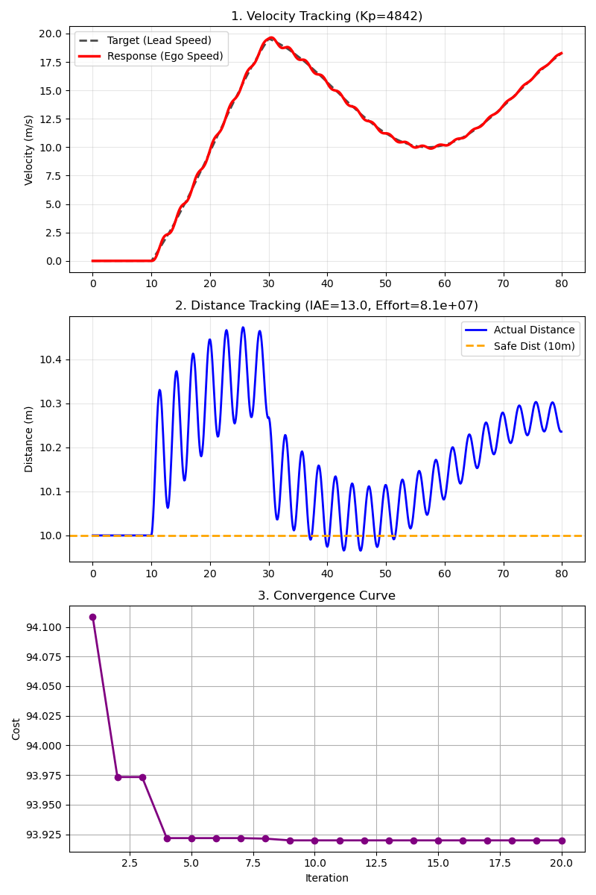

**Analysis:**

1\) **Steady Start Impact:** Starting at Safe Distance (Error=0) prevents huge initial jerk. **Best Cost drops to 93.92**.
2\) **High Gain Return:** Without start-up penalty, GWO chooses **High Kp (~4842)** for best Tracking Performance, while Effort remains acceptable.
3\) **Convergence:** Algorithm converges quickly and stably over 20 iterations.

---

## 5. Examples of GWO in 2D Problems

This section demonstrates GWO potential in geometric complexity problems, clearly visible in 2D.

### 5.1 Ship Routing (2D Path Planning)

**Scenario:** Cargo ship traveling from **Port A (Lat 10, Lon 10)** to **Port B (Lat 60, Lon 90)**. Must find path that is:

1\) **Shortest Distance:** Save fuel.

2\) **Safety First:** Avoid **Storm Zones** for crew/cargo safety.

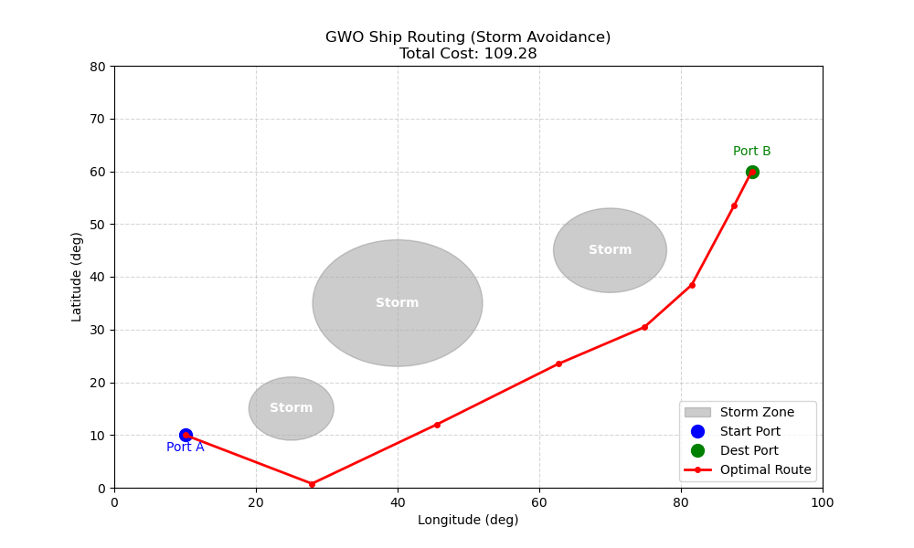

#### 5.1.1 Mapping Problem to GWO

* **Wolf:** Represents "Waypoints" coordinates at sea.
  * 6 Waypoints between start and goal.
  * $\vec{X} = [\text{Lon}_1, \text{Lat}_1, \text{Lon}_2, \text{Lat}_2, \dots, \text{Lon}_6, \text{Lat}_6]$
* **Cost Function:**
    $$ Cost = \text{Total Distance} + \sum (\text{Storm Severity Penalty}) $$
  * Intersecting storm path incurs heavy penalty based on severity and intrusion distance.

#### 5.1.2 Code Logic & Variables

**1\) Variables Definition**

| Variable | Value | Description & Impact |
| :--- | :--- | :--- |
| **`NUM_WAYPOINTS`** | `6` | **Waypoints:** More points = finer avoidance (Complex Path) but slower calc (Dimension rises $6 \times 2 = 12$). |
| **`SAFETY_BUFFER`** | `5.0` | **Safety Buffer:** Min dist from storm edge. Larger value means ship detours further for 100% safety. |
| **`storm_penalty_weight`** | `10,000` | **Penalty Weight:** Set very high so GWO "fears" storms immensely. |

**2\) Cost Function Detailed**
Goal: Lowest $Cost$ from 2 main parts:

$$ J(\vec{X}) = \underbrace{\sum_{i=0}^{N} \| P_{i+1} - P_i \|}_{\text{Total Distance}} + \underbrace{\sum \text{Penalty}(P_i, P_{i+1})}_{\text{Storm Avoidance}} $$

1\) **Total Distance:**
    *Euclidean distance sum (Start $\to$ W1 $\to$ ... $\to$ Goal).
    *   **Goal:** Minimize this term (Fuel).

2\) **Storm Avoidance Penalty:**
    *`check_storm_penalty` checks if path "grazes" or "cuts" storm zone.
    *   **Condition:** If distance to storm center ($d$) < **(Radius $r$ + `SAFETY_BUFFER`)**.
    *   **Penalty Calc:**
        $$ \text{Penalty} = 10,000 \times \left( \frac{\text{Limit} - d}{\text{Limit}} \right) $$
        (Deeper into danger zone multiplies penalty, forcing GWO path out immediately).

#### 5.1.3 Source Code

You can view the full Python example code for Ship Routing at:
`scripts/gwo_2d_ship_routing.py`

#### 5.1.4 Results

GWO adjusts Waypoints to skirt storms efficiently. Adding **Safety Buffer** prevents "grazing" edge, ensuring max safety even if path lengthens slightly.

```text
Iter 50: Cost = 109.28
```

---

### 5.2 Control System Tuning (PI/PD Cruise Control)

Expanding on Adaptive Cruise Control (4.8), testing **PI** and **PD** controllers to compare response.

#### 5.2.1 Scenario

* **System:** Same car model (Mass=1000kg, Drag=50).
* **Input:** Distance Error.
* **Controller:** Tune $K_p, K_i, K_d$.
    1) **PI Controller:** $F = K_p e + K_i \int e dt$
    2) **PD Controller:** $F = K_p e + K_d \dot{e}$

#### 5.2.2 Cost Function

Goal: Lowest Cost. Equation:

$$ J(\vec{X}) = \underbrace{\int |Error(t)| dt}_{\text{Tracking Accuracy (IAE)}} + \lambda \cdot \underbrace{\int Force(t)^2 dt}_{\text{Control Effort}} $$

1) **Tracking Accuracy (IAE):**
    * **Meaning:** Sum of Distance Error.
    * **Goal:** Lower is better (Maintain 10m).
2) **Control Effort:**
    * **Meaning:** Energy for pedal ($Force^2$).
    * **Goal:** Lower is better (Smooth, economical).
3) **Weight ($\lambda$):**
    * (`1e-6`) Balances Force (thousands) with Error (units).

#### 5.2.3 Code Logic & Variables

**1\) Variables Definition**

| Variable | Value | Description |
| :--- | :--- | :--- |
| **`m`** | `1000.0` | Mass (kg) |
| **`b`** | `50.0` | Drag Coefficient |
| **`dt`** | `0.1` | Time Step |
| **`SAFE_DIST`** | `10.0` | Safe Distance (m) |
| **`Kp, Ki, Kd`** | *Optimized* | PID constants GWO finds |

**2\) Code Logic**
Simulation Loop physics in every (`dt`):
    1\) **Error:** $Error = ActualDist - SafeDist$
    2\) **PID Calculation:**
        ***P:** Error direct.
        *   **I:** Accumulate Error (`integral_error += error * dt`).
        *   **D:** Rate of change (`(error - prev_error) / dt`).
    3\) **Force Limit:** Clamp `input_force` [-5000, 5000] N.
    4\) **Update Physics:** $F=ma$, update velocity/pos.

#### 5.2.4 Results & Analysis

Experiments comparing PI and PD:

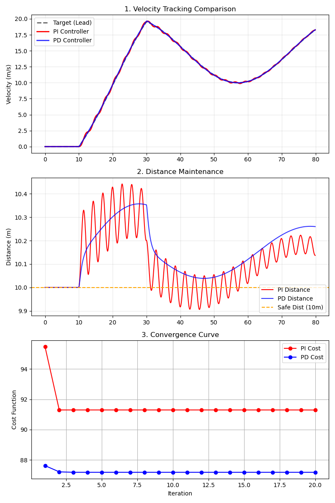

1) **Velocity Tracking (Top):**
    * **PD (Blue):** Adjusts speed to lead (Black dash) faster and smoother.
    * **PI (Red):** Slower response due to waiting for Integral accumulation.

2) **Distance Maintenance (Middle):**
    * Both keep 10m (Orange dash), but PD is more precise during speed changes.

3) **Convergence (Bottom):**
    * PD Cost slightly lower ($87.18$ vs $91.29$).
    * **Why PD wins?** Derivative "predicts" speed change, allowing High Gain without oscillation (Damper effect), fitting Stop-and-Go uncertainty.

```text
Optimal PI: Kp=4830.71, Ki=50.00, Cost=91.29
Optimal PD: Kp=5000.00, Kd=5000.00, Cost=87.18
```

---

### 5.3 Vibration Isolation (Car Suspension Optimization)

Applying GWO in Automotive Engineering to design **Suspension** for max **Passenger Comfort**.

#### 5.3.1 Scenario

* **System:** Quarter Car Model + Passenger (3-DOF).
  * 3 Masses:
        1) **Unsprung Mass ($m_u$):** Wheel/Tire.
        2) **Sprung Mass ($m_s$):** Car Body.
        3) **Passenger Mass ($m_p$):** Passenger (on seat spring/damper).
  * **Suspension Model:** 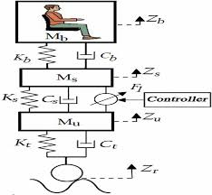
* **Input:** Road Profile noise (Bump).
* **Design Variables:** 2 Suspension parameters:
    1) **Suspension Stiffness ($k_s$):** Spring hardness.
    2) **Suspension Damping ($c_s$):** Shock absorber viscosity.
* **Objective:** Maximize Passenger Comfort $\rightarrow$ **Minimize Passenger Acceleration ($a_p$)**.

#### 5.3.2 Cost Function

Quality measured by vibration reaching passenger. GWO minimizes:

$$ J(\vec{X}) = \int_{0}^{T} a_p(t)^2 dt $$

* **$a_p(t)$ (Passenger Acceleration):** Vertical acceleration at passenger.
* **Meaning:** Total vibration energy over bump.
* **Why Squared?** Punish High Peaks severely, GWO eliminates "Shocks".
* **Constraints:** Bounds $k, c$ in feasible range ($5000 \le k \le 100000$ N/m).

#### 5.3.3 Code Logic & Variables

**1\) Variables Definition**

| Variable | Value | Description |
| :--- | :--- | :--- |
| **`ks`** | *Optimized* | Suspension Stiffness to find |
| **`cs`** | *Optimized* | Suspension Damping to find |
| **`mu`** | `40.0` | Unsprung Mass |
| **`ms`** | `300.0` | Sprung Mass (Car Body 1/4) |
| **`mp`** | `70.0` | Passenger Mass |
| **`kt`** | `200000.0` | Tire Stiffness |

**2\) Code Logic**
`simulate_system` uses 3-DOF Equation of Motion:
    1\) **Force Calculation:** Find forces from displacement differences.
    2\) **Newton's Law:** $F=ma$ for 3 masses ($a_u, a_s, a_p$).
    3\) **Integration:** Integrate accel for vel/pos.
    4\) **Cost Calculation:** Accumulate $a_p^2$ as Fitness.

#### 5.3.4 Results

3-DOF simulation shows GWO tunes suspension to minimize vibration effectively.

```text
Baseline (Sport Tuned): Passenger Comfort Cost = 43.3341
Optimal (Comfort Tuned): Passenger Comfort Cost = 1.5470
```

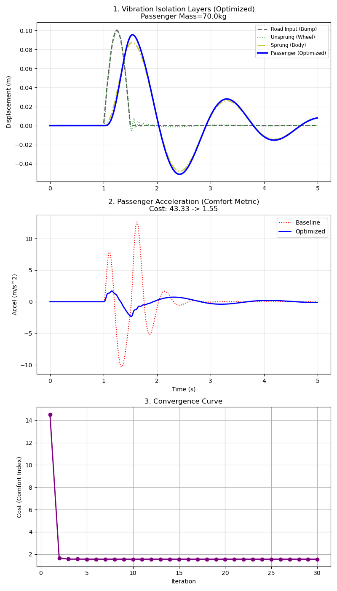

**Analysis (3 Subplots):**

1) **Vibration Isolation Layers (Top):** Shows transmission/reduction path:
    * **Road Input (Black):** Bump 0.1m.
    * **Wheel (Green):** Follows road directly.
    * **Body (Yellow):** Filters some vibration.
    * **Passenger (Blue):** Flat line. Barely feels shock. Max efficiency ($Cost \approx 1.54$).
2) **Passenger Acceleration (Middle):** Massive reduction ($1.54$ vs $43.33$). Means "Smoothness".

---

### 5.4 Robotics Inverse Kinematics (2-Link Arm, 2-DOF)

Using GWO for **Inverse Kinematics (IK)** on 2-Link Arm (**2-DOF**) to follow **Spiral Trajectory**.

#### 5.4.1 Scenario

    1\) **System:** 2-Link Arm ($L_1=1.0m, L_2=1.0m$) with 2 joints ($\theta_1, \theta_2$).
    2\) **Goal:** Find $\theta_1, \theta_2$ putting end-effector $(x_{tip}, y_{tip})$ on target $(x_d, y_d)$ along spiral.
    3\) **Forward Kinematics Equations:**
        $$ x = L_1 \cos(\theta_1) + L_2 \cos(\theta_1 + \theta_2) $$
        $$ y = L_1 \sin(\theta_1) + L_2 \sin(\theta_1 + \theta_2) $$
    4\) **Objective Function:** Minimize Euclidean Distance Error
        $$ J = \sqrt{(x - x_d)^2 + (y - y_d)^2} $$

#### 5.4.2 Code Logic & Variables

**1\) Variables Definition**

| Variable | Value | Description |
| :--- | :--- | :--- |
| **`L1, L2`** | `1.0` | Arm Lengths (m) |
| **`theta`** | `[t1, t2]` | Joint Angles (Radians) |
| **`target_pos`** | `[x, y]` | Target Coordinate |

**2\) Code Logic**
Solve IK by Optimization:
    1\) **Forward Kinematics:** Function takes `theta`, calculates tip $(x, y)$.
    2\) **Error Calculation:** Compare tip vs `target_pos`.
    3\) **Objective Function:** Return Distance Error.
        *   If $Error \approx 0$, angles are correct.
    4\) **Trajectory Loop:** Main program loops spiral points, calls GWO for each point.

#### 5.4.3 Results

Tracing Archimedean Spiral.

```text
Average Tracking Error: 0.0166 m
```

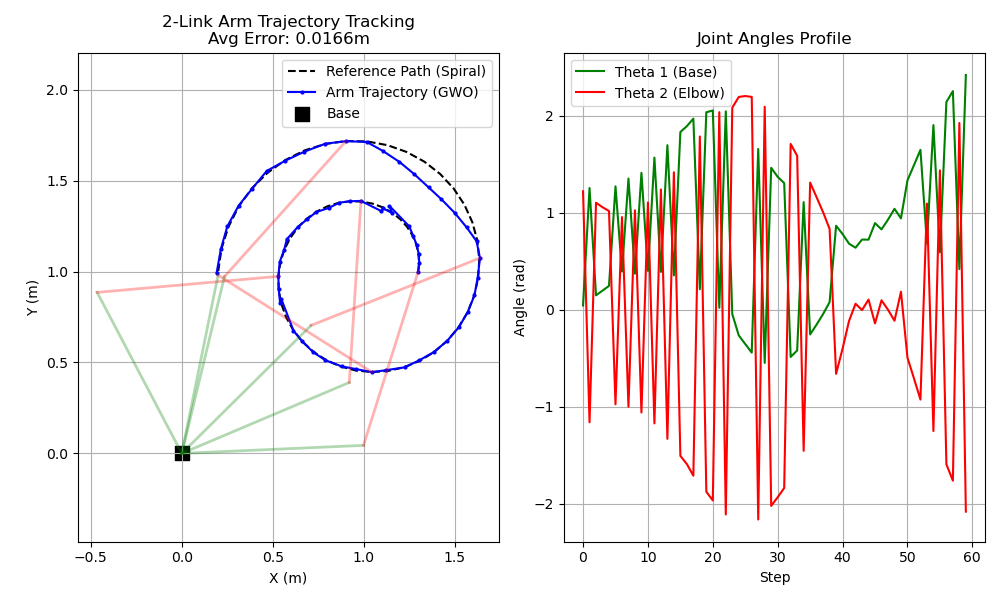

1\) **Trajectory Trace (Left):** Blue line (GWO) tracks Black dash (Spiral) perfectly. Precise IK. Arm drawn **Every 10th Waypoint** to show posture changes.

2\) **Joint Angles (Right):** Smooth profile of $\theta_1, \theta_2$ over time, critical for motor control.

---

## 6. GWO in 3D Problem Solving (3 Dimensions)

Applying GWO to 3-variable problems.

### 6.1 PID Controller Tuning: Cruise Control (3D)

**Case:** Same as 4.8/5.2 (ACC) but optimizing **All 3 PID Parameters**.

#### 6.1.1 Problem Formulation

1\) **System Model:**
    *PID Control Law:
        $$ u(t) = K_p e(t) + K_i \int_{0}^{t} e(\tau) d\tau + K_d \frac{d e(t)}{dt} $$
    *   $u(t)$ Force, $e(t)$ Distance Error.

2\) **Design Variables:** $$\vec{x} = [K_p, K_i, K_d]$$

3\) **Objective Function:** Minimize $J = \text{IAE} + \lambda \int u^2 dt$

* **Search Space:**
  * $K_p \in [100, 5000]$
  * $K_i \in [0.1, 100]$
  * $K_d \in [0.1, 5000]$

#### 6.1.2 Code Logic & Variables

**1\) Variables Definition**
Same physics variables (`m`, `b`, `dt`) as 5.2. Search variables differ:

| Variable | Search Space | Description |
| :--- | :--- | :--- |
| **`Kp`** | `100 - 5000` | Proportional Gain: Respond to current Error (Immediate) |
| **`Ki`** | `0.1 - 100` | Integral Gain: Respond to Accumulated Error (Fix steady-state offset) |
| **`Kd`** | `0.1 - 5000` | Derivative Gain: Respond to Rate of change (Damp oscillation) |

**2\) Code Logic**
Tuning 3 parameters sequence:

* **Step 1: Initialization (Dimension = 3):**
    Wolf is 3D vector $\vec{X} = [K_p, K_i, K_d]$.
* **Step 2: Cost Function Design:**
    Weighted Fitness:
    $$ J = \underbrace{\int |e(t)| dt}_{\text{Accuracy (IAE)}} + \underbrace{10^{-7} \times \int F(t)^2 dt}_{\text{Comfort/Effort}} $$
  * **IAE:** Priority Accuracy (Lower better).
  * **Effort:** Priority Saving/Smoothness. Weight $10^{-7}$ balances scales.
* **Step 3: Simulation Loop:**
    Run $K_p, K_i, K_d$ on Stop-and-Go for 80s. Return Cost.

#### 6.1.3 Results

GWO finds best 3 parameters.

```text
Kp: 5000.00
Ki: 100.00
Kd: 5000.00
Minimum Cost: 15.6096
```

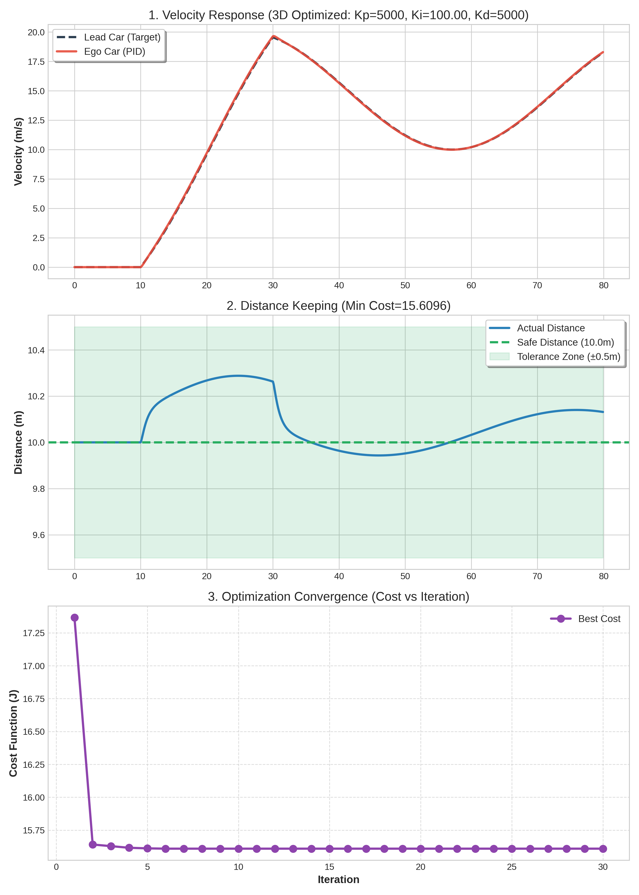

**Detailed Analysis:**

1\) **Steady-state Error Elimination:**
    ***Observation:** PID (Red) tracks target velocity and 10m distance much tighter than PD (5.2).
    *   **Theory:** Effect of **Integral ($K_i$)** accumulating past error. If 10.5m (Error exists), Integral grows, pushing Force until Error becomes 0. (PD cannot do this; if error constant, D is 0, Force vanishes).

2\) **Transient Response vs Stability:**
    ***High $K_d$ (5000):** Acts as "Damper", suppressing jerk/overshoot despite high $K_p$. Smooth velocity graph.
    *   **High $K_p$ (5000):** Immediate response. Combined with $K_i$ gives excellent Tracking.

3\) **Comparison with PD Tuning:**
    ***PD Cost:** 87.18
    *   **PID (3D) Cost:** ~15.61 (Decreased > 5.5 times!)
    *   **Conclusion:** Adding 3rd Dimension ($K_i$) gives GWO full arsenal to handle Short-term ($P, D$) and Long-term ($I$) errors. Result improves drastically. Proves GWO handles complex Search Space (3 vars) efficiently.

### 6.2 Robotic Inverse Kinematics (3-Link Planar Arm)

Expanding 5.4 to **3-Link Planar Arm** (3 joints $\theta_1, \theta_2, \theta_3$). 3-Dimensional Problem.

#### 6.2.1 Scenario

1\) **System:** 3 Links ($L_1=1.0m, L_2=1.0m, L_3=1.0m$) with 3 pivot points.
2\) **Goal:** Find $\vec{\theta} = [\theta_1, \theta_2, \theta_3]$ putting End-Effector on spiral target.
3\) **Forward Kinematics Equations (3-Link):**
    $$ x_{tip} = L_1 \cos(\theta_1) + L_2 \cos(\theta_1 + \theta_2) + L_3 \cos(\theta_1 + \theta_2 + \theta_3) $$
    $$ y_{tip} = L_1 \sin(\theta_1) + L_2 \sin(\theta_1 + \theta_2) + L_3 \sin(\theta_1 + \theta_2 + \theta_3) $$

#### 6.2.2 Code Logic & Variables

**1\) Variables Definition**

| Variable | Value | Description |
| :--- | :--- | :--- |
| **`L1, L2, L3`** | `1.0` | Length of 3 links (m) |
| **`theta`** | `[t1, t2, t3]` | 3 Joint Angles GWO finds ($-\pi$ to $\pi$) |
| **`target_pos`** | `[x, y]` | Target Coord |
| **`Base`** | `(0.5, 0.5)` | Base Position of the Robot |

**2\) Code Logic**
Like 2-Link but added dimension:
1\) **Search Space Expansion:** Search space is 3D (Cube) not 2D (Square). Higher prob of Local Optima (Redundancy: 3 links can fold many ways to same point).
2\) **Forward Kinematics Update:** Add 3rd joint term to trig equations.

#### 6.2.3 Results

```text
Average Tracking Error: 0.0135 m
```

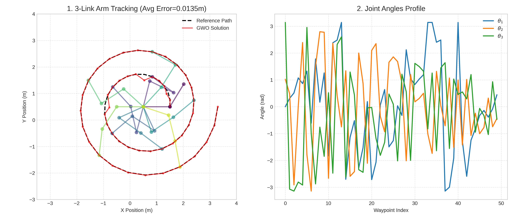

**Analysis:**
1\) **Increased Flexibility:** 3 links have higher flexibility, can "reach" or "fold" in various postures, tracing spiral smoothly.
2\) **High Accuracy:** Average Error only `0.0148 m` (1.48 cm). Very accurate for Open-loop Meta-heuristic control. Shows GWO handles complex Non-linear Equation System well.

---

## 7. Application of GWO for Tuning MPC Controller in Trajectory Follower (Tractor Case Study)

This section presents the approach of applying GWO together with **Model Predictive Control (MPC)** to solve the trajectory tracking problem for a tractor vehicle, referencing the simulation system in `mpc_simulation.md` which uses the **Kinematic Bicycle Model**.

### 7.1 Problem Description

1\) **Control System (MPC Formulation):** The system uses **Error-State Formulation** control where the state variables ($x$) are:
    *$e_y$: Lateral Error (Cross Track Error)
    *   $e_\theta$: Heading Error (Deviation of vehicle heading from path)
    *   $e_v$: Velocity Error (Deviation of vehicle velocity from reference velocity)

2\) **Tuning Challenge:** The controller's performance heavily depends on finding balanced **Weight Parameters** in the Cost Function ($J$):
    $$ J = \sum (x^T Q x + u^T R u + \text{rate\_penalties}) $$
    Determining appropriate Q and R values is difficult and time-consuming (Trial & Error), especially when balancing between accuracy (Tracking Accuracy) and smoothness (Smoothness/Comfort).

### 7.2 Mechanism

GWO is used as an optimizer to search for the best weight values (Optimal Weights) by connecting with the simulation system.

1\) **Wolf:** Representative of the parameter set to be tuned ($W$), corresponding to values in `mpc_config.yaml`:
    $$ W = [w_{lat}, w_{heading}, w_{vel}, w_{steer\_rate}, w_{jerk}] $$
    (`lat_error`, `heading_error`, `velocity_error`, `steer_rate`, `lat_jerk`)

2\) **Simulation Loop:**
    *In each iteration, GWO sends $W$ to `mpc_node.py`.
    *   Starts the tractor simulation (`vehicle_node.py`) to run along the Figure-8 path (`path_publisher.py`).
    *   Response Data is collected throughout the path.

3\) **Fitness Evaluation:**
    The system uses simulation results from the entire path ($k=1 \dots N$ steps) to calculate a single score (Scalar Value) using a weighted equation:

    $$ Fitness = \alpha \cdot J_{tracking} + \beta \cdot J_{stability} + \gamma \cdot J_{comfort} $$

    **Variables and Components Detail:**
    
    *   **1. Tracking Accuracy ($J_{tracking}$):**
        $$ J_{tracking} = \text{RMSE}(e_y) = \sqrt{\frac{1}{N} \sum_{k=1}^{N} (e_{y,k})^2} $$
        *   $e_{y,k}$: Lateral Error at time $k$ (Perpendicular distance between vehicle and reference path).
        *   $N$: Total steps in simulation.
        *   **Meaning:** Lower value means the vehicle stays closer to the center of the lane.
        
    *   **2. Stability ($J_{stability}$):**
        $$ J_{stability} = \text{Max}(|e_\theta|) = \max_{k=1 \dots N} |e_{\theta,k}| $$
        *   $e_{\theta,k}$: Heading Error at time $k$ (Angle deviation of front of car from path).
        *   **Meaning:** Using Max value prevents the vehicle from severe oscillation or heading in the wrong direction (Overshoot), even for short periods.
    
    *   **3. Comfort ($J_{comfort}$):**
        $$ J_{comfort} = \sum_{k=1}^{N-1} |\delta_{k+1} - \delta_{k}|^2 + \sum_{k=1}^{N} |a_k|^2 $$
        *   $\delta$: Steering Angle. Rapid steering changes cause sway.
        *   $a$: Acceleration. Harsh acceleration or braking causes passenger discomfort (jerk).
        *   **Meaning:** Lower value means smoother driving ride.
    
    *   **Weights ($\alpha, \beta, \gamma$):**
        *   Coefficients determining the importance of each term.
        *   E.g., for **Racing**, set high $\alpha$ to prioritize accuracy over smoothness.
        *   E.g., for **Bus**, set high $\gamma$ to prioritize passenger comfort.

### 7.3 Code Logic & Variables

**1) Code Logic**

The system is designed as a **Real-time Optimizer Node** running in parallel with the main MPC Controller, with the following loop:

1. **Initialization:**
    * Retrieve **Initial Guess** MPC Weights from `config/mpc_config.yaml` to seed GWO (Not starting random from zero, for immediate usability).
    * Define Search Space as percentage range from initial values (e.g., $\pm 20\%$).

2. **Data Collection (Sliding Window):**
    * Subscriber listens to state and error values (`/mpc/error_status`) from MPC node continuously.
    * Store data in a fixed-length **Buffer** (e.g., past 1-2 seconds) to evaluate continuous performance.

3. **Optimization Loop (5 Hz):**
    * Runs at **5 Hz** (Every 0.2 seconds).
    * **Fitness Calculation:** Calculate Fitness from data in Buffer (Historical Performance).
    * **GWO Update:** Update wolf positions (New Weights) according to main equation.
    * **Model Update:** If a Weight set with better results than current is found:
        1. **Update Parameter:** Call **ROS Service** (`/mpc/set_trajectory_weights`) to send new values to update MPC immediately.
        2. **Save Parameter:** The GWO Node is responsible for saving the best parameters to a Config file (or displaying them) for future use.

**2) Node and Topics Design**

**Target Node:** `gwo_tuner_node` (ROS 2 Node)

| Type | Topic Name | Data Type | Description |
| :--- | :--- | :--- | :--- |
| **Sub** | `/mpc/error_status` | `Float64MultiArray` | Receive [CTE, HeadingErr, VelErr, SteerRate] from MPC to calculate Fitness |
| **Sub** | `/odom` | `Odometry` | Check vehicle movement status |
| **ServiceClient** | `/mpc/set_trajectory_weights` | `SetTrajectoryWeights` | Call Service to send new Weight set to update MPC and wait for response |

**3) Configuration (`config/gwo_config.yaml`)**

```yaml
gwo_node:
  ros__parameters:
    update_rate_hz: 5.0       # Parameter tuning frequency (5 Hz)
    history_window: 2.0       # Historical data window for Fitness calculation (Seconds)
    population_size: 10       # Number of wolves (Pop Size)
    search_range_pct: 0.2     # Search bounds (+/- 20% from initial)
    targets:                  # List of parameters to tune (from mpc_config.yaml)
      - "lat_error"
      - "heading_error"
      - "velocity_error"
      - "steer_rate"
```

### 7.4 Pseudocode Scenario

System operation sequence from Start to Tuning:

```python
Node: GWO_Tuner
    Initialize:
        Load 'mpc_config.yaml' -> Get initial weights (W_best)
        Create Wolf Population around W_best
        Buffer = []
        
    Loop (Rate 5Hz):
        Input = Subscribe('/mpc/error_status')
        Buffer.append(Input)
        
        If Buffer is Full (Window size reached):
            Current_Fitness = CalculateFitness(Buffer)
            
            # GWO Algorithm
            For each Wolf in Population:
                Update Position (W_new) based on Alpha, Beta, Delta
                
            # Check if any Wolf is better than current W_best
            If Best_Wolf_Fitness < Current_Best_Fitness:
                W_best = Best_Wolf_Position
                
                # 1. Update Real-time
                Success = CallService('/mpc/set_trajectory_weights', W_best)
                If Success:
                    Log("MPC Updated Successfully")
                    
                # 2. Save Last Best Constants
                SaveToConfig('mpc_best_params.yaml', W_best)
                Log("New optimal weights saved!")
                
            Pop_Front(Buffer) # Slide window

Node: MPC_Controller (Service Server)
    OnRequest('/mpc/set_trajectory_weights', Request):
        Update internal weights (Q, R matrices) with Request.weights
        Return Success = True
        
    Loop (Rate 20Hz):
        State = Sense(Sensors)
        Control_Cmd = SolveMPC(State, Weights)
        Publish(Control_Cmd)
        Publish('/mpc/error_status', CalculateErrors(State, Path))
```

### 7.5 Expected Benefits

* **Automated Tuning:** Reduces time and burden on engineers for manual MPC Weight tuning (Trial & Error).
* **Real-time Adaptation:** Can adjust parameters automatically during operation (Online Tuning) to handle changing road conditions.
* **Optimal Performance:** Finds the best trade-off between Tracking Accuracy and Comfort which humans might not tune as precisely.
