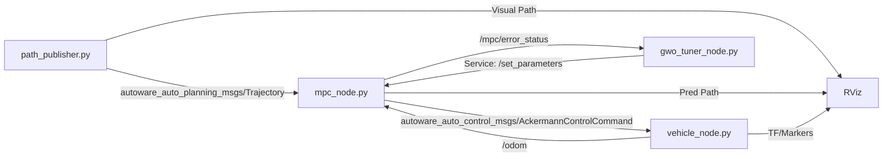

# MPC Simulation Documentation

## 1. Working Principle (หลักการทำงาน)

The simulation implements a **Model Predictive Control (MPC)** system for a tractor vehicle based on the **Kinematic Bicycle Model**. It uses a coupled **Lateral and Longitudinal Error-State Formulation** in the Frenet Frame.

### Component Diagram



The simulation uses a modular **Multi-Node Architecture**:

1. **Path Publisher**: Reads CSV and broadcasts the global reference path.
2. **MPC Controller**: Pure control node. Receives odometry and reference, outputs steering/acceleration commands.
3. **Vehicle Plant**: Simulates physical dynamics. Receives commands and publishes the resulting vehicle state (Odom/TF).
4. **GWO Tuner**: (Optional) Real-time optimizer. Monitors control performance and tunes MPC weights on-the-fly via ROS 2 Service.

### 1.1 Vehicle Plant (Simulation)

The vehicle dynamics are simulated using the non-linear kinematic bicycle equations:

- **State**: $x, y, \theta$ (Pose), $v$ (Velocity).
- **Input**: $\delta$ (Steering Angle), $a$ (Acceleration).
- **Update**:
  $$
  \begin{aligned}
  \dot{x} &= v \cos(\theta) \\
  \dot{y} &= v \sin(\theta) \\
  \dot{\theta} &= \frac{v \tan(\delta)}{L} \\
  \dot{v} &= a
  \end{aligned}
  $$

### 1.2 MPC Controller (Error-State)

**Source Code**: `mpc_node.py`

The controller minimizes errors relative to a **Reference Path** loaded from a CSV file.

- **State Vector ($x$)**: $[e_y, e_\theta, e_v]$
  - $e_y$: Lateral error (Cross-track error).
  - $e_\theta$: Heading error.
  - $e_v$: Velocity error ($v - v_{ref}$).
- **Input Vector ($u$)**: $[\Delta \delta, a]$
  - $\Delta \delta$: Steering angle correction ($\delta = \delta_{ref} + \Delta \delta$).
  - $a$: Acceleration command.

The MPC solves a Quadratic Programming (QP) problem to minimize a cost function that includes state errors, input magnitudes, and input rates (for smoothness):
$$ J = \sum_{k=0}^{N} (x_k^T Q x_k + u_k^T R u_k + \text{rate\_penalties}) $$

---

## 2. Configuration (`config/mpc_config.yaml`)

### 2.1 System & Environment

| Parameter | Default | Unit | Description |
| :--- | :--- | :--- | :--- |
| `dt` | 0.1 | s | **Cycle Time**: The internal loop rate for simulation update and control calculation. |
| `traj_resample_dist` | 0.1 | m | **Path Resolution**: Distance between points in the interpolated reference path. Lower = smoother. |
| `use_steer_prediction` | `false` | - | **Delay Compensation**: Predicts the next steering state based on current rate to reduce lag. |
| `use_delayed_initial_state` | `false` | - | **Control Lag Proxy**: Starts MPC optimization from a predicted future state. |
| `control_cmd_topic` | `"/mpc/control_cmd"` | - | **Signal Path**: Topic used to send [steering, acceleration] from Controller to Vehicle. |

### 2.2 Vehicle Physical Dimensions

| Parameter | Default | Unit | Description |
| :--- | :--- | :--- | :--- |
| `wheelbase` | 2.5 | m | **Axle Distance ($L$)**: Crucial for turning radius calculations ($R = L/\tan(\delta)$). |
| `track_width` | 1.2 | m | **Tread**: Lateral distance between wheels. Affects visual model and stability. |
| `max_steer` | 0.6 | rad | **Steering Lock**: Hard physical limit of the front wheel steering angle. |
| `max_accel` | 2.0 | m/s² | **Tractor Force**: Peak acceleration/deceleration capability of the drivetrain. |
| `wheel_radius` | 0.4 | m | **Tire Size**: Used for calculating wheel rotation speed and visual rendering. |
| `chassis_length` | 3.5 | m | **Bounding Box (X)**: Length of the vehicle body for visualization. |
| `chassis_width` | 1.6 | m | **Bounding Box (Y)**: Width of the vehicle body for visualization. |
| `chassis_height` | 1.0 | m | **Bounding Box (Z)**: Height of the vehicle body for visualization. |

### 2.3 MPC Optimization Weights

| Category | Parameter | Default | Unit/Type | Description |
| :--- | :--- | :--- | :--- | :--- |
| **Horizon** | `prediction_horizon` | 20 | steps | **Look-ahead ($N$)**: How many steps into the future the MPC optimizes. |
| | `prediction_dt` | 0.1 | s | **Time Step**: Time interval between each predicted step in the horizon. |
| | `min_prediction_length` | 5.0 | m | **Adaptive Horizon**: Ensures minimum distance coverage regardless of speed. |
| **Errors** | `lat_error` | 10.0 | Weight | **Tracking Accuracy**: Penalty for cross-track error. Higher weights track tighter. |
| | `heading_error` | 1.0 | Weight | **Directional Penalty**: Ensures vehicle orientation aligns with reference path. |
| | `velocity_error` | 1.0 | Weight | **Speed Control**: Penalty for deviation from the reference velocity. |
| **Smoothness** | `steer_rate` | 1.0 | Weight | **Agility Constraint**: Penalizes fast steering movement. Higher = slower turns. |
| | `steer_acc` | 0.1 | Weight | **Actuator Protection**: Limits steering acceleration to protect mechanical parts. |
| | `lat_jerk` | 0.1 | Weight | **Passenger Comfort**: Penalty for rapid changes in lateral force. |
| **Inputs** | `steering_input` | 0.1 | Weight | **Effort Penalty**: Minimizes unnecessary steering to stay close to zero if possible. |
| | `acceleration_input` | 0.05 | Weight | **Energy Efficiency**: Penalizes heavy throttle or brake usage. |
| **Hard Limit** | `acceleration_limit` | 2.0 | m/s² | **Safety Cap**: The maximum command the MPC is allowed to output. |

### 2.4 Topics & Identification

| Parameter | Default | Description |
| :--- | :--- | :--- |
| `reference_path_file` | `"paths/figure8.csv"` | **Trajectory Source**: The CSV file read by `path_publisher.py` to create the path. |
| `ref_traj_topic` | `"/mpc/reference_traj"` | **Communication**: The base name for topics used to share path data between nodes. |

### 2.5 Debug Configuration

General logging and visualization settings used for debugging simulation behavior and MPC performance.

### 2.6 GWO Configuration (`config/gwo_config.yaml`)

Configuration for the Grey Wolf Optimizer node.

| Parameter | Default | Unit | Description |
| :--- | :--- | :--- | :--- |
| `update_rate_hz` | 5.0 | Hz | **Tuning Frequency**: How often the GWO loop runs. |
| `history_window` | 2.0 | s | **Evaluation Window**: Duration of data buffer used to calculate fitness. |
| `population_size` | 10 | - | **Agents**: Number of "wolves" in the search space. |
| `targets` | List | - | **Tuning Targets**: Names of MPC weights to optimize (e.g., `lat_error`). |

---

## 3. Reference Path & Publisher

### 3.1 Path Generation (`generate_path.py`)

- Generates a Figure-8 trajectory.
- Saves to `paths/figure8.csv` (Format: `x, y, theta, v, kappa`).

### 3.2 Path Publisher (`path_publisher.py`)

- Reads the CSV file and publishes the trajectory periodically.
- **Topics**:
  - `/mpc/reference_traj`: `nav_msgs/Path` for RViz.
  - `/mpc/reference_traj_data`: `Float64MultiArray` for the controller.

---

## 4. ROS 2 Topics

### Publishers (Outputs)

| Topic Name | Publisher | Type | Description |
| :--- | :--- | :--- | :--- |
| `/odom` | `vehicle_node.py` | `nav_msgs/Odometry` | Current simulated vehicle state (Ground Truth). |
| `/mpc/control_cmd` | `mpc_node.py` | `autoware_auto_control_msgs/AckermannControlCommand` | Standard Autoware control. |
| `/vehicle/status/steering_status` | `vehicle_node.py` | `autoware_auto_vehicle_msgs/SteeringReport` | Current steering telemetry. |
| `/vehicle/status/velocity_status` | `vehicle_node.py` | `autoware_auto_vehicle_msgs/VelocityReport` | Current velocity telemetry. |
| `/mpc/reference_traj` | `path_publisher.py` | `autoware_auto_planning_msgs/Trajectory` | Reference path for visualization. |
| `/reference_path` | `mpc_node.py` | `nav_msgs/Path` | Reference path segments processed by the MPC. |
| `/predicted_trajectory` | `mpc_node.py` | `nav_msgs/Path` | The optimal future path planned by the MPC. |
| `/vehicle_marker` | `vehicle_node.py` | `visualization_msgs/MarkerArray` | 3D Visualization models of the tractor. |
| `/mpc/debug_target` | `mpc_node.py` | `visualization_msgs/Marker` | Red target point the MPC is currently tracking. |

### Subscribers (Inputs)

| Topic Name | Subscriber | Type | Description |
| :--- | :--- | :--- | :--- |
| `/odom` | `mpc_node.py` | `nav_msgs/Odometry` | Feedback for the controller. |
| `/mpc/control_cmd` | `vehicle_node.py` | `autoware_auto_control_msgs/AckermannControlCommand` | Input for the vehicle simulation. |
| `/mpc/reference_traj_data` | `mpc_node.py` | `autoware_auto_planning_msgs/Trajectory` | Standard trajectory data format. |
| `/initialpose` | `vehicle_node.py` | `geometry_msgs/PoseWithCovarianceStamped` | Resets the simulated vehicle position. |

---

## 5. How to Run

1. **Terminal 1: Path Publisher**

   ```bash
   python3 path_publisher.py
   ```

2. **Terminal 2: Vehicle Plant (Simulator)**

   ```bash
   python3 vehicle_node.py
   ```

3. **Terminal 3: MPC Controller**

   ```bash
   python3 mpc_node.py
   ```

4. **Terminal 4: RViz2 Visualization**

   ```bash
   rviz2 -d mpc_config.rviz
   ```

> [!TIP]
> Use the **"2D Pose Estimate"** tool in RViz to click and drag on the map. This will reset the vehicle in `vehicle_node.py` to that specific location and orientation.

1. **Terminal 5: GWO Tuner (Optional)**

   To enable real-time adaptive tuning:

   ```bash
   # Make sure to enable tuning in MPC Node if required, or GWO will handle it check
   ros2 run mpc_controller gwo_tuner_node
   ```

   *Note: Ensure `enable_gwo_tuning` parameter is set to `True` in `mpc_node` or passed via launch arguments if implemented.*
