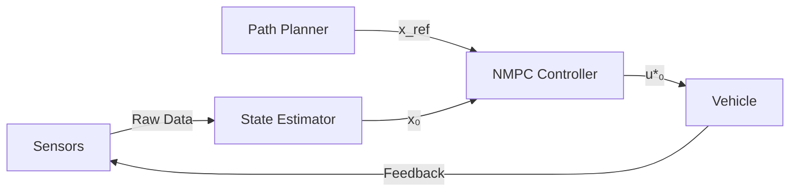
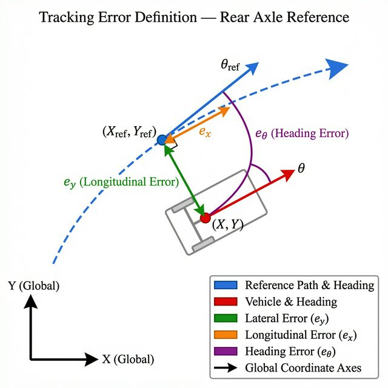

# หลักการทำงานของ NMPC (Nonlinear Model Predictive Control)

---

## 1. Overview

**Nonlinear Model Predictive Control (NMPC)** คือระบบควบคุมแบบทำนายล่วงหน้าที่ใช้ **แบบจำลองทางคณิตศาสตร์ที่เป็นสมการไม่เชิงเส้น (Nonlinear Model)** ในการคำนวณค่าการควบคุมที่เหมาะสมที่สุด (Optimal Control) เพื่อให้ระบบทำงานได้ตามเป้าหมายภายใต้ข้อจำกัดต่างๆ

### 1.1 ทำไมต้องใช้ NMPC? (Why Nonlinear?)

ในระบบ MPC แบบดั้งเดิม (Linear MPC) มักใช้แบบจำลองเส้นตรง ($\dot{x} = Ax + Bu$) แต่ในความเป็นจริง **ระบบยานพาหนะมีความเป็น Nonlinear สูง**:

* **Vehicle Dynamics:** ความสัมพันธ์ระหว่างมุมล้อกับทิศทางรถมีฟังก์ชันตรีโกณมิติ ($\sin, \cos, \tan$) เกี่ยวข้องตลอดเวลา
* **Tire Physics:** แรงยึดเกาะถนน (Tire curve) ไม่แปรผันตรงกับมุมเลี้ยว โดยเฉพาะที่ความเร็วสูงหรือถนนลื่น
* **High Speed:** เมื่อรถวิ่งเร็ว พฤติกรรมรถจะซับซ้อนขึ้นจน Linear Model รับมือไม่ไหว

**NMPC** แก้ปัญหานี้โดยใช้สมการจริงของระบบ (Nonlinear Equations) ในการคำนวณโดยตรง ทำให้ควบคุมได้แม่นยำกว่ามากในสถานการณ์จริง

### 1.2 ขั้นตอนการทำงาน (Working Principle)

กระบวนการทำงานของ NMPC ในแต่ละรอบเวลาควบคุม (Control Loop):

#### 1.2.1 การวัดสถานะและทำนายอนาคต

1) ระบบรับค่าสถานะปัจจุบัน $x_0$ จากเซนเซอร์ (GPS/Lidar → ตำแหน่ง, IMU → มุมหัน, Canbus → ความเร็ว)
2) ใช้ **Nonlinear System Model** $x_{k+1} = f(x_k, u_k)$ จำลองเหตุการณ์ล่วงหน้า $N$ ก้าว (Prediction Horizon)
3) ลองใส่ค่า Input ต่างๆ (มุมพวงมาลัย, คันเร่ง) เพื่อดูว่ารถจะวิ่งไปทางไหนในอนาคต

#### 1.2.2 การหาค่าที่เหมาะสม (Optimization)

ระบบหาชุด Input ($u_0, u_1, \ldots, u_{N-1}$) ที่ทำให้ **Cost Function ($J$)** ต่ำที่สุด ประกอบด้วย:

1) **Tracking Error** — ความคลาดเคลื่อนจากเส้นทางที่วางไว้
2) **Control Effort** — ปริมาณการใช้ Input (ไม่หักพวงมาลัยรุนแรง)
3) **Smoothness** — ความนิ่มนวลในการเปลี่ยน Input

ภายใต้ **Constraints** ได้แก่ ขอบถนน, Actuator Limits ($\delta_{min} \le \delta \le \delta_{max}$) และขีดจำกัดความเร็ว/อัตราเร่ง

#### 1.2.3 การแก้สมการและสั่งการ (Solve & Execute)

1) แก้ปัญหา **Nonlinear Programming (NLP)** ด้วยวิธี SQP หรือ Interior Point
2) ดึงเฉพาะ **$u^*_0$** (ค่าแรก) ส่งไปควบคุมรถจริง
3) วนลูปใหม่ในรอบถัดไป (**Receding Horizon**) เพื่อตอบสนองต่อสิ่งรบกวนได้ทันท่วงที

### 1.3 สรุปข้อดี-ข้อเสีย

| หัวข้อ | NMPC (Nonlinear) | Linear MPC |
| :--- | :--- | :--- |
| **ความแม่นยำ** | **สูงมาก** (ความเร็วสูง/มุมเลี้ยวเยอะ) | ปานกลาง (ดีที่ความเร็วต่ำ/ทางตรง) |
| **การคำนวณ** | **หนักหน่วง (High Computational Cost)** | เบาและรวดเร็ว (Low Cost) |
| **ความยากในการจูน** | ยาก (โมเดลซับซ้อน) | ง่ายกว่า |
| **ความเสถียร** | อาจติดที่ Local Minima ถ้าจูนไม่ดี | การันตี Global Optimum (Convex Problem) |

> **สรุป:** NMPC คือการขับรถโดย "จินตนาการ" ล่วงหน้าด้วยสมการฟิสิกส์จริงๆ ว่าถ้าหักพวงมาลัยเท่านี้รถจะไปอยู่ที่ไหน แล้วเลือกวิธีที่ให้รถเกาะเส้นทางดีที่สุดภายใต้ข้อจำกัดจริง

---

## 2. System Architecture

ระบบ NMPC สำหรับการควบคุมยานพาหนะประกอบด้วยโมดูลหลักที่ทำงานร่วมกันดังแผนภาพ:

```text
┌─────────────────────────────────────────────────────────────────┐
│                     NMPC System Architecture                    │
│                                                                 │
│  ┌──────────────┐    ┌───────────────┐    ┌──────────────────┐  │
│  │   Sensors /  │    │    State      │    │  Reference Path  │  │
│  │ Localization │───▶│   Estimator   │    │   (Waypoints)    │  │
│  └──────────────┘    └───────┬───────┘    └────────┬─────────┘  │
│                              │ x₀                  │ x_ref      │
│                              ▼                     ▼            │
│                    ┌─────────────────────────────────────────┐  │
│                    │           NMPC Controller               │  │
│                    │  ┌──────────┐  ┌──────────────────────┐ │  │
│                    │  │Prediction│  │    NLP Optimizer     │ │  │
│                    │  │ Model    │◀─│  (IPOPT / SQP / RTI) │ │  │
│                    │  │ f(x,u)   │  │                      │ │  │
│                    │  └──────────┘  └──────────────────────┘ │  │
│                    │       Cost Function J(x,u)              │  │
│                    │       Constraints: bounds on u, x       │  │
│                    └─────────────────────┬───────────────────┘  │
│                                          │ u*₀                  │
│                                          ▼                      │
│                              ┌───────────────────┐              │
│                              │  Vehicle / Plant  │              │
│                              │   (Actuators)     │              │
│                              └─────────┬─────────┘              │
│                                        │ Feedback               │
│                                        └──────────────▶ Sensors │
└─────────────────────────────────────────────────────────────────┘
```

### 2.1 โมดูลหลักของระบบ

| โมดูล | หน้าที่ |
| :--- | :--- |
| **Sensors / Localization** | รับข้อมูล ตำแหน่ง, ความเร็ว, มุมหัน จาก GPS, LiDAR, IMU |
| **State Estimator** | Fuse ข้อมูลจาก Sensor เพื่อให้ได้สถานะ $x_0$ ที่แม่นยำ |
| **Reference Path** | เส้นทางเป้าหมาย (Waypoints) จาก Path Planning Module |
| **Prediction Model** | สมการ Nonlinear $f(x,u)$ สำหรับทำนายอนาคต |
| **NLP Optimizer** | แก้ Optimization เช่น IPOPT, qpOASES, ACADO |
| **Vehicle / Plant** | ยานพาหนะจริงหรือ Simulator รับ Control Input และส่ง Feedback |

### 2.2 การไหลของข้อมูล (Data Flow)



1) **Sensors** ส่งข้อมูลดิบให้ **State Estimator** คำนวณสถานะปัจจุบัน $x_0$
2) **Path Planner** กำหนด Reference Trajectory $x_{ref}$ ตาม Waypoints
3) **NMPC Controller** รับ $x_0$ และ $x_{ref}$ แล้วแก้ปัญหา Optimization
4) **Control Input** $u^*_0$ ถูกส่งไปยังยานพาหนะ
5) ยานพาหนะตอบสนองและส่ง Feedback กลับเป็นวงปิด (Closed-loop)

### 2.3 การ Implement บน ROS 2

ในงานวิจัยนี้ระบบ NMPC ถูก Implement บน **ROS 2 (Robot Operating System 2)** ซึ่งเป็น Middleware มาตรฐานสำหรับระบบ Robotics และยานพาหนะอัตโนมัติ ROS 2 ถูกเลือกใช้เพราะรองรับการสื่อสารแบบ Pub/Sub ระหว่าง Node ที่ทำงานแบบ Parallel ได้อย่างมีประสิทธิภาพ รองรับ Real-time execution และมีระบบ Message Type มาตรฐาน (เช่น Autoware Messages) ที่ใช้ร่วมกับระบบ Autonomous Driving อื่นๆ ได้

สถาปัตยกรรมของระบบแบ่งออกเป็น 3 Node หลัก ซึ่งสื่อสารกันผ่าน ROS 2 Topic:

| Node | Role | Topic (Subscribe) | Topic (Publish) |
| :--- | :--- | :--- | :--- |
| `path_publisher` | Path Planning | — | `/planning/trajectory` |
| `mpc_node` | NMPC Controller | `/planning/trajectory`, `/vehicle/state` | `/control/command/control_cmd` |
| `vehicle_node` | Vehicle Simulator | `/control/command/control_cmd` | `/vehicle/state` |

---

## 3. NMPC Algorithm Formulation

### 3.1 Vehicle Kinematic Model (Bicycle Model)

**Kinematic Bicycle Model** เป็นแบบจำลองที่ลดความซับซ้อนของยานพาหนะ 4 ล้อให้เหลือเป็น "จักรยาน" 2 ล้อ (ล้อหน้าและล้อหลัง) โดยมีสมมติฐานหลักดังนี้:

1) ความเร็วไม่สูงมากจน Tire Slip มีนัยสำคัญ (ไม่มีการลื่นของล้อ — **No-Slip Condition**)
2) ยานพาหนะเป็น Rigid Body — ไม่มีการแอ่นตัวหรือ Roll
3) ล้อซ้าย-ขวาข้างเดียวกันมีพฤติกรรมเหมือนกัน (รวมเป็น 1 ล้อสมมติ)

#### 3.1.1 Design Center และรูปแบบ Model

**ตำแหน่ง Design Center (Reference Point)** กำหนดไว้ที่ **จุดกึ่งกลางเพลาล้อหลัง (Rear Axle Center)** ซึ่งเป็นแนวทางมาตรฐานของ Kinematic Bicycle Model เพราะทำให้สมการเคลื่อนที่มีรูปแบบเรียบง่าย:

```text
                        δ (Steering angle)
                       /
              ┌───────/───┐   ← Front wheel
              │      /    │
              └─────/─────┘
                   /
      L (Wheelbase)
                   │
              ┌────┴────┐       ← Rear wheel (Reference Point)
              │  (X,Y)  │         State (X, Y, θ) defined here
              └─────────┘
                   │
                   θ (Heading angle from X-axis)
```

**ข้อดีของการกำหนด Reference Point ที่เพลาหลัง:**

* สมการ $\dot{X} = v\cos\theta$, $\dot{Y} = v\sin\theta$ เป็น Pure Kinematic ไม่ต้องอาศัย Steering angle เพิ่ม
* อัตราการหมุน $\dot{\theta}$ ขึ้นอยู่กับ $\delta$ และ $L$ เพียงอย่างเดียว
* ลด Nonlinearity ในสมการ (ไม่ต้องพจน์ slip angle เพิ่มเติม)

> **หากกำหนด Reference Point ที่เพลาหน้า** สมการจะซับซ้อนขึ้น เนื่องจากต้องคำนึงถึงมุม $\delta$ ในทุก term ของ $\dot{X}$, $\dot{Y}$

**State Vector** $x \in \mathbb{R}^4$ (นิยามที่จุดกึ่งกลางเพลาหลัง):

| ตัวแปร | ความหมาย | หน่วย |
| :--- | :--- | :--- |
| $X$ | ตำแหน่งแกน X ใน Global Frame | m |
| $Y$ | ตำแหน่งแกน Y ใน Global Frame | m |
| $\theta$ | มุมหัวรถจากแกน X (Heading Angle) | rad |
| $v$ | ความเร็วที่เพลาหลัง | m/s |

**Control Input** $u \in \mathbb{R}^2$:

| ตัวแปร | ความหมาย | หน่วย |
| :--- | :--- | :--- |
| $\delta$ | มุมพวงมาลัยล้อหน้า (Steering Angle) | rad |
| $a$ | อัตราเร่ง/เบรก (Longitudinal Acceleration) | m/s² |

โดย $L$ คือระยะฐานล้อ (Wheelbase) [m]

---

**Forward Kinematics (สมการเคลื่อนที่ต่อเนื่อง):**

$$
\dot{x} = f(x, u) =
\begin{bmatrix} \dot{X} \\ \dot{Y} \\ \dot{\theta} \\ \dot{v} \end{bmatrix}
=
\begin{bmatrix} v \cos\theta \\ v \sin\theta \\ \dfrac{v \tan\delta}{L} \\ a \end{bmatrix}
$$

สมการของ $\dot{\theta} = \dfrac{v \tan\delta}{L}$ มาจากการที่รัศมีการเลี้ยว $R = \dfrac{L}{\tan\delta}$ และ $\dot{\theta} = \dfrac{v}{R}$

---

**Equation of Motion — Matrix Form:**

เขียนในรูป Affine Nonlinear System:

$$
\dot{x} = f_1(x) + f_2(x)\, u
$$

$$
\underbrace{\begin{bmatrix} \dot{X} \\ \dot{Y} \\ \dot{\theta} \\ \dot{v} \end{bmatrix}}_{\dot{x}}
=
\underbrace{\begin{bmatrix} v\cos\theta \\ v\sin\theta \\ 0 \\ 0 \end{bmatrix}}_{f_1(x)}
+
\underbrace{\begin{bmatrix} 0 & 0 \\ 0 & 0 \\ \frac{v}{L\cos^2\delta} & 0 \\ 0 & 1 \end{bmatrix}}_{f_2(x,u)}
\underbrace{\begin{bmatrix} \delta \\ a \end{bmatrix}}_{u}
$$

> **หมายเหตุ:** ในทางปฏิบัติมักเขียนเป็น Nonlinear ODE โดยตรง และ Linearize รอบจุด Trajectory ในแต่ละก้าวเวลา เพื่อใช้ใน SQP Solver

---

**Reverse Kinematics (การถอย / เดินหลัง):**

Kinematic Bicycle Model รองรับการเดินถอยหลัง (Reverse Motion) ได้โดยตรง เพียงให้ $v < 0$ สมการยังคงรูปแบบเดิมทุกประการ:

$$
\dot{x} = \begin{bmatrix} v\cos\theta \\ v\sin\theta \\ \dfrac{v\tan\delta}{L} \\ a \end{bmatrix}, \quad v < 0
$$

ผลที่เกิดขึ้นเมื่อ $v < 0$:

1) $\dot{X}, \dot{Y}$: รถเคลื่อนที่ในทิศ **ตรงข้าม** กับ Heading angle $\theta$
2) $\dot{\theta}$: รถเลี้ยวในทิศ **สลับกัน** เมื่อเทียบกับการเดินหน้า (เช่น หักซ้ายแต่หัวรถหันขวา ซึ่งเป็นพฤติกรรมปกติของการถอยหลัง)
3) Constraints ของ $v$ ต้องรวม $v_{min} < 0$ ด้วย

**Inverse Kinematics** — จาก State Trajectory ที่ต้องการ หา Control Input ที่สอดคล้อง:

$$
\delta = \arctan\!\left(\frac{L\,\dot{\theta}}{v}\right), \quad a = \dot{v}
$$

ใช้สำหรับสร้าง Initial Guess (Warm-start) ให้ Optimizer ก่อนเริ่มแก้ NLP

### 3.2 Optimal Control Problem (OCP)

NMPC แก้ปัญหา Optimal Control Problem ในรูปแบบ:

$$
\min_{u_0, \ldots, u_{N-1}} \quad J = \sum_{k=0}^{N-1} \ell(x_k, u_k) + V_f(x_N)
$$

สมการ Discrete-Time ที่ใช้ทำนาย (Euler / RK4):

$$
x_{k+1} = x_k + \Delta t \cdot f(x_k, u_k), \quad k = 0, 1, \ldots, N-1
$$

#### 3.2.1 Cost Function

**Stage Cost** $\ell(x_k, u_k)$:

$$
\ell(x_k, u_k) = (x_k - x^{ref}_k)^T Q (x_k - x^{ref}_k) + u_k^T R\, u_k + \Delta u_k^T R_d \Delta u_k
$$

**Terminal Cost** $V_f(x_N)$:

$$
V_f(x_N) = (x_N - x^{ref}_N)^T P (x_N - x^{ref}_N)
$$

| Matrix | Dimension | ความหมาย |
| :--- | :--- | :--- |
| $Q$ | $4 \times 4$ | น้ำหนัก State Tracking Error |
| $R$ | $2 \times 2$ | น้ำหนัก Control Effort |
| $R_d$ | $2 \times 2$ | น้ำหนัก Rate of Change (Smoothness) |
| $P$ | $4 \times 4$ | น้ำหนัก Terminal State |

#### 3.2.2 Constraints และ Full NLP Formulation

**ทำไมถึงกลายเป็นปัญหา NLP?**

ลองพิจารณาว่าเราต้องการทำอะไร: หาชุด Input $U = [u_0, \ldots, u_{N-1}]$ ที่ทำให้ Cost Function $J$ ต่ำที่สุด โดยมีเงื่อนไขว่า State ต้องไปตามสมการ $x_{k+1} = f(x_k, u_k)$ และไม่ละเมิด Constraints ต่างๆ

นี่คือโครงสร้างของปัญหา **Mathematical Programming** ทั่วไป รูปแบบ:

$$
\min_z \; \phi(z) \quad \text{subject to} \quad g(z) \le 0,\; h(z) = 0
$$

| ถ้า $\phi$, $g$, $h$ เป็น... | ประเภทของปัญหา | วิธีแก้ |
| :--- | :--- | :--- |
| Linear ทั้งหมด | **LP** (Linear Program) | Simplex, Interior Point |
| Quadratic + Linear | **QP** (Quadratic Program) | qpOASES, OSQP |
| มี Nonlinear อย่างน้อย 1 ตัว | **NLP** (Nonlinear Program) | IPOPT, SQP, ACADO |

ใน NMPC สมการพลวัต $x_{k+1} = f(x_k, u_k)$ **เป็น Nonlinear** (มี $\sin\theta$, $\cos\theta$, $\tan\delta$) ทำให้ Equality Constraint กลายเป็น Nonlinear Function ดังนั้นปัญหาทั้งหมด **บังคับต้องแก้เป็น NLP**

---

#### NLP คืออะไร? (Nonlinear Programming)

**Nonlinear Programming (NLP)** คือสาขาของ Mathematical Optimization ที่เกิดขึ้นในช่วงทศวรรษ 1950-1960 เมื่อนักคณิตศาสตร์พบว่า ปัญหาในโลกจริงส่วนใหญ่ไม่เป็น Linear ทำให้ต้องพัฒนาวิธีแก้ปัญหาใหม่ที่รองรับ Nonlinearity ได้

ลักษณะสำคัญของ NLP:

1) **Objective Function** $J(z)$ หรือ **Constraints** $g(z)$, $h(z)$ มีอย่างน้อยหนึ่งฟังก์ชันที่เป็น Nonlinear
2) **ไม่มี Global Optimum รับรอง** — อาจมีหลาย Local Minima ทำให้ initial guess สำคัญมาก
3) **คำนวณหนักกว่า LP/QP** อย่างมีนัยสำคัญ วิธีเชิงตัวเลขจึงต้อง Linearize ปัญหาซ้ำๆ (Iterative)

ใน NMPC ปัญหา NLP ที่ต้องแก้มีขนาดใหญ่เพราะ **Decision Variables** ประกอบด้วย:

* State ทุกก้าว: $x_0, x_1, \ldots, x_N$ → $(N+1) \times n_x$ ตัวแปร
* Input ทุกก้าว: $u_0, u_1, \ldots, u_{N-1}$ → $N \times n_u$ ตัวแปร

ตัวอย่าง: $N=20$, $n_x=4$, $n_u=2$ → มี Decision Variables รวม **$20 \times 4 + 20 \times 2 = 120$ ตัว** ต้องแก้ให้เสร็จทุก 50 ms

---

นอกจาก Cost Function แล้ว ปัญหา Optimization ยังต้องมี **Constraints** เพื่อให้ผลลัพธ์ที่ได้ปลอดภัยและทำได้จริงทางกายภาพ Constraints แบ่งออกเป็น 3 ประเภทหลัก:

1) **State Constraints** — ตำแหน่งต้องอยู่ในขอบเขตที่กำหนด (เช่น อยู่บนถนน)
2) **Input Constraints** — มุมพวงมาลัยและอัตราเร่งต้องอยู่ในพิกัด ($\delta_{min} \le \delta_k \le \delta_{max}$, $a_{min} \le a_k \le a_{max}$)
3) **Rate Constraints** — อัตราการเปลี่ยนแปลง Input ต้องไม่เกินที่กำหนด ($|\Delta\delta_k| \le \Delta\delta_{max}$, $|\Delta a_k| \le \Delta a_{max}$)

เมื่อรวม Cost Function และ Constraints ทั้งหมดเข้าด้วยกัน จะได้เป็น **Nonlinear Program (NLP)** มาตรฐานที่ต้องแก้ในทุก Control Cycle:

$$
\begin{aligned}
\min_{X, U} \quad & J(X, U) \\
\text{subject to:} \quad & x_0 = \hat{x}_0 \\
& x_{k+1} = f(x_k, u_k), \quad k = 0, \ldots, N-1 \\
& x_{min} \le x_k \le x_{max} \\
& u_{min} \le u_k \le u_{max} \\
& |\Delta u_k| \le \Delta u_{max}
\end{aligned}
$$

โดย $X = [x_0, x_1, \ldots, x_N]$ และ $U = [u_0, u_1, \ldots, u_{N-1}]$ คือ Decision Variables ที่ Optimizer ต้องหา

### 3.3 Solution Method และ Parameters

#### 3.3.1 Real-time Iteration (RTI) Algorithm

ปัญหา NLP ที่ได้จากหัวข้อ 3.2 มีความซับซ้อนสูงและต้องแก้ให้เสร็จใน Sampling Time $\Delta t$ ที่สั้นมาก (เช่น 50 ms) วิธีที่นิยมใช้ใน NMPC แบบ Real-time คือ **Real-time Iteration (RTI)** ซึ่งเป็นรูปแบบหนึ่งของ **Sequential Quadratic Programming (SQP)** โดยแทนที่จะรอให้ Optimizer Converge ครบ จะทำเพียง **1 Iteration ต่อรอบ** แล้วส่ง Solution ทันที ทำให้เร็วพอสำหรับ Real-time แต่ยังคงความแม่นยำในระดับที่ยอมรับได้

กระบวนการทำงานในแต่ละ Time Step:

```text
Algorithm: NMPC Real-time Iteration (RTI)

At each time step t:
  1) Receive current state x₀ = x(t)
  2) Warm-start: shift previous solution by one step
  3) Solve NLP (1 SQP Iteration):
       a) Linearize f(x,u) around current trajectory → Jacobians
       b) Formulate QP sub-problem
       c) Solve QP (qpOASES / OSQP)
       d) Update primal/dual variables
  4) Extract u*₀ → apply to vehicle
  5) t ← t + Δt, go to step 1)
```

**ซอฟต์แวร์ที่นิยมใช้:**

| Library | Method | ข้อดี |
| :--- | :--- | :--- |
| **CasADi + IPOPT** | Interior Point | ยืดหยุ่น, เหมาะวิจัย |
| **ACADO Toolkit** | SQP/RTI | เร็ว, Real-time |
| **do-mpc** | MPC Framework | Python API, ใช้งานง่าย |
| **acados** | SQP + qpOASES | เร็วมาก, Embedded |

#### 3.3.2 Parameter Summary

| พารามิเตอร์ | สัญลักษณ์ | ค่าตัวอย่าง | ความหมาย |
| :--- | :--- | :--- | :--- |
| Prediction Horizon | $N$ | 20 | จำนวนก้าวที่ทำนายล่วงหน้า |
| Sampling Time | $\Delta t$ | 0.05 s | ระยะเวลาต่อก้าว |
| Wheelbase | $L$ | 2.7 m | ระยะฐานล้อ |
| Max Steering | $\delta_{max}$ | 0.5 rad | มุมพวงมาลัยสูงสุด |
| Max Acceleration | $a_{max}$ | 3.0 m/s² | อัตราเร่งสูงสุด |
| Min Acceleration | $a_{min}$ | -5.0 m/s² | อัตราเบรกสูงสุด |

> **หมายเหตุ:** การจูน Weight Matrices ($Q$, $R$, $R_d$, $P$) มีผลโดยตรงต่อพฤติกรรมของตัวควบคุม — ค่า $Q$ สูงให้ความสำคัญกับการเกาะเส้นทาง, ค่า $R$ สูงลดการใช้ Actuator แต่อาจทำให้ Tracking แย่ลง

---

## 4. NMPC Apply to Vehicle Path-Following (Kinematic Bicycle Model — Reference at Rear Axle Center)

หัวข้อนี้นำแนวคิดทั้งหมดจาก Section 1–3 มา **ประกอบรวมกัน** เป็น NMPC ที่ใช้งานจริงสำหรับปัญหา **Path-Following** ของยานพาหนะ โดยใช้ Kinematic Bicycle Model ที่มี Reference Point ที่เพลาหลัง

### 4.1 นิยามปัญหา Path-Following

**Path-Following** แตกต่างจาก **Trajectory Tracking** ดังนี้:

| | Path-Following | Trajectory Tracking |
| :--- | :--- | :--- |
| **เป้าหมาย** | เกาะ Geometric Path | ไปให้ถึง Position ณ เวลาที่กำหนด |
| **ข้อจำกัด** | ไม่มีข้อจำกัดด้านเวลา | มี Time Constraint เข้มงวด |
| **ความยืดหยุ่น** | ปรับความเร็วตามสภาพถนนได้ | ความเร็วถูกกำหนดจาก Trajectory |
| **ใช้กับ** | Autonomous Driving ทั่วไป | Robotic Arm, Time-critical Task |

ในงานนี้ **Reference Path** กำหนดเป็นชุด Waypoints $(X^{ref}_i, Y^{ref}_i, \theta^{ref}_i, v^{ref}_i)$ ที่ได้มาจาก Path Planner

### 4.2 การนิยาม Tracking Error

เนื่องจาก Reference Point อยู่ที่ **เพลาหลัง** การคำนวณ Error จาก Waypoints ที่ใกล้ที่สุดทำได้ตรงไปตรงมา:



**Error States ที่สำคัญ:**

1) **Lateral Error** $e_y$ — ระยะห่างตั้งฉากระหว่างรถกับ Path:

$$
e_y = -(X - X^{ref})\sin\theta^{ref} + (Y - Y^{ref})\cos\theta^{ref}
$$

1) **Longitudinal Error** $e_x$ — ระยะห่างตามแนวเส้นทาง:

$$
e_x = (X - X^{ref})\cos\theta^{ref} + (Y - Y^{ref})\sin\theta^{ref}
$$

1) **Heading Error** $e_\theta$ — ความแตกต่างของมุมหัวรถ:

$$
e_\theta = \theta - \theta^{ref}
$$

1) **Speed Error** $e_v$ — ความแตกต่างของความเร็ว:

$$
e_v = v - v^{ref}
$$

### 4.3 Specific OCP สำหรับ Path-Following

นำ Error States จาก 4.2 มาสร้าง Cost Function เฉพาะสำหรับ Path-Following:

#### 4.3.1 Cost Function (Stage Cost in Matrix Form)

**แนวคิดพื้นฐาน — ทำไมต้องมี Cost Function?**

NMPC ไม่ได้ "บังคับ" ให้รถเดินตาม Path โดยตรง แต่ใช้วิธี **บอก Optimizer ว่าอยากได้พฤติกรรมแบบไหน** ผ่าน Cost Function ซึ่งเป็น "คะแนนโทษ" — ยิ่ง Cost สูง = พฤติกรรมยิ่งแย่ Optimizer จะหาชุด Input ที่ทำให้ Cost ต่ำที่สุด

Cost ใน Path-Following ประกอบด้วย **3 เป้าหมายที่ขัดกัน**:

| เป้าหมาย | ต้องการอะไร | ถ้าไม่มี term นี้ |
| :--- | :--- | :--- |
| **Tracking** | รถอยู่ใกล้ Path | รถออกนอกเส้นทาง |
| **Effort** | ไม่หักพวงมาลัยรุนแรง | รถ Overshoot สุดพิกัด |
| **Smoothness** | เปลี่ยน Input ช้าๆ | พวงมาลัยกระตุกรุนแรง |

Weight แต่ละตัวกำหนดว่า Optimizer "ให้ความสำคัญ" กับเป้าหมายใดมากกว่า

---

##### ขั้นที่ 1 — นิยาม Error Vector และ Input Vector

จาก Error States ใน 4.2 เลือกตัวแปรที่ต้องการลดใน Cost:

$$
e_k = \begin{bmatrix} e_{y,k} \\ e_{\theta,k} \\ e_{v,k} \end{bmatrix} \in \mathbb{R}^3, \qquad
u_k = \begin{bmatrix} \delta_k \\ a_k \end{bmatrix} \in \mathbb{R}^2, \qquad
\Delta u_k = u_k - u_{k-1} = \begin{bmatrix} \Delta\delta_k \\ \Delta a_k \end{bmatrix} \in \mathbb{R}^2
$$

> **ทำไมไม่ใส่ $e_x$ (Longitudinal Error) ใน Cost?** เพราะใน Path-Following เราควบคุมความเร็วผ่าน $e_v$ แทน ทำให้ตำแหน่งตามแนวเส้นทางถูกจัดการโดยปริยาย หากใส่ $e_x$ ด้วยจะเกิด Conflict กับ $e_v$

---

##### ขั้นที่ 2 — Scalar Form (รูปแบบที่เข้าใจง่าย)

เริ่มจากรูปแบบที่ง่ายที่สุด: **บวกกันทีละตัว** คูณ weight ที่เหมาะสม

$$
\ell_k = \underbrace{w_{e_y} e_{y,k}^2 + w_{e_\theta} e_{\theta,k}^2 + w_{e_v} e_{v,k}^2}_{\text{① Tracking Error Cost}} + \underbrace{w_\delta \delta_k^2 + w_a a_k^2}_{\text{② Control Effort Cost}} + \underbrace{w_{\Delta\delta}(\Delta\delta_k)^2 + w_{\Delta a}(\Delta a_k)^2}_{\text{③ Smoothness Cost}}
$$

**ทำไมใช้ยกกำลัง 2 ($e^2$)?** เหตุผลสำคัญ 3 ข้อ:

1) **สมมาตร** — ผิดซ้ายหรือขวาเท่ากันให้ penalty เท่ากัน ($(-5)^2 = (5)^2 = 25$)
2) **Smooth และ Differentiable** — Optimizer ต้องการ Gradient ในการหาจุดต่ำสุด
3) **ลงโทษ Error ใหญ่มากกว่า** — $e=10$ ให้ cost $100$, แต่ $e=1$ ให้ cost $1$ เท่านั้น (ไม่ใช่ $\times 10$)

---

##### ขั้นที่ 3 — แปลงแต่ละ Group เป็น Quadratic Form

**Quadratic Form** คือการเขียน $\sum_i w_i x_i^2$ ในรูป $x^T W x$ ซึ่งทำให้โค้ดและสมการกระชับขึ้น พิสูจน์ได้ดังนี้:

**① Tracking Error Cost** → $e_k^T Q_e\, e_k$

ทำการคูณ Matrix จริงๆ ทีละขั้น:

$$
\begin{bmatrix} e_{y} & e_{\theta} & e_{v} \end{bmatrix}
\begin{bmatrix} w_{e_y} & 0 & 0 \\ 0 & w_{e_\theta} & 0 \\ 0 & 0 & w_{e_v} \end{bmatrix}
\begin{bmatrix} e_{y} \\ e_{\theta} \\ e_{v} \end{bmatrix}
$$

$$
= \begin{bmatrix} w_{e_y} e_{y} & w_{e_\theta} e_{\theta} & w_{e_v} e_{v} \end{bmatrix}
\begin{bmatrix} e_{y} \\ e_{\theta} \\ e_{v} \end{bmatrix}
= w_{e_y} e_{y}^2 + w_{e_\theta} e_{\theta}^2 + w_{e_v} e_{v}^2 \checkmark
$$

ดังนั้น:

$$
w_{e_y} e_{y,k}^2 + w_{e_\theta} e_{\theta,k}^2 + w_{e_v} e_{v,k}^2
= e_k^T \underbrace{\begin{bmatrix} w_{e_y} & 0 & 0 \\ 0 & w_{e_\theta} & 0 \\ 0 & 0 & w_{e_v} \end{bmatrix}}_{Q_e \in \mathbb{R}^{3\times3}} e_k
$$

**② Control Effort Cost** → $u_k^T R\, u_k$

$$
w_\delta \delta_k^2 + w_a a_k^2
= \begin{bmatrix} \delta_k \\ a_k \end{bmatrix}^T
\underbrace{\begin{bmatrix} w_\delta & 0 \\ 0 & w_a \end{bmatrix}}_{R \in \mathbb{R}^{2\times2}}
\begin{bmatrix} \delta_k \\ a_k \end{bmatrix}
= w_\delta \delta_k^2 + w_a a_k^2 \checkmark
$$

**③ Smoothness Cost** → $\Delta u_k^T R_d\, \Delta u_k$

$$
w_{\Delta\delta}(\Delta\delta_k)^2 + w_{\Delta a}(\Delta a_k)^2
= \begin{bmatrix} \Delta\delta_k \\ \Delta a_k \end{bmatrix}^T
\underbrace{\begin{bmatrix} w_{\Delta\delta} & 0 \\ 0 & w_{\Delta a} \end{bmatrix}}_{R_d \in \mathbb{R}^{2\times2}}
\begin{bmatrix} \Delta\delta_k \\ \Delta a_k \end{bmatrix} \checkmark
$$

---

##### ขั้นที่ 4 — Compact Matrix Form (รูปแบบสุดท้าย)

รวมทั้ง 3 term:

$$
\boxed{\ell_k = e_k^T Q_e\, e_k + u_k^T R\, u_k + \Delta u_k^T R_d\, \Delta u_k}
$$

**ตัวอย่างตัวเลข** — สมมติ $k=5$:

$$
e_5 = \begin{bmatrix} 0.3 \\ 0.05 \\ 0.2 \end{bmatrix}, \quad u_5 = \begin{bmatrix} 0.1 \\ 1.0 \end{bmatrix}, \quad \Delta u_5 = \begin{bmatrix} 0.02 \\ 0.3 \end{bmatrix}
$$

$$
Q_e = \text{diag}(10, 5, 1), \quad R = \text{diag}(0.1, 0.1), \quad R_d = \text{diag}(1, 1)
$$

$$
\ell_5 = \underbrace{10(0.3)^2 + 5(0.05)^2 + 1(0.2)^2}_{= 0.90 + 0.0125 + 0.04 = 0.9525} + \underbrace{0.1(0.1)^2 + 0.1(1.0)^2}_{= 0.001 + 0.1 = 0.101} + \underbrace{1(0.02)^2 + 1(0.3)^2}_{= 0.0004 + 0.09 = 0.0904}
$$

$$
\ell_5 = 0.9525 + 0.101 + 0.0904 = \mathbf{1.144}
$$

**สรุป Weight Matrices:**

| Matrix | ขนาด | นิยาม | บทบาท |
| :--- | :--- | :--- | :--- |
| $Q_e$ | $3 \times 3$ | $\text{diag}(w_{e_y},\; w_{e_\theta},\; w_{e_v})$ | ลงโทษ Tracking Error |
| $R$ | $2 \times 2$ | $\text{diag}(w_\delta,\; w_a)$ | ลงโทษการใช้ Input มาก |
| $R_d$ | $2 \times 2$ | $\text{diag}(w_{\Delta\delta},\; w_{\Delta a})$ | ลงโทษการเปลี่ยน Input กะทันหัน |

> **ข้อสังเกต:** Weight Matrices เป็น **Diagonal** ทำให้ Tune แต่ละตัวแบบ Decoupled ได้ เช่น เพิ่ม $w_{e_y}$ โดยไม่กระทบ $w_{e_\theta}$

**Terminal Cost** ใช้รูปแบบเดียวกับ Tracking Error แต่ไม่มี Control Term เพราะที่ก้าว $k=N$ ไม่มีการสั่ง Input แล้ว:

$$
V_f = e_N^T P_e\, e_N, \qquad P_e = \text{diag}(p_{e_y},\; p_{e_\theta},\; p_{e_v})
$$

โดยทั่วไปตั้ง $P_e \succeq Q_e$ (Terminal Weight ≥ Stage Weight) เพื่อให้ระบบ Stable ที่ขอบ Horizon

#### 4.3.2 Full OCP สำหรับ Path-Following

$$
\begin{aligned}
\min_{\delta_0,\ldots,\delta_{N-1},\; a_0,\ldots,a_{N-1}} \quad & \sum_{k=0}^{N-1} \ell_k + V_f \\[6pt]
\text{subject to:} \quad
& x_0 = \hat{x}_0 \quad \text{(Initial condition)} \\
& \begin{bmatrix} X_{k+1} \\ Y_{k+1} \\ \theta_{k+1} \\ v_{k+1} \end{bmatrix}
= \begin{bmatrix} X_k + \Delta t\, v_k \cos\theta_k \\ Y_k + \Delta t\, v_k \sin\theta_k \\ \theta_k + \Delta t\, \dfrac{v_k \tan\delta_k}{L} \\ v_k + \Delta t\, a_k \end{bmatrix}, \quad k = 0,\ldots,N-1 \\[8pt]
& -\delta_{max} \le \delta_k \le \delta_{max} \\
& a_{min} \le a_k \le a_{max} \\
& |\delta_{k+1} - \delta_k| \le \Delta\delta_{max} \\
& |a_{k+1} - a_k| \le \Delta a_{max} \\
& v_{min} \le v_k \le v_{max}
\end{aligned}
$$

### 4.4 Workflow ของ NMPC Path-Following

กระบวนการทำงานในแต่ละ Control Cycle (ทุก $\Delta t$ วินาที):

```text
┌─────────────────────────────────────────────────────────────────────┐
│  Step 1: รับสถานะปัจจุบัน x̂₀ = [X, Y, θ, v] จากเซนเซอร์                   │
├─────────────────────────────────────────────────────────────────────┤
│  Step 2: คำนวณ Reference Waypoints ที่ใกล้ที่สุด N จุดล่วงหน้า            │
│          (X_ref, Y_ref, θ_ref, v_ref) ตาม Prediction Horizon         │
├─────────────────────────────────────────────────────────────────────┤
│  Step 3: คำนวณ Error States (e_y, e_θ, e_v) แต่ละก้าว                  │
├─────────────────────────────────────────────────────────────────────┤
│  Step 4: แก้ NLP → ได้ Optimal {δ*₀,...,δ*_{N-1}, a*₀,...,a*_{N-1}}│
│          (Warm-start จาก Inverse Kinematics หรือ Previous Solution) │
├─────────────────────────────────────────────────────────────────────┤
│  Step 5: ส่ง δ*₀ และ a*₀ ไปยัง Actuator                            │
├─────────────────────────────────────────────────────────────────────┤
│  Step 6: เลื่อน Horizon ไป 1 ก้าว → วนกลับ Step 1                  │
└─────────────────────────────────────────────────────────────────────┘
```

### 4.5 การเลือก Solver ให้เหมาะกับปัญหา Path-Following

ปัญหา NLP ที่ได้จาก Section 4.3 มีลักษณะเฉพาะที่กำหนดว่าควรใช้ Solver ประเภทไหน:

* **Nonlinear** — มี $\sin\theta$, $\cos\theta$, $\tan\delta$ ใน Dynamic Constraint
* **Real-time** — ต้องแก้ให้เสร็จภายใน $\Delta t$ (เช่น 50–100 ms)
* **Warm-startable** — Solution รอบก่อนใช้เป็น Initial Guess รอบนี้ได้
* **ขนาดกลาง** — Decision Variables ประมาณ 100–300 ตัว

#### 4.5.1 ประเภทของ Solver และหลักการทำงาน

##### Sequential Quadratic Programming (SQP)

แนวคิด: Linearize ปัญหา NLP รอบ Operating Point แล้วแก้เป็น QP ซ้ำๆ จนกว่าจะ Converge

```text
SQP Loop:
  1) Linearize f(x,u) รอบ (x̄, ū) ปัจจุบัน → ได้ QP
  2) แก้ QP → ได้ Step Δz
  3) อัปเดต z ← z + αΔz  (α = Step size)
  4) ถ้า ||Δz|| < ε → หยุด, ไม่งั้น → วนซ้ำที่ 1)
```

##### Interior Point Method (IPM)

แนวคิด: แปลง Inequality Constraints เป็น Barrier Function แล้วแก้ด้วย Newton Method ข้างในอย่างเดียว ไม่ต้องวน Outer Loop

##### Real-time Iteration (RTI)

แนวคิด: SQP แบบพิเศษที่ทำ **เพียง 1 Iteration ต่อรอบ** แล้วส่ง Solution ทันที โดยอาศัย Warm-start จากรอบก่อน

```text
RTI (ทุกรอบ Control):
  1) Preparation Phase: Linearize และ Factorize เมทริกซ์ล่วงหน้า
  2) Feedback Phase:    รับ x₀ → แก้ QP 1 ครั้ง → ส่ง u*
```

รวมเวลาทั้งสองเฟสมักอยู่ใน **< 10 ms** สำหรับ Horizon $N=20$

#### 4.5.2 เปรียบเทียบ Solver Options

| Solver | Algorithm | ภาษา | Warm-start | เหมาะกับ | ข้อเสีย |
| :--- | :--- | :--- | :--- | :--- | :--- |
| **IPOPT** | IPM + MA27 | C++/Python | รองรับ | ความแม่นยำสูง, offline | ช้าสำหรับ Real-time |
| **acados** | RTI/SQP + qpOASES/HPIPM | C | ✓ ดีมาก | **Real-time Embedded** | ตั้งค่ายาก |
| **CasADi + IPOPT** | IPM | Python/MATLAB | รองรับ | Prototyping เร็ว | ช้า, Overhead Python |
| **FORCES Pro** | IPM / SQP | C (codegen) | ✓ | Embedded, Commercial | มีค่าใช้จ่าย |
| **qpOASES** | Active Set | C++ | ✓ | Linear MPC, QP เท่านั้น | ไม่รองรับ NLP |

#### 4.5.3 คำแนะนำสำหรับปัญหา Path-Following นี้

**สถานการณ์ที่ 1 — Simulation / Prototyping:**

> ใช้ **CasADi + IPOPT** เพราะ Python API ใช้งานง่าย, Debug ง่าย, ไม่ต้องกังวลเรื่องเวลา

```text
CasADi NLP Solver:
  opti = casadi.Opti()
  X = opti.variable(4, N+1)
  U = opti.variable(2, N)
  opti.minimize(cost)
  opti.subject_to(constraints)
  opti.solver('ipopt')
  sol = opti.solve()
```

**สถานการณ์ที่ 2 — Real-time บนรถจริง ($\Delta t \le 100$ ms):**

> ใช้ **acados + RTI** เพราะออกแบบมาสำหรับ Embedded Real-time NMPC โดยเฉพาะ

| ข้อกำหนด | acados RTI |
| :--- | :--- |
| Solve time | $< 5$ ms สำหรับ $N=20$ |
| Memory footprint | ต่ำ (C codegen) |
| Warm-start | อัตโนมัติจาก Previous Solution |
| ROS 2 Integration | ผ่าน C++ Node |

**Flow การตัดสินใจเลือก Solver:**

```text
      มี Real-time Constraint?
          │
    ┌─────┴─────┐
   ใช่          ไม่ใช่
    │               │
  $\Delta t$ < 100 ms?   CasADi + IPOPT
    │
  ┌─┴───┐
 ใช่    ไม่
  │      │
acados  CasADi+IPOPT
(RTI)   + Tight Loop
```

#### 4.5.4 ตัวอย่าง Solver Setup สำหรับงานนี้

สำหรับการ Implement บน ROS 2 แนะนำใช้ **CasADi + IPOPT** สำหรับ Simulation Phase:

| พารามิเตอร์ | ค่า | เหตุผล |
| :--- | :--- | :--- |
| `max_iter` | 100 | เพียงพอสำหรับ NLP ขนาด $N=20$ |
| `tol` | $10^{-4}$ | Balance ระหว่างความแม่นยำ vs เวลา |
| `warm_start_init_point` | `yes` | ใช้ Solution รอบก่อนเป็น Initial Guess |
| `print_level` | 0 | ปิด Output เพื่อความเร็ว |

> **หมายเหตุ:** เมื่อ Prototype ทำงานได้ถูกต้องแล้ว แนะนำย้ายไป **acados** เพื่อลด Solve Time ก่อน Deploy บนรถจริง

#### 4.5.5 การใช้งาน Solver แต่ละตัวในเชิงลึก

---

##### 1) IPOPT (Interior Point OPTimizer)

###### 1.1 หลักการและที่มา

IPOPT (Interior Point OPTimizer) พัฒนาโดย **Andreas Wächter และ Carl Biegler** ที่ Carnegie Mellon University ตีพิมพ์ปี **2006** ในวารสาร Mathematical Programming และปัจจุบันเป็น Open-source ภายใต้ EPL License

ก่อน IPOPT นิยมใช้ SQP (Active Set) ซึ่งช้าเมื่อ Constraints มีจำนวนมาก IPOPT แก้ปัญหานี้ด้วย **Primal-Dual Interior Point Method** ที่ทำงานได้ดีกับ Large-scale Sparse NLP เนื่องจากใช้ Sparse Linear Algebra ภายใน (MA27/MUMPS)

แนวคิดหลัก: แทนที่จะแก้ปัญหามี Inequality Constraint โดยตรง ให้ **"ดัน" Solution ออกจาก Boundary** ด้วย Barrier Function ทำให้ Constraint ทุกตัวกลายเป็น Soft Penalty ที่ Differentiable

---

###### 1.2 สมการคณิตศาสตร์

ปัญหา NLP ทั่วไป:

$$
\min_{z} \; f(z) \quad \text{s.t.} \quad h(z) = 0, \quad g(z) \le 0
$$

**ขั้นตอนที่ 1 — แปลงเป็น Barrier Problem:**

เพิ่ม Slack Variable $s > 0$ แทน $g(z) \le 0$ ด้วย $g(z) + s = 0$:

$$
\min_{z, s} \; f(z) - \mu \sum_{i=1}^{m} \ln s_i \quad \text{s.t.} \quad h(z) = 0, \quad g(z) + s = 0
$$

เมื่อ $\mu \to 0$ Barrier Problem Converge ไปยัง Solution เดิม

**ขั้นตอนที่ 2 — KKT Conditions (เงื่อนไขจำเป็นสำหรับ Optimality):**

$$
\nabla f(z) + J_h(z)^T \lambda + J_g(z)^T \nu = 0 \quad \text{(Stationarity)}
$$

$$
h(z) = 0, \quad g(z) + s = 0 \quad \text{(Primal Feasibility)}
$$

$$
\nu_i s_i = \mu, \quad \nu_i \ge 0, \quad s_i \ge 0 \quad \text{(Complementarity)}
$$

**ขั้นตอนที่ 3 — Newton Step แก้ KKT System:**

$$
\underbrace{\begin{bmatrix} H & J_h^T & J_g^T & 0 \\ J_h & 0 & 0 & 0 \\ J_g & 0 & 0 & I \\ 0 & 0 & S & N \end{bmatrix}}_{K \text{ (KKT Matrix)}}
\begin{bmatrix} \Delta z \\ \Delta\lambda \\ \Delta\nu \\ \Delta s \end{bmatrix}
= -
\begin{bmatrix} \nabla f + J_h^T\lambda + J_g^T\nu \\ h(z) \\ g(z) + s \\ S\nu - \mu\mathbf{1} \end{bmatrix}
$$

โดย $H = \nabla^2 f + \lambda^T \nabla^2 h + \nu^T \nabla^2 g$, $S = \text{diag}(s)$, $N = \text{diag}(\nu)$

---

###### 1.3 Pseudocode

```text
IPOPT Algorithm (Primal-Dual Interior Point):
  Input: f, h, g, z₀, λ₀, ν₀, μ₀ = 0.1, σ = 0.2, tol = 1e-4

  WHILE μ > tol_barrier:
      k = 0
      REPEAT (Newton Iterations for fixed μ):
          k ← k + 1
          1) Compute: ∇f, ∇²f, Jh, Jg, H (Hessian of Lagrangian)
          2) Assemble KKT Matrix K
          3) Solve K·[Δz, Δλ, Δν, Δs]ᵀ = -rhs  (via MA27 or MUMPS)
          4) Fraction-to-Boundary: find max α ∈ (0,1] s.t.
                 s + α·Δs ≥ (1-τ)·s  and  ν + α·Δν ≥ (1-τ)·ν
          5) Update: z ← z + α·Δz, λ ← λ + α·Δλ, ν ← ν + α·Δν, s ← s + α·Δs
      UNTIL ||KKT residual|| < ε(μ)

      μ ← σ·μ  (ลด Barrier Parameter)

  Return z*, λ*, ν*
```

---

###### 1.4 Solve Flow

```text
ข้อมูล: f(z), h(z), g(z), z₀
            │
            ▼
     ┌─────────────────────────────────────┐
     │  Outer Loop (ลด μ ทีละรอบ)          │
     │                                     │
     │  ┌──────────────────────────────┐   │
     │  │  Inner Newton Loop           │   │
     │  │  1) คำนวณ Gradient & Hessian │   │
     │  │  2) Assemble KKT Matrix      │   │
     │  │  3) Factorize (MA27/MUMPS)   │   │
     │  │  4) Solve → Δz              │   │
     │  │  5) Line Search (FtB Rule)   │   │
     │  │  6) Update z, λ, ν, s        │   │
     │  │  7) Check ||rhs|| < ε(μ)?    │   │
     │  └──────────────────────────────┘   │
     │                                     │
     │  μ ← σ·μ → Check μ < tol_barrier?  │
     └─────────────────────────────────────┘
            │
            ▼
        z* (Optimal Solution)
```

---

###### 1.5 ตัวอย่างการคำนวณ (Step-by-step, $N=2$, Path-Following)

สมมติ Decision Variables $z = [\delta_0, \delta_1, a_0, a_1]^T$ (4 ตัว), $\mu_0 = 0.1$

**Iteration 1 (μ=0.1):**

สถานะเริ่มต้น: $z^0 = [0.0, 0.0, 0.0, 0.0]^T$, Cost $f(z^0) = 12.4$

$$
\text{Barrier: } f_B^0 = 12.4 - 0.1 \times \sum \ln s_i = 12.4 - 0.1 \times (-8.2) = 13.22
$$

KKT Residual: $\|r^0\| = 4.31$

Newton Step: $\alpha = 0.85$, $\Delta z = [0.18, 0.12, 0.63, 0.41]^T$

$$
z^1 = z^0 + 0.85 \times \Delta z = [0.153, 0.102, 0.536, 0.349]^T
$$

Cost: $f(z^1) = 3.87$, KKT Residual: $\|r^1\| = 1.12$

**Iteration 2 (μ=0.1, continued):**

Newton Step: $\alpha = 0.94$, $\Delta z = [0.04, 0.02, 0.09, 0.06]^T$

$$
z^2 = [0.191, 0.121, 0.621, 0.405]^T, \quad f(z^2) = 1.98, \quad \|r^2\| = 0.031
$$

ConvergedInner Loop → ลด $\mu = 0.2 \times 0.1 = 0.02$ → วน Outer Loop ต่อจนกว่า $\mu < 10^{-6}$

**ผลลัพธ์สุดท้าย:** $\delta^* = [0.19, 0.12]$ rad, $a^* = [0.62, 0.41]$ m/s², Cost = 1.91

| Iteration | μ | $f(z)$ | $\|\|r\|\|$ | Solve Time |
| :--- | :--- | :--- | :--- | :--- |
| 1 | 0.1 | 12.4 → 3.87 | 4.31 → 1.12 | 1.2 ms |
| 2 | 0.1 | 1.98 | 0.031 ✓ | 0.9 ms |
| 3 | 0.02 | 1.94 | 0.008 ✓ | 0.7 ms |
| 4 | 0.004 | **1.91** | 0.00009 ✓ | 0.6 ms |
| **รวม** | — | — | — | **~3.4 ms** |

---

##### 2) acados (Advanced Control and Optimization Software)

###### 2.1 หลักการและที่มา

acados พัฒนาโดยทีมจาก **KU Leuven, IMTEK Freiburg และ SYSCOP** ตีพิมพ์ปี **2021** ในวารสาร Mathematical Programming Computation ออกแบบมาตั้งแต่ต้นเพื่อ **Embedded Real-time NMPC** บน Microcontroller และ ECU

แนวคิดหลัก: ปัญหา NMPC ต้องแก้ทุก $\Delta t$ ภายในเวลาน้อยมาก (< 10 ms) SQP แบบดั้งเดิมต้อง Converge หลาย Iteration — แต่ **RTI (Real-time Iteration)** ทำเพียง **1 SQP Iteration ต่อรอบ** และแบ่งการทำงานเป็น 2 เฟสที่ทำงาน **Parallel** กับ Actuator ได้

---

###### 2.2 สมการคณิตศาสตร์

**Linearization รอบ Predicted Trajectory $(x̄_k, ū_k)$:**

$$
x_{k+1} \approx \bar{x}_{k+1} + A_k(x_k - \bar{x}_k) + B_k(u_k - \bar{u}_k)
$$

$$
A_k = \frac{\partial f}{\partial x}\bigg|_{\bar{x}_k,\bar{u}_k}, \quad B_k = \frac{\partial f}{\partial u}\bigg|_{\bar{x}_k,\bar{u}_k}
$$

**QP ที่สร้างในแต่ละรอบ (Condensed Form):**

$$
\min_{\Delta U} \; \frac{1}{2} \Delta U^T H \, \Delta U + g^T \Delta U
\quad \text{s.t.} \quad lb \le C\,\Delta U \le ub
$$

โดย $H$ และ $g$ มาจาก Gauss-Newton Approximation ของ Hessian Lagrangian:

$$
H \approx J_{\ell}^T J_{\ell}, \quad g = J_{\ell}^T \ell(\bar{x}, \bar{u})
$$

**Riccati Recursion** (Factorize QP แบบ Structured):

คำนวณจาก Terminal Condition ย้อนกลับมา:

$$
P_N = P_e, \quad P_k = Q_e + A_k^T P_{k+1} A_k - A_k^T P_{k+1} B_k (R + B_k^T P_{k+1} B_k)^{-1} B_k^T P_{k+1} A_k
$$

---

###### 2.3 Pseudocode

```text
acados RTI (Real-time Iteration):
  Input: OCP model, N, Δt, μ₀ (warm-start trajectory)

  LOOP every Δt:

    === Preparation Phase (Parallel กับ Actuator) ===
    FOR k = 0 to N-1:
        Aₖ ← ∂f/∂x|_{x̄ₖ,ūₖ}   (Jacobian of Dynamics)
        Bₖ ← ∂f/∂u|_{x̄ₖ,ūₖ}
    Assemble QP: H, g, C, lb, ub  (ใช้ Gauss-Newton)
    Factorize H  (Riccati Recursion → O(N·n³) complexity)

    === Feedback Phase (เมื่อรับ x₀ ใหม่) ===
    Fix RHS: update initial condition mismatch
    Solve QP (1 Step only):
        Δu* ← Riccati Back-substitution  (O(N·n²))
    u*ₖ ← ūₖ + Δuₖ*  for k = 0,...,N-1

    Apply u*₀ to Actuator

    === Shift Warm-start ===
    ū₀,...,ū_{N-2} ← u*₁,...,u*_{N-1}
    ū_{N-1} ← extrapolate
```

---

###### 2.4 Solve Flow

```text
t=0: Initial Guess (e.g. from Inverse Kinematics)
                │
         ┌──────▼──────────────────────────────────────────────┐
         │  Preparation Phase  (runs while actuator executes)   │
         │  Linearize all stages → Build QP → Riccati Factorize │
         └──────┬──────────────────────────────────────────────┘
                │
         [Actuator executing u*_{prev}]  ← time passes...
                │
                ▼  [Sensor reads new x₀]
         ┌──────────────────────────────────────────────────────┐
         │  Feedback Phase  (< 1 ms)                            │
         │  Fix initial cond. mismatch → Back-substitute → u*   │
         └──────┬───────────────────────────────────────────────┘
                │
                ▼
         Apply u*₀ = [δ*, a*]   │   Shift Warm-start by 1 step
                │               │
                └───────────────┘ (back to Preparation Phase)
```

---

###### 2.5 ตัวอย่างการคำนวณ ($N=3$, Kinematic Bicycle, $\Delta t=0.05$ s)

**สถานะเริ่มต้น:** $x_0 = [10.0, 5.3, 0.12, 3.5]^T$ (X,Y,θ,v), Reference: Straight Line, $v^{ref} = 3.5$ m/s

**Preparation Phase — Linearize ที่ $k=0$:**

State เดิม $\bar{x}_0$, $\bar{u}_0 = [0.05, 0.0]^T$:

$$
A_0 = \begin{bmatrix} 1 & 0 & -v\sin\theta \cdot \Delta t & \cos\theta \cdot \Delta t \\ 0 & 1 & v\cos\theta \cdot \Delta t & \sin\theta \cdot \Delta t \\ 0 & 0 & 1 & \frac{\tan\delta}{L}\Delta t \\ 0 & 0 & 0 & 1 \end{bmatrix} \bigg|_{\bar{x}_0,\bar{u}_0}
$$

$$
\approx \begin{bmatrix} 1 & 0 & -0.0212 & 0.0497 \\ 0 & 1 & 0.174 & 0.00600 \\ 0 & 0 & 1 & 0.00083 \\ 0 & 0 & 0 & 1 \end{bmatrix}
$$

**Feedback Phase — QP Solve:**

| ตัวแปร | ก่อน QP (Warm-start) | หลัง QP (Δu* applied) |
| :--- | :--- | :--- |
| $\delta_0$ | 0.05 rad | 0.042 rad |
| $a_0$ | 0.0 m/s² | -0.15 m/s² |
| $e_{y,0}$ | 0.31 m | — |

**Timing:**

| Phase | Operation | เวลา |
| :--- | :--- | :--- |
| Preparation | Linearize (3 stages) | 1.1 ms |
| Preparation | Build QP + Riccati | 1.8 ms |
| Feedback | Fix RHS + Solve | 0.6 ms |
| **รวม** | — | **3.5 ms** |

---

##### 3) CasADi (Symbolic Framework)

###### 3.1 หลักการและที่มา

CasADi พัฒนาโดย **Joel Andersson, Joris Gillis และ Greg Horn** ที่ KU Leuven (เบลเยียม) เปิดตัวปี **2012** และปัจจุบันเป็น LGPL Open-source ชื่อย่อมาจาก "**Ca**lculus of variations and **s**ensitivity **A**nalysis with **Di**fferentiation"

CasADi ไม่ใช่ Solver — แต่เป็น **Symbolic Computation Framework** ที่ออกแบบมาสำหรับ Optimal Control และ Optimization โดยเฉพาะ ความสามารถหลักคือ **Automatic Differentiation (AD)** ที่คำนวณ Gradient, Jacobian, Hessian ได้แบบ Exact (ไม่ใช่ Finite Difference) ซึ่งสำคัญมากสำหรับ NLP Solvers ที่ต้องการ Derivatives ที่แม่นยำ

---

###### 3.2 สมการคณิตศาสตร์

**Forward Mode AD** (เหมาะกับ Output มาก, Input น้อย):

สำหรับ Function $f: \mathbb{R}^n \to \mathbb{R}^m$, Forward AD คำนวณ Directional Derivative:

$$
\dot{f} = J_f \cdot \dot{x}, \quad \dot{x} \in \mathbb{R}^n \text{ (seed vector)}
$$

ต้องทำ $n$ ครั้งเพื่อได้ Jacobian ทั้งหมด

**Reverse Mode AD** (เหมาะกับ Output น้อย เช่น Scalar Cost):

$$
\bar{x} = J_f^T \cdot \bar{f}, \quad \bar{f} \in \mathbb{R}^m \text{ (adjoint seed)}
$$

ทำครั้งเดียวได้ Gradient ทั้งหมด: $\nabla f \in \mathbb{R}^n$

**Chain Rule บน Computational Graph:**

ถ้า $f(x) = h(g(x))$ แล้ว:

$$
J_f = J_h \cdot J_g, \quad \nabla^2 f = J_g^T \nabla^2 h J_g + \sum_i (\nabla h)_i \nabla^2 g_i
$$

CasADi สร้าง Computational Graph แล้วใช้ Chain Rule อัตโนมัติ

---

###### 3.3 Pseudocode

```text
CasADi Symbolic NLP Construction:

  === ขั้นตอนที่ 1: กำหนด Symbolic Variables ===
  x  = MX.sym('x', 4)     # State: [X, Y, θ, v]
  u  = MX.sym('u', 2)     # Input: [δ, a]
  L  = 2.7                # Wheelbase (m)
  dt = 0.05               # Time step (s)

  === ขั้นตอนที่ 2: กำหนด Kinematics (Symbolic) ===
  f_ode = vertcat(
      x[3] * cos(x[2]),           # dX/dt = v·cosθ
      x[3] * sin(x[2]),           # dY/dt = v·sinθ
      x[3] * tan(u[0]) / L,       # dθ/dt = v·tan(δ)/L
      u[1]                        # dv/dt = a
  )
  f_func = Function('f', [x, u], [x + dt * f_ode])  # Euler

  === ขั้นตอนที่ 3: สร้าง Cost + Constraints ===
  J = 0;  g_list = [];  z_list = [X0]
  u_prev = u_ref  # สำหรับ Rate Cost

  FOR k in range(N):
      ek = Xk - Xref[:, k]           # Tracking Error
      J += ek.T @ Qe @ ek            # Tracking Cost
      J += Uk.T @ R @ Uk             # Effort Cost
      J += (Uk - u_prev).T @ Rd @ (Uk - u_prev)  # Smoothness
      g_list += [Xk1 - f_func(Xk, Uk)]  # Dynamics Constraint
      z_list += [Uk, Xk1]
      u_prev = Uk

  J += eN.T @ Pe @ eN               # Terminal Cost

  === ขั้นตอนที่ 4: Compile และส่งให้ Solver ===
  z = vertcat(*z_list)
  g = vertcat(*g_list)
  nlp = {'x': z, 'f': J, 'g': g}
  solver = nlpsol('S', 'ipopt', nlp, ipopt_opts)

  === ขั้นตอนที่ 5: Solve ทุก Control Cycle ===
  LOOP:
      sol = solver(x0=z_init, lbg=0, ubg=0, lbx=lb, ubx=ub)
      u_opt = sol['x'][n_x : n_x + n_u]   # Input แรก
      z_init = shift(sol['x'])             # Warm-start
```

---

###### 3.4 Solve Flow

```text
User Code (Python/MATLAB)
        │
        │  ① สร้าง Symbolic Variables (MX.sym)
        ▼
CasADi Symbolic Graph
        │
        │  ② Apply ode/cost → สร้าง DAG (Directed Acyclic Graph)
        ▼
NLP Problem: {f, g, x}
        │
        │  ③ Auto-Differentiate → Jacobian Jg, Hessian H
        ▼
NLP Solver Interface (nlpsol)
        │
        ├────── 'ipopt'  → IPOPT (วนซ้ำหลาย Iter)
        ├────── 'qpoases' → qpOASES (Linear QP เท่านั้น)
        └────── 'highs'  → HiGHS (LP/QP)
        │
        ▼
sol = solver(x0, lbx, ubx, lbg, ubg)
        │
        ▼
sol['x'] = z* = [X*₀,...,X*_N, U*₀,...,U*_{N-1}]
u_opt = z*[n_x : n_x + n_u]   ← Apply ทันที
```

---

###### 3.5 ตัวอย่างการคำนวณ (Automatic Differentiation, ฟังก์ชันง่ายๆ)

สมมติ Cost เดี่ยว $f(x, u) = w_1 x^2 + w_2 u^2$, กับ $w_1=10, w_2=0.1$

**Step 1 — Symbolic Expression:**

```text
x_sym = MX.sym('x');  u_sym = MX.sym('u')
f_sym = 10*x_sym**2 + 0.1*u_sym**2
```

**Step 2 — Compute Gradient (Reverse AD):**

CasADi สร้าง Computational Graph และ trace backward:

$$
\frac{\partial f}{\partial x} = 20x, \quad \frac{\partial f}{\partial u} = 0.2u
$$

ที่ $(x, u) = (0.3, 0.1)$:

$$
\nabla f = [20 \times 0.3,\; 0.2 \times 0.1] = [6.0,\; 0.02]
$$

**Step 3 — Hessian:**

$$
H = \begin{bmatrix} 20 & 0 \\ 0 & 0.2 \end{bmatrix}
$$

**Step 4 — Newton Step (ถ้าใช้ IPOPT):**

$$
\Delta z = -H^{-1} \nabla f = -\begin{bmatrix} 0.05 & 0 \\ 0 & 5 \end{bmatrix} \begin{bmatrix} 6.0 \\ 0.02 \end{bmatrix} = \begin{bmatrix} -0.3 \\ -0.1 \end{bmatrix}
$$

$$
z^1 = z^0 + \Delta z = [0.3, 0.1] + [-0.3, -0.1] = [0, 0] \quad \checkmark \text{ (Optimal)}
$$

ต้องใช้เพียง 1 Newton Step เพราะ $f$ เป็น Quadratic

---

##### 4) CasADi + IPOPT (การใช้งานร่วมกัน)

###### 4.1 หลักการและที่มา

CasADi + IPOPT คือ **Combination มาตรฐานในงานวิจัย NMPC** — CasADi ทำหน้าที่ **สร้าง Symbolic NLP และคำนวณ Derivatives** อัตโนมัติ แล้วส่งผ่าน NLP Interface ให้ IPOPT แก้ด้วย **Interior Point Method**

ความสัมพันธ์ระหว่างทั้งสอง: CasADi ไม่รู้จัก Optimization Algorithm, IPOPT ไม่รู้จัก Symbolic Dynamics — ทั้งสองทำงานร่วมกันผ่าน **NLP Interface** ที่ CasADi สร้าง $f, g, \nabla f, J_g, H$ ให้ IPOPT โดยอัตโนมัติ

Workflow ทั่วไป: กำหนด OCP ครั้งเดียว → Compile → วน Solve Loop ด้วย Warm-start

---

###### 4.2 สมการคณิตศาสตร์

ปัญหาที่ CasADi + IPOPT แก้ร่วมกัน (Euler-integrated Nonlinear MPC):

$$
\min_{X, U} \; \sum_{k=0}^{N-1} \left( e_k^T Q_e e_k + u_k^T R u_k + \Delta u_k^T R_d \Delta u_k \right) + e_N^T P_e e_N
$$

$$
\text{s.t.} \quad x_{k+1} = x_k + \Delta t \cdot f(x_k, u_k), \quad k = 0, \ldots, N-1
$$

$$
x_0 = x_{\text{current}}, \quad u_{\min} \le u_k \le u_{\max}, \quad \Delta u_{\min} \le \Delta u_k \le \Delta u_{\max}
$$

โดย $e_k = x_k - x^{ref}_k$ และ $\Delta u_k = u_k - u_{k-1}$

**ขนาด Decision Variables:**

$$
z \in \mathbb{R}^{(n_x + n_u) \times N + n_x} = \mathbb{R}^{(4+2)\times 20 + 4} = \mathbb{R}^{124}
$$

---

###### 4.3 Pseudocode

```text
CasADi + IPOPT (Opti Stack API):

  === One-time Setup ===
  opti = casadi.Opti()

  X = opti.variable(4, N+1)     # State Trajectory
  U = opti.variable(2, N)       # Input Trajectory
  x0_param = opti.parameter(4)  # Parametric Initial State

  J = 0
  FOR k = 0 to N-1:
      ek = X[:, k] - Xref[:, k]
      duk = U[:, k] - (U[:, k-1] if k>0 else u_prev_param)
      J += ek.T @ Qe @ ek + U[:,k].T @ R @ U[:,k] + duk.T @ Rd @ duk
  J += (X[:,N]-Xref[:,N]).T @ Pe @ (X[:,N]-Xref[:,N])
  opti.minimize(J)

  opti.subject_to(X[:, 0] == x0_param)
  FOR k = 0 to N-1:
      Xk1_pred = X[:,k] + dt * kinematics(X[:,k], U[:,k])
      opti.subject_to(X[:, k+1] == Xk1_pred)
      opti.subject_to(-0.5 <= U[0, k] <= 0.5)   # Steering [rad]
      opti.subject_to(-3.0 <= U[1, k] <= 3.0)   # Acceleration [m/s²]

  opti.solver('ipopt', {
      'ipopt.max_iter': 100,
      'ipopt.tol': 1e-4,
      'ipopt.warm_start_init_point': 'yes',
      'ipopt.print_level': 0
  })

  === Real-time Control Loop ===
  LOOP every Δt:
      opti.set_value(x0_param, x_measured)
      sol = opti.solve()          # IPOPT วน Newton Iterations
      u_opt = sol.value(U[:, 0]) # ส่ง Input ก้าวแรก
      opti.set_initial(X, sol.value(X))   # Warm-start
      opti.set_initial(U, sol.value(U))
```

---

###### 4.4 Solve Flow

```text
One-time Setup:
  [CasADi builds Symbolic DAG → Jacobian/Hessian Functions compiled]
                │
                ▼
        Ready-to-call `solver` object

Control Loop (every Δt):
         ┌─────────────────────────────────────────────────┐
         │  Step 1: opti.set_value(x0, x_measured)         │
         │  Step 2: opti.solve() ─────┐                    │
         │               IPOPT Loop:  │                     │
         │               a) Eval f, g (CasADi evaluates)   │
         │               b) Eval Jg, H (CasADi AD)         │
         │               c) Newton Step → Δz               │
         │               d) Line Search → z ← z + αΔz      │
         │               e) Check KKT residual              │
         │             Until Converged ◄─────────────────── │
         │  Step 3: u_opt = sol.value(U[:, 0])             │
         │  Step 4: Warm-start for next cycle               │
         └─────────────────────────────────────────────────┘
                │
                ▼
         Apply u_opt to Vehicle Actuator
```

---

###### 4.5 ตัวอย่างการคำนวณ ($N=5$, Cold Start → Warm Start)

**สถานะ:** $x_0 = [0, 0.5, 0.1, 3.0]^T$, เส้นทาง: เส้นตรง $y=0$, $v^{ref}=3$ m/s

**Tracking Error เริ่มต้น:**

$$
e_0 = [0 - 0,\; 0.5 - 0,\; 0.1 - 0,\; 3.0 - 3.0]^T = [0, 0.5, 0.1, 0]^T
$$

$$
\ell_0^{track} = e_0^T Q_e e_0 = [0, 0.5, 0.1, 0] \begin{bmatrix} 10 & 0 & 0 \\ 0 & 5 & 0 \\ 0 & 0 & 1 \end{bmatrix} [0, 0.5, 0.1]^T = 5 \times 0.25 + 1 \times 0.01 = 1.26
$$

**IPOPT Iterations (Cold Start):**

| Iter | $f(z)$ | $\|\|KKT\|\|$ | $\alpha$ | Time |
| :--- | :--- | :--- | :--- | :--- |
| 0 (Init) | 24.8 | 12.4 | — | — |
| 1 | 8.21 | 3.71 | 0.82 | 5.1 ms |
| 2 | 2.94 | 0.84 | 0.91 | 4.3 ms |
| 3 | 1.87 | 0.12 | 0.97 | 3.8 ms |
| 4 | 1.72 | 0.009 ✓ | 1.00 | 3.6 ms |
| **Cold total** | — | — | — | **~16.8 ms** |

**Warm Start (รอบถัดไป):**

| Iter | $f(z)$ | $\|\|KKT\|\|$ | Time |
| :--- | :--- | :--- | :--- |
| 1 | 1.69 | 0.041 | 4.1 ms |
| 2 | 1.67 | 0.003 ✓ | 3.4 ms |
| **Warm total** | — | — | **~7.5 ms** |

> ผลลัพธ์: $\delta^* = -0.087$ rad (เลี้ยวซ้าย), $a^* = 0.0$ m/s²

---

##### 5) FORCES Pro

###### 5.1 หลักการและที่มา

FORCES Pro พัฒนาโดยบริษัท **Embotech** (สวิตเซอร์แลนด์) ก่อตั้งปี **2012** โดยนักวิจัยจาก ETH Zürich ชื่อมาจาก **F**ast Optimal Real-time Control with Embedded S**olver**s

แนวคิดหลัก: MPC Solvers ทั่วไปเป็น Generic — แต่ FORCES Pro รับ OCP Formulation เฉพาะของผู้ใช้แล้ว **Generate C Code เฉพาะ (Tailored Solver)** สำหรับปัญหานั้น ทำให้ Code ขนาดเล็ก, Overhead ต่ำ, เร็วกว่า Generic Solver ได้ถึง 10×

ใช้งานได้ฟรีสำหรับ **Academic Research** ผ่าน FORCES Academic License

---

###### 5.2 สมการคณิตศาสตร์

FORCES Pro แก้ NLP แบบ **Multi-stage** โดยแต่ละ Stage $k$ มี:

$$
\min_{z_k} \; \sum_{k=1}^{N} f_k(z_k) \quad \text{s.t.} \quad c_k(z_k, z_{k+1}) = 0, \quad l_k \le z_k \le u_k
$$

โดย $z_k = [x_k; u_k]$ เป็น Stage Variables และ Dynamics เป็น Equality Constraint ระหว่าง Stage

**KKT Conditions ต่อ Stage:**

$$
\nabla_{z_k} f_k + \nabla_{z_k} c_k^T \lambda_k + \nabla_{z_k} c_{k-1}^T \lambda_{k-1} + \mu_k - \nu_k = 0
$$

$$
l_k \le z_k \le u_k, \quad \mu_k \ge 0, \quad \nu_k \ge 0, \quad \mu_k \odot (z_k - l_k) = 0
$$

FORCES ใช้ **Path-following IPM** (PFAS) ที่ลด Barrier Parameter ตามเส้นทาง Central Path

---

###### 5.3 Pseudocode

```text
FORCES Pro Workflow:

  === Phase 1: Problem Definition (ทำครั้งเดียว, ใช้ Python) ===
  import forcespro, casadi as cas

  model = forcespro.nlp.SymForces('NMPCSolver')
  model.N   = 20              # Prediction Horizon
  model.nvar = 6              # State [4] + Input [2] per stage
  model.neq  = 4              # Equality Constraints (Dynamics)
  model.nineq = 0             # Inequality (นอกจาก Bounds)
  model.ub   = [0.5, 3.0, ...]  # State/Input Upper Bounds
  model.lb   = [-0.5, -3.0, ...]

  z = cas.SX.sym('z', 6)         # z = [δ, a, X, Y, θ, v]
  model.objective = lambda z: z[0:2].T @ R @ z[0:2] + ...
  model.eq        = lambda z, zn: zn[2:] - f_kinematics(z)
  model.E         = ...          # Stage transition matrix

  solver = model.generate_solver(options)  # → generates C code

  === Phase 2: Runtime (ทำทุก Control Cycle) ===
  params = {
      'x0': z_init,       # Warm-start (previous solution)
      'xinit': x_current, # Current state
      'Xref': x_ref_traj  # Reference over horizon
  }
  output, _, info = solver.solve(params)
  u_opt = output['x01'][0:2]   # [δ*, a*] of first stage

  z_init = shift_by_one(output)   # Warm-start for next cycle
```

---

###### 5.4 Solve Flow

```text
Developer Machine (One-time, Offline):
  ┌─────────────────────────────────────────────────────────┐
  │  Python/MATLAB: specify NLP via forcespro API            │
  │  → Embotech server generates Tailored C code            │
  │  → Download: NMPCSolver.c + NMPCSolver.h                │
  └─────────────────────────────────────────────────────────┘
              │ Compile (gcc / cross-compile for ECU)
              ▼
  ┌─────────────────────────────────────────────────────────┐
  │  NMPCSolver.so / NMPCSolver.lib (< 100 KB typical)      │
  └─────────────────────────────────────────────────────────┘
              │ Load at runtime
              ▼
  Control Loop (every Δt, on ECU/PC):

    params → solver.solve(params)
                 │
                 │ FORCES IPM (Path-following, < 1 ms)
                 ▼
             output['x01'] = u*  → Apply to Actuator
             output['x02..xN'] → Shift for Warm-start
```

---

###### 5.5 ตัวอย่างการคำนวณ ($N=10$, NMPC Path-Following)

**Problem Size:**

| Parameter | ค่า |
| :--- | :--- |
| Stage Variables ($n_z$) | 6 per stage |
| Stages ($N$) | 10 |
| Total Variables | 60 |
| Equality Constraints | $4 \times 10 = 40$ |
| Bound Constraints | $6 \times 10 = 60$ (box bounds) |

**IPM Solve (Warm-started):**

สถานะ: $x_0 = [5.0, 0.2, 0.05, 4.0]^T$, Path: Straight, $v^{ref}=4$ m/s

| Iter | Barrier $\mu$ | Primal Res | Dual Res | Time |
| :--- | :--- | :--- | :--- | :--- |
| 1 | 0.10 | 0.182 | 0.094 | 0.18 ms |
| 2 | 0.02 | 0.031 | 0.017 | 0.12 ms |
| 3 | 0.004 | 0.004 | 0.002 ✓ | 0.09 ms |
| **รวม** | — | — | — | **~0.39 ms** |

**ผลลัพธ์:** $\delta^* = -0.031$ rad, $a^* = -0.12$ m/s² (ชะลอเล็กน้อยเพราะเกิน $v^{ref}$)

| | FORCES Pro | CasADi+IPOPT | acados RTI |
| :--- | :--- | :--- | :--- |
| Solve time ($N=10$) | ~0.4 ms | ~12 ms | ~2 ms |
| Memory | 45 KB | ~50 MB | ~2 MB |
| License | Commercial | LGPL/EPL | BSD |

---

##### 6) qpOASES (QP Active Set Solver)

###### 6.1 หลักการและที่มา

qpOASES พัฒนาโดย **Hans Joachim Ferreau, Christian Kirches** และทีมจาก KIT (Karlsruhe Institute of Technology) เปิดตัวปี **2008** เป็น LGPL Open-source

ชื่อย่อมาจาก "**QP** solver based on an **O**nline **A**ctive **SE**t strategy" — ออกแบบสำหรับ **Online QP Solving** ที่ QP เปลี่ยนเล็กน้อยในแต่ละรอบ (เหมาะกับ SQP และ MPC มาก)

qpOASES ไม่ใช่ NLP Solver — เป็น **Inner QP Solver** ที่ใช้ภายใน SQP Loop ของ acados, ACADO และ do-mpc

---

###### 6.2 สมการคณิตศาสตร์

ปัญหา QP มาตรฐาน:

$$
\min_{\Delta z} \; \frac{1}{2} \Delta z^T H \, \Delta z + g^T \Delta z \quad \text{s.t.} \quad lb \le C\, \Delta z \le ub
$$

**Active Set Method:** แนวคิดคือ KKT Condition สำหรับ Constrained QP กล่าวว่า:

$$
H\, \Delta z + g + C_{\mathcal{A}}^T \lambda = 0, \quad C_{\mathcal{A}} \, \Delta z = b_{\mathcal{A}}
$$

โดย $\mathcal{A}$ คือ Active Set (Constraints ที่ Active อยู่ $=$ ที่ Boundary) ถ้ารู้ $\mathcal{A}$ ที่ถูกต้อง แก้ระบบ KKT นี้ครั้งเดียวจบ

**Online Active Set Strategy:** ถ้า QP เปลี่ยนเล็กน้อย (เช่น $g$ เปลี่ยน แต่ $H$ เหมือนเดิม) Active Set ที่เปลี่ยนจาก Solution เดิมมักน้อยมาก ทำให้ Warm-start ได้ผลดี:

$$
\Delta \mathcal{A} = \mathcal{A}_{\text{new}} \setminus \mathcal{A}_{\text{old}} \text{ (เพิ่ม/ลบ Constraint ทีละตัว)}
$$

---

###### 6.3 Pseudocode

```text
qpOASES Active Set:
  Input: H (nVar×nVar), g (nVar), C (nCon×nVar), lb, ub
         Δz_warm (warm-start from previous QP)

  === Initialization ===
  If warm_start:
      Active Set 𝒜 ← Active Set จากรอบก่อน
  Else:
      Solve unconstrained: Δz_unc = -H⁻¹ g
      𝒜 ← {i : lb[i] ≤ C[i]·Δz_unc ≤ ub[i] ไม่เป็นจริง}

  k = 0
  WHILE k < max_iter:
      k ← k + 1

      === ① Equality QP ด้วย Active Set ปัจจุบัน ===
      แก้:  [H   C_𝒜ᵀ] [Δz]   [-g   ]
            [C_𝒜  0  ] [λ ] = [b_𝒜  ]
      ได้ Δz*, λ*

      === ② ตรวจ Dual Feasibility ===
      If all λᵢ ≥ 0 for all i ∈ 𝒜:
          If no constraint violated:
              STOP → Optimal!  (Return Δz*)
          Else:
              i_add = argmin ratio test (add tightest violated)
              𝒜 ← 𝒜 ∪ {i_add}              # Add to Active Set
      Else:
          i_remove = argmin λᵢ (most negative)
          𝒜 ← 𝒜 \ {i_remove}               # Remove from Active Set

  Output: Δz*, λ*  (Newton Direction for SQP)
```

---

###### 6.4 Solve Flow

```text
SQP Outer Loop (ทำใน acados Preparation Phase):

  FOR each SQP Iteration:
    NLP Linearize → ได้ QP: (H, g, C, lb, ub)
                │
                ▼
    qpOASES.init(H, g, C, lb, ub, 𝒜_warm)
                │
    ┌───────────────────────────────────────┐
    │  Active Set Iterations               │
    │  ① Solve Equality KKT System         │
    │  ② Check Feasibility + Dual Cond.    │
    │  ③ Add/Remove Constraint from 𝒜      │
    │  Repeat until Optimal                │
    └──────────────┬────────────────────────┘
                   │
                   ▼
    Δz* (QP Solution → Newton Step for SQP)
                   │
    SQP: z ← z + α·Δz*
    Warm-start: 𝒜_next ← 𝒜_current
```

---

###### 6.5 ตัวอย่างการคำนวณ (QP Solve, $N=5$)

**ขนาดปัญหา:**

$$
\Delta z \in \mathbb{R}^{n_u \times N} = \mathbb{R}^{2 \times 5} = \mathbb{R}^{10}
$$

$$
H \in \mathbb{R}^{10 \times 10} \text{ (Gauss-Newton Hessian)}, \quad C \in \mathbb{R}^{20 \times 10} \text{ (Constraint Jacobian)}
$$

**ตัวอย่าง H และ g (Simplified):**

$$
H = \begin{bmatrix} 2R_{11} & 0 & \cdots \\ 0 & 2R_{22} & \cdots \\ \vdots & & \ddots \end{bmatrix} \approx \begin{bmatrix} 0.2 & 0 & \cdots \\ 0 & 0.2 & \cdots \\ & & \ddots \end{bmatrix}
$$

$$
g = 2 R^T \bar{u} + \text{terms from } Q_e e \approx [0.015, -0.008, 0.02, \ldots]^T
$$

**Active Set Solve (Warm-started, 2 Iterations):**

| Iter | Active Set $\mathcal{A}$ | $\|\|\Delta z\|\|$ | Action |
| :--- | :--- | :--- | :--- |
| 1 (warm) | $\{u_0 = 0.5\}$ (Steering limit) | 0.341 | Check → Remove $u_0$ limit |
| 2 | $\emptyset$ | 0.287 | Optimal ✓ |

**Solution:** $\Delta\delta^* = [-0.058, -0.041, \ldots]$, $\Delta a^* = [0.012, 0.009, \ldots]$

Solve time: **~0.12 ms** (Warm-started, $N=5$)

> Active Set ของรอบนี้บันทึกไว้เป็น Warm-start สำหรับรอบถัดไป ซึ่งปกติเปลี่ยนแค่ 1–2 Constraint ทำให้เร็วมาก

### 4.6 การจูน Weight สำหรับ Path-Following

ลักษณะพฤติกรรมที่ต้องการสามารถปรับได้ผ่าน Weight:

| พฤติกรรมที่ต้องการ | การปรับ Weight |
| :--- | :--- |
| เกาะเส้นทางแม่นยำสูง | เพิ่ม $w_{e_y}$, $w_{e_\theta}$ |
| ขับนิ่มนวล ไม่กระตุก | เพิ่ม $w_{\Delta\delta}$, $w_{\Delta a}$ |
| ตอบสนองเร็ว (Aggressive) | ลด $w_\delta$, $w_a$ |
| รักษาความเร็วอ้างอิง | เพิ่ม $w_{e_v}$ |
| ลด Overshoot ที่โค้ง | เพิ่ม $w_{e_\theta}$, เพิ่ม $w_{\Delta\delta}$ |

> **แนวทางการจูนเบื้องต้น:** เริ่มด้วยการให้ $Q_e = \text{diag}(10, 5, 1)$, $R = \text{diag}(0.1, 0.1)$, $R_d = \text{diag}(1, 1)$ แล้วค่อยๆ ปรับจาก Simulation ก่อน Deploy บนรถจริง
