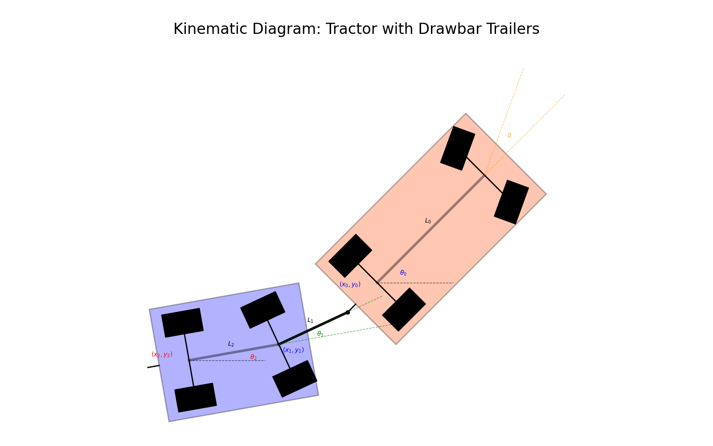
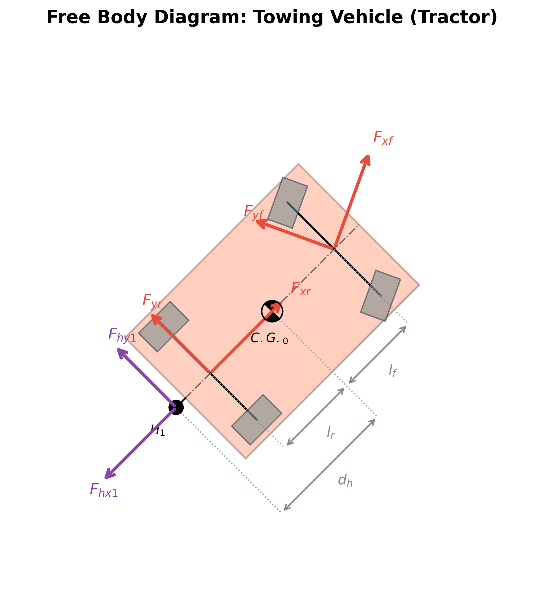
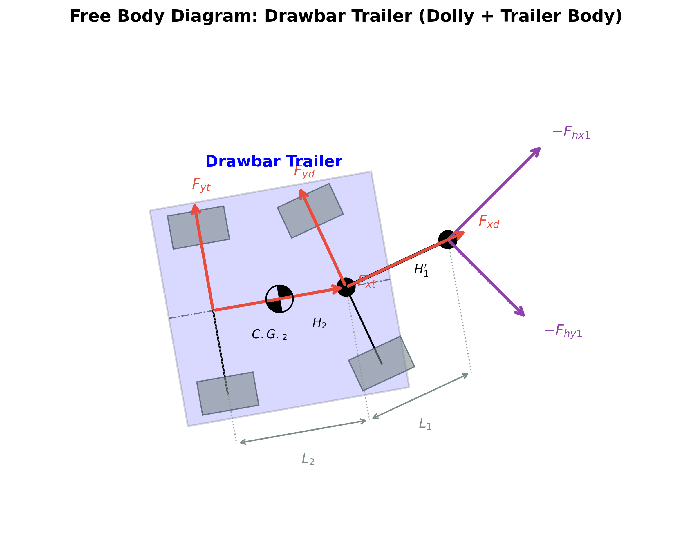

# แบบจำลองพลศาสตร์ของยานยนต์ลากจูงพร้อมแรงปฏิกิริยาที่จุดพ่วง (Dynamic Model of a Towing Vehicle with Hitch Forces)

เอกสารนี้แสดงการจัดทำแบบจำลองพลศาสตร์ระดับวิชาการของยานยนต์ลากจูง (Tractor/Towing Vehicle) ที่ได้รับผลกระทบจากแรงปฏิกิริยา ณ จุดพ่วง (Hitch Forces) โดยใช้วิธี **Newton-Euler** ซึ่งเป็นโครงสร้างคณิตศาสตร์ที่เหมาะสมอย่างยิ่งสำหรับการนำไปพัฒนาต่อยอดในซอฟต์แวร์จำลองสถานการณ์ระบบ (System Simulation) เช่น MATLAB/Simulink, Python หรือ Modelica

---

## 0. Schematic and Coordinate Systems (แผนผังและระบบพิกัด)

### 0.1 ภาพรวมของระบบยานยนต์ลากจูง (Tractor-Trailer System)
การวิเคราะห์ใช้วิธีทางกลศาสตร์ระนาบ (Planar Vehicle Dynamics) โดยใช้ **Bicycle Model (Single-Track Model)** เพื่อลดความซับซ้อน แต่รักษารายละเอียดทางพลศาสตร์หลักอย่างครบถ้วน รถลากจูง (Tractor) จะเชื่อมต่อกับส่วนพ่วง (Trailer) ผ่านจุดเชื่อมต่อแบบหมุนได้อิสระ (Pin Joint) ที่เรียกว่า **จุดพ่วง (Hitch Point)** 



### 0.2 การกำหนดพิกัดโลก (Global Frame) และพิกัดอ้างอิงตัวรถ (Body-Fixed Frame)
1. **พิกัดอ้างอิงโลก (Global Inertial Frame - $OXY$)**: เป็นพิกัดอ้างอิงคงที่บนพื้นราบแกน $X$ ชี้ไปทิศตามแนวนอน แกน $Y$ ชี้ไปทิศตามแนวตั้ง
2. **พิกัดอ้างอิงตัวรถ (Body-Fixed Frame - $Cxy$)**: วางจุดกำเนิดพิกัดไว้ที่จุดศูนย์กลางมวล (Center of Gravity - C.G.) ของรถลากจูง โดยแกน $x$ ชี้ไปด้านหน้าตามแนวกึ่งกลางตัวรถ (Longitudinal centerline) และแกน $y$ ชี้ไปทางซ้ายของตัวรถในแนวขวาง (Lateral direction)

### 0.3 ตำแหน่งของจุดศูนย์ถ่วง (CG) และจุดพ่วง (Hitch Point)
*   **จุดศูนย์ถ่วง (C.G.)**: อยู่ห่างจากเพลาหน้าเป็นระยะ $l_f$ และห่างจากเพลาหลังเป็นระยะ $l_r$
*   **จุดพ่วง (Hitch Point - $H$)**: วางอยู่กึ่งกลางแนวท้ายรถ ห่างจากจุด C.G. ไปทางด้านหลังตามแนวแกน $-x$ เป็นระยะขจัดเท่ากับ $d_h$ พิกัดของจุดพ่วงใน Body Frame คือ $(-d_h, 0)$

---

## 1. Comparison of Newton-Euler and Lagrangian Formulation (การเปรียบเทียบวิธีการสร้างแบบจำลอง)

### 1.1 หลักการของ Newton-Euler สำหรับวัตถุแข็งเกร็ง (Rigid Body Dynamics)
การวิเคราะห์การเคลื่อนที่ของวัตถุแข็งเกร็งบนระนาบ 2 มิติ ประกอบด้วยสองส่วนหลัก:
1.  **กฎข้อที่สองของนิวตันสำหรับการแปลตำแหน่ง (Translational Motion)**:
    $$\sum \vec{F} = m \vec{a}_{cg}$$
2.  **สมการออยเลอร์สำหรับการหมุนรอบจุดศูนย์ถ่วง (Rotational Motion)**:
    $$\sum M_z = I_z \dot{r}$$
    โดยที่ $\vec{a}_{cg}$ คือความเร่งเชิงเส้นของจุด C.G. และ $r = \dot{\theta}_0$ คือความเร็วเชิงมุมในการหมุนรอบแกนดิ่ง (Yaw Rate)

### 1.2 ความแตกต่างระหว่าง Newton-Euler และ Lagrangian ในระบบที่มีแรงดึงพ่วง
*   **วิธี Newton-Euler**: ใช้หลักการแบ่งส่วนโครงสร้าง (Joint Cut Method) เพื่อวิเคราะห์วัตถุอิสระ (Free Body Diagram) ของรถลากและส่วนพ่วงแยกกัน ทำให้ **แรงปฏิกิริยาที่จุดพ่วง ($F_{hx1}, F_{hy1}$)** ปรากฏขึ้นมาในสมการอย่างชัดเจนในฐานะแรงภายนอก (External Forces) สะดวกต่อการจับคู่ระบบและการเขียนโปรแกรมเชิงโมดูล (Modular Programming) ในการจำลองสถานการณ์
*   **วิธี Lagrangian**: มุ่งเน้นการวิเคราะห์พลังงานจลน์ (Kinetic Energy) และพลังงานศักย์ (Potential Energy) ของระบบแบบองค์รวม โดยกำหนดพิกัดทั่วไป (Generalized Coordinates) ซึ่งทำให้แรงปฏิกิริยาพ่วงที่เป็นแรงภายใน (Internal Constraint Forces) หักล้างกันไปตามหลักงานเสมือน (Principle of Virtual Work) เว้นแต่จะใช้วิธีตัวคูณลากรองจ์ (Lagrange Multipliers) ซึ่งมีความซับซ้อนสูงกว่าในการแก้สมการทางคณิตศาสตร์

---

## 2. Variable and Parameter Definitions (คำจำกัดความของตัวแปรและพารามิเตอร์)

เพื่อให้การวิเคราะห์ทางคณิตศาสตร์มีความชัดเจน ตารางด้านล่างนี้แสดงคำนิยามและพารามิเตอร์ของระบบรถลากจูงและส่วนพ่วง:

| สัญลักษณ์ | คำอธิบาย (ภาษาไทย) | Description (English) | หน่วย |
|:---:|:---|:---|:---:|
| $m$ | มวลของรถลากจูง (Tractor) | Tractor mass | $\text{kg}$ |
| $I_z$ | โมเมนต์ความเฉื่อยรอบแกนดิ่งของรถลากจูง | Tractor yaw moment of inertia | $\text{kg}\cdot\text{m}^2$ |
| $l_f$ | ระยะจาก C.G. รถลากจูงไปยังเพลาหน้า | Distance from C.G. to front axle | $\text{m}$ |
| $l_r$ | ระยะจาก C.G. รถลากจูงไปยังเพลาหลัง | Distance from C.G. to rear axle | $\text{m}$ |
| $d_h$ | ระยะยื่นท้ายรถลากจูงจาก C.G. ถึงจุดพ่วง $H_1$ | Tractor hitch overhang from C.G. to $H_1$ | $\text{m}$ |
| $v_x, v_y$ | ความเร็วของ C.G. ในแนวแกนยาวและแกนขวางของรถลาก | Tractor C.G. longitudinal and lateral velocities | $\text{m/s}$ |
| $r$ | อัตราการหมุนรอบแกนดิ่ง (Yaw rate) ของรถลาก | Tractor yaw rate | $\text{rad/s}$ |
| $\delta$ | มุมเลี้ยวล้อหน้าของรถลากจูง | Front wheel steering angle | $\text{rad}$ |
| $F_{xf}, F_{yf}$ | แรงจากหน้าสัมผัสยางล้อหน้าในแนวแกนล้อ | Front tire longitudinal and lateral forces | $\text{N}$ |
| $F_{xr}, F_{yr}$ | แรงจากหน้าสัมผัสยางล้อหลังในแนวแกนล้อ | Rear tire longitudinal and lateral forces | $\text{N}$ |
| $F_{hx1}, F_{hy1}$ | แรงปฏิกิริยาที่จุดพ่วงพิกัดตัวรถลากจูง | Hitch reaction forces in tractor body frame | $\text{N}$ |
| $L_1$ | ความยาวก้านลาก (Drawbar length) ของส่วนพ่วง | Drawbar length | $\text{m}$ |
| $L_2$ | ระยะจากเพลารถพ่วงดอลลี่ถึงเพลาท้ายส่วนพ่วง | Trailer body wheelbase | $\text{m}$ |

---

## 3. Free Body Diagram (FBD) and Force Analysis (แผนภาพวัตถุอิสระและการวิเคราะห์แรง)

เพื่อให้วิเคราะห์แรงแยกแยะได้อย่างถูกต้อง ระบบยานยนต์ลากจูงและส่วนพ่วงจะถูกแยกพิจารณาในรูปแบบของแผนภาพวัตถุอิสระ (FBD) ดังนี้:

### 3.1 แผนภาพวัตถุอิสระของยานยนต์ลากจูง (FBD of Towing Vehicle)
แผนภาพวัตถุอิสระสำหรับตัวรถลากจูง (Tractor) แสดงตำแหน่งของจุด C.G., เพลาหน้าที่มีมุมเลี้ยว $\delta$, เพลาหลัง, และจุดพ่วง $H_1$ พร้อมกับแรงภายนอกที่กระทำทั้งหมด ได้แก่ แรงที่หน้าสัมผัสยาง ($F_{xf}, F_{yf}, F_{xr}, F_{yr}$) และแรงปฏิกิริยาพ่วง ($F_{hx1}, F_{hy1}$)



### 3.2 แผนภาพวัตถุอิสระของส่วนพ่วงลากจูง (FBD of Drawbar Trailer)
แผนภาพวัตถุอิสระสำหรับส่วนพ่วงลากจูง (Drawbar Trailer) พิจารณาในลักษณะโครงสร้างวัตถุชิ้นเดียวกันที่ต่อพ่วงกัน โดยแสดงจุดต่อหัวก้านลาก $H_1'$, ล้อดอลลี่ และล้อท้ายส่วนพ่วง พร้อมแรงดึงกลับจากจุดพ่วง ($-F_{hx1}, -F_{hy1}$) และแรงยางที่หน้าสัมผัส ($F_{xd}, F_{yd}, F_{xt}, F_{yt}$)



### 3.3 การแตกแรงที่หน้าสัมผัสยาง (Tire Forces) เข้าสู่พิกัดตัวรถ
แรงสัมผัสยางที่กระทำที่เพลาหน้าทำมุมเลี้ยว $\delta$ เทียบกับแนวแกนยาวของรถลากจูง เพื่อนำไปคำนวณสมดุลแรงบนตัวรถ จึงต้องทำการแตกแรงเข้าสู่แกนอ้างอิงตัวรถ ($Cxy$) ดังนี้:
*   **แรงตามแนวแกนยาวของตัวรถ ($x$-axis)**:
    $$F_{xf}^{body} = F_{xf}\cos\delta - F_{yf}\sin\delta$$
*   **แรงตามแนวแกนขวางของตัวรถ ($y$-axis)**:
    $$F_{yf}^{body} = F_{xf}\sin\delta + F_{yf}\cos\delta$$

สำหรับล้อหลังที่ไม่มีการเลี้ยว มุมเลี้ยวเป็นศูนย์ แรงยางจึงชี้ในแนวพิกัดตัวรถโดยตรง:
*   $$F_{xr}^{body} = F_{xr}$$
*   $$F_{yr}^{body} = F_{yr}$$

### 3.4 การวิเคราะห์ทิศทางของแรงปฏิกิริยาและโมเมนต์ที่กระทำต่อจุดพ่วง
แรงปฏิกิริยาที่จุดพ่วง $H_1$ กระทำห่างจากจุด C.G. ไปทางด้านหลังเป็นระยะทาง $d_h$ ส่งผลให้เกิดแรงดึงในแนวยาว $F_{hx1}$ และแรงในแนวขวาง $F_{hy1}$ ในพิกัดตัวรถ แรงขวาง $F_{hy1}$ จะทำให้เกิดโมเมนต์บิดรอบแกนดิ่งของตัวรถมีค่าเท่ากับ $-d_h F_{hy1}$ (เครื่องหมายลบแสดงทิศทางตามเข็มนาฬิกาเมื่อแรงมีทิศทางชี้ไปทางซ้ายของตัวรถ)

---

## 4. Derivation of Equations of Motion for Tractor (การสร้างสมการการเคลื่อนที่สำหรับรถลากจูง)

ความเร่งเชิงเส้นของจุด C.G. ของตัวรถลากจูงในพิกัดตัวรถที่กำลังหมุนด้วยอัตรา $r$ ประกอบด้วยผลจากความเร่งสัมพัทธ์และความเร่งสู่ศูนย์กลาง (Centripetal Acceleration) เขียนได้ดังนี้:
$$a_x = \dot{v}_x - v_y r$$
$$a_y = \dot{v}_y + v_x r$$

### 4.1 Longitudinal Dynamics: สมการสมดุลแรงตามแนวยาว
ผลรวมของแรงภายนอกตามแนวแกน $x$ ของตัวรถลากจูง:
$$\sum F_x = m a_x$$
$$F_{xr} + F_{xf}\cos\delta - F_{yf}\sin\delta + F_{hx1} = m (\dot{v}_x - v_y r)$$

$$\boxed{
m(\dot{v}_x - v_y r) = F_{xr} + F_{xf}\cos\delta - F_{yf}\sin\delta + F_{hx1}
}$$

### 4.2 Lateral Dynamics: สมการสมดุลแรงตามแนวด้านข้าง
ผลรวมของแรงภายนอกตามแนวแกน $y$ ของตัวรถลากจูง:
$$\sum F_y = m a_y$$
$$F_{yr} + F_{xf}\sin\delta + F_{yf}\cos\delta + F_{hy1} = m (\dot{v}_y + v_x r)$$

$$\boxed{
m(\dot{v}_y + v_x r) = F_{yr} + F_{xf}\sin\delta + F_{yf}\cos\delta + F_{hy1}
}$$

### 4.3 Yaw Dynamics: สมการสมดุลโมเมนต์รอบจุด C.G.
ผลรวมของโมเมนต์ดิ่งรอบจุด C.G. ของรถลากจูง (กำหนดทิศทวนเข็มนาฬิกาเป็นบวก):
$$\sum M_z = I_z \dot{r}$$
$$l_f (F_{yf}\cos\delta + F_{xf}\sin\delta) - l_r F_{yr} - d_h F_{hy1} = I_z \dot{r}$$

$$\boxed{
I_z \dot{r} = l_f (F_{yf}\cos\delta + F_{xf}\sin\delta) - l_r F_{yr} - d_h F_{hy1}
}$$

*หมายเหตุ: แรงขวางพ่วง $F_{hy1}$ ทำมุมเป็นลบในสมการโมเมนต์ เนื่องจากระยะพ่วงยื่นไปทางด้านท้ายรถ ($d_h$) ทำให้แรงขวางจุดพ่วงส่งแรงดึงกลับรอบจุดหมุน*

---

## 5. Derivation of Equations of Motion for Drawbar Trailer (การสร้างสมการการเคลื่อนที่สำหรับส่วนพ่วงลาก)

ส่วนพ่วงลากแบบ Drawbar Trailer (หรือ A-dolly trailer) ประกอบด้วยสองส่วนหลักที่เชื่อมโยงกันแบบหมุนได้รอบสลักพ่วงห้า (Fifth wheel) ได้แก่ ชุดดอลลี่ (Dolly/Drawbar) และตัวพ่วงหลัก (Trailer Body)

### 5.1 พลศาสตร์ของชุดดอลลี่ (Dolly / Drawbar Dynamics)
ชุดดอลลี่มีมวล $m_d$ และโมเมนต์ความเฉื่อยรอบแกนดิ่ง $I_{zd}$ โดยมีทิศหัวรถดอลลี่ทำมุม $\theta_1$ และมีความเร็วของจุด C.G. ในแนวแกนดอลลี่คือ $v_{xd}, v_{yd}$ และอัตราการหมุนคือ $r_d = \dot{\theta}_1$

แรงปฏิกิริยาจากจุดพ่วงตัวรถลากจูง ($-F_{hx1}, -F_{hy1}$) และแรงจากตัวพ่วงหลัก ($F_{hx2}, F_{hy2}$) ต้องถูกแปลงเข้าสู่ระบบพิกัดของตัวดอลลี่ดังนี้:
$$\begin{bmatrix} F_{hx1}^d \\ F_{hy1}^d \end{bmatrix} = R(\theta_0 - \theta_1) \begin{bmatrix} -F_{hx1} \\ -F_{hy1} \end{bmatrix}$$
$$\begin{bmatrix} F_{hx2}^d \\ F_{hy2}^d \end{bmatrix} = R(\theta_2 - \theta_1) \begin{bmatrix} F_{hx2} \\ F_{hy2} \end{bmatrix}$$
โดยที่ $R(\Delta\theta) = \begin{bmatrix} \cos\Delta\theta & \sin\Delta\theta \\ -\sin\Delta\theta & \cos\Delta\theta \end{bmatrix}$ คือเมทริกซ์การหมุน (Rotation Matrix)

สมการการเคลื่อนที่ตามหลัก Newton-Euler ของชุดดอลลี่:
*   **Longitudinal Dynamics**:
    $$m_d (\dot{v}_{xd} - v_{yd} r_d) = F_{xd} + F_{hx1}^d + F_{hx2}^d$$
*   **Lateral Dynamics**:
    $$m_d (\dot{v}_{yd} + v_{xd} r_d) = F_{yd} + F_{hy1}^d + F_{hy2}^d$$
*   **Yaw Dynamics**:
    $$I_{zd} \dot{r}_d = l_{fd} F_{hy1}^d - l_{rd} F_{hy2}^d$$
    โดยที่ $l_{fd}$ คือระยะจาก C.G. ของดอลลี่ไปด้านหน้ายังจุดพ่วง $H_1'$ และ $l_{rd}$ คือระยะจาก C.G. ของดอลลี่ไปยังข้อต่อพ่วงห้า $H_2$

### 5.2 พลศาสตร์ของตัวพ่วงหลัก (Trailer Body Dynamics)
ตัวพ่วงหลักมีมวล $m_t$ และโมเมนต์ความเฉื่อยรอบแกนดิ่ง $I_{zt}$ โดยมีทิศหัวรถพ่วงทำมุม $\theta_2$ และมีความเร็ว C.G. ในแนวแกนพ่วงคือ $v_{xt}, v_{yt}$ และอัตราการหมุนคือ $r_t = \dot{\theta}_2$

สมการการเคลื่อนที่ตามหลัก Newton-Euler ของตัวพ่วงหลัก:
*   **Longitudinal Dynamics**:
    $$m_t (\dot{v}_{xt} - v_{yt} r_t) = F_{xt} - F_{hx2}$$
*   **Lateral Dynamics**:
    $$m_t (\dot{v}_{yt} + v_{xt} r_t) = F_{yt} - F_{hy2}$$
*   **Yaw Dynamics**:
    $$I_{zt} \dot{r}_t = l_{ft} F_{hy2} - l_{rt} F_{yt}$$
    โดยที่ $l_{ft}$ คือระยะจากข้อต่อพ่วงห้า $H_2'$ ไปยัง C.G. ของตัวพ่วง และ $l_{rt}$ คือระยะจาก C.G. ไปยังเพลาล้อท้ายส่วนพ่วง

### 5.3 เงื่อนไขผูกมัดทางจลนศาสตร์ (Kinematic Constraints at Joints)
ความเร็วเชิงเส้น ณ จุดเชื่อมต่อพ่วงต้องมีความสัมพันธ์เชิงจลนศาสตร์เพื่อรักษาการเชื่อมต่อทางกายภาพของวัตถุ:
1. **ความเร็วที่จุดพ่วงแรก ($H_1$)** ในพิกัดของตัวรถลากจูง:
   $$v_{hx1}^0 = v_x$$
   $$v_{hy1}^0 = v_y - d_h r$$
   และเทียบเท่ากับความเร็วในพิกัดดอลลี่:
   $$\begin{bmatrix} v_{xd} \\ v_{yd} + l_{fd} r_d \end{bmatrix} = R(\theta_0 - \theta_1) \begin{bmatrix} v_x \\ v_y - d_h r \end{bmatrix}$$
2. **ความเร็วที่จุดพ่วงห้า ($H_2$)** ระหว่างดอลลี่และตัวพ่วงหลัก:
   ความเร็วที่กระทำบนจุดพ่วงของทั้งสองวัตถุต้องสอดคล้องกัน:
   $$\begin{bmatrix} v_{xt} \\ v_{yt} + l_{ft} r_t \end{bmatrix} = R(\theta_1 - \theta_2) \begin{bmatrix} v_{xd} \\ v_{yd} - l_{rd} r_d \end{bmatrix}$$

---

## 6. System Simulation Formulation (การจัดรูปสมการสำหรับการจำลองระบบ)

### 6.1 การจัดรูปสมการให้อยู่ในรูปแบบ State-Space Matrix หรือ Control-Affine Form
เพื่อนำไปเขียนโปรแกรมจำลองระบบ สมการพลศาสตร์ของตัวรถลากจูงเขียนแบบแยกแรงอิสระได้ในรูปของอนุพันธ์ $\dot{\nu} = [\dot{v}_x, \dot{v}_y, \dot{r}]^T$:

$$\boxed{
M_b \dot{\nu} + C_b(\nu)\nu = B(\delta) F_{\text{tire}} + B_{h1} F_{\text{hitch1}}
}$$

โดยที่รายละเอียดของแมทริกซ์มีลักษณะดังเดิม:
*   **Body-Fixed Mass Matrix ($M_b$)**:
    $$M_b = \begin{bmatrix}
    m & 0 & 0 \\
    0 & m & 0 \\
    0 & 0 & I_z
    \end{bmatrix}$$
*   **Coriolis & Centripetal Matrix ($C_b$)**:
    $$C_b(\nu) = \begin{bmatrix}
    0 & -m r & 0 \\
    m r & 0 & 0 \\
    0 & 0 & 0
    \end{bmatrix}$$
*   **Tire Force Vector ($F_{\text{tire}}$)**:
    $$F_{\text{tire}} = \begin{bmatrix} F_{xr} \\ F_{yr} \\ F_{xf} \\ F_{yf} \end{bmatrix}$$
*   **Input Distribution Matrix ($B(\delta)$)**:
    $$B(\delta) = \begin{bmatrix}
    1 & 0 & \cos\delta & -\sin\delta \\
    0 & 1 & \sin\delta & \cos\delta \\
    0 & -l_r & l_f\sin\delta & l_f\cos\delta
    \end{bmatrix}$$
*   **Hitch Force Matrix ($B_{h1}$)**:
    $$B_{h1} = \begin{bmatrix}
    1 & 0 \\
    0 & 1 \\
    0 & -d_h
    \end{bmatrix}$$

สำหรับตัวดอลลี่และตัวพ่วง สามารถตั้งสมการ Newton-Euler ในรูปแบบเมทริกซ์ทำนองเดียวกัน และอาศัยเงื่อนไขจลนศาสตร์ข้อผูกมัดร่วมกับเมทริกซ์การหมุนเพื่อคำนวณหาแรงปฏิกิริยาพ่วง $F_{\text{hitch1}}$ และ $F_{\text{hitch2}}$ ร่วมกันขณะแก้สมการเชิงอนุพันธ์สามัญ (ODE Solver)

### 6.2 การเตรียมสมการ (Block Diagram Mapping) สำหรับคอมพิวเตอร์
ในแบบจำลองโครงสร้างสองยูนิต บล็อกการจำลองสามารถป้อนสัญญาณเชื่อมโยงกันเป็นวงรอบ (Closed Loop) ดังนี้:

```
┌──────────────────────────────────────────┐
│              Tractor Block               │
│  Inputs: delta, Fxr, [Fhx1, Fhy1]        │────► Output: States (vx, vy, r)
│  Dynamics: Mb*d_nu + Cb*nu = B*F + Bh*Fh │
└──────────────────────────────────────────┘
      ▲                               │
      │ [Fhx1, Fhy1]                  │ [vhx1, vhy1] (Hitch 1 Velocity)
      │                               ▼
┌──────────────────────────────────────────┐
│           Drawbar Trailer Block          │
│  Solves Dolly & Trailer Body dynamics,   │────► Output: Trailer States
│  calculates constraints and reaction forces│
└──────────────────────────────────────────┘
```
ความเร็ว ณ จุดพ่วงแรกเพื่อส่งต่อไปยังบล็อกดอลลี่คำนวณจาก:
$$v_{hx1}^0 = v_x$$
$$v_{hy1}^0 = v_y - d_h r$$

---

## 7. Preliminary Stability Analysis (การวิเคราะห์เสถียรภาพเบื้องต้น)

### 7.1 ผลกระทบของแรง $F_{hy1}$ ต่อเสถียรภาพ of รถลาก
แรงในแนวขวางจุดพ่วง $F_{hy1}$ ถือเป็นปัจจัยกวนภายนอกที่ส่งผลร้ายแรงที่สุดต่อการหันเลี้ยวของรถลากจูง เนื่องจากกระทำที่ระยะยื่นท้ายรถ ($d_h$) ซึ่งทำให้เกิดแรงบิดกระทำต่อตัวรถดังนี้:
1.  เมื่อแรง $F_{hy1}$ ดึงไปทางขวา (ทิศทาง $-y$) มันจะสร้างทอร์คทวนเข็มนาฬิกาเชิงบวก ($+d_h F_{hy1}$) พยายามดันหน้ารถให้เบนไปทางซ้าย
2.  ทอร์คปฏิกิริยานี้จะทำหน้าที่เพิ่มพฤติกรรมเลี้ยวเกิน (Oversteer) ให้กับรถลากจูง ซึ่งนำไปสู่การสูญเสียเสถียรภาพได้ง่ายขึ้นที่ความเร็วสูง

### 7.2 การอธิบายปรากฏการณ์ความไม่เสถียร
1.  **Trailer Sway (การส่ายของตัวพ่วง)**: เกิดขึ้นเมื่อรถขับเคลื่อนด้วยความเร็วสูงเกินขีดจำกัดวิกฤต (Critical Speed) ส่วนพ่วงจะเริ่มส่ายแบบกวัดแกว่งสะสมพลังงาน (Oscillation) ซึ่งจะส่งแรง $F_{hy1}$ สลับซ้าย-ขวาอย่างรุนแรงกลับมาที่ท้ายรถลากจูง หากไม่มีการหน่วงพลังงานที่ดี รถลากจะแกว่งตามจนสูญเสียการควบคุม
2.  **Jackknifing (การพับตัวของส่วนพ่วง)**: มักเกิดในขณะเบรกกระทันหันหรือสูญเสียแรงยึดเกาะทางด้านข้างของล้อหลังรถลาก แรงเฉื่อยของส่วนพ่วงจะดันไปข้างหน้า ($F_{hx1} > 0$) ร่วมกับแรงขวาง $F_{hy1}$ ทำให้รถลากปัดหมุนอย่างรวดเร็ว และพับเข้าหากันคล้ายมีดพับ